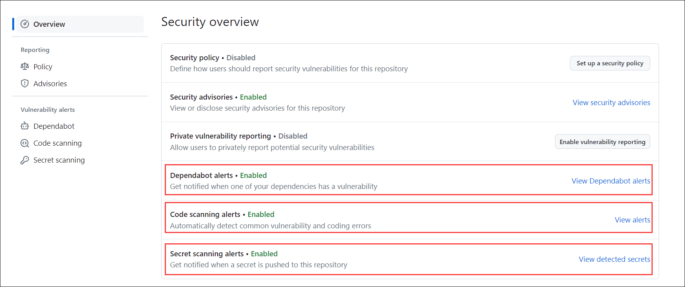
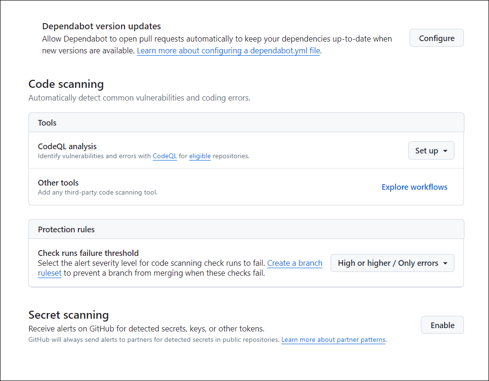

# Exercise 01: GitHub Advanced Security Overview [Read-Only]

## Lab Scenario

## Lab objectives
In this lab, you will perform:

- Task 1: What is GitHub Advanced Security? 
- Task 2: What are the components of GHAS?  
- Task 3: Where to turn on the different components of GHAS?  

### Estimated timing: 20 minutes

### Task 1: What is GitHub Advanced Security?

GitHub Advanced Security, or GHAS, is an integrated security suite tailored to enhance your GitHub repositories against potential threats, vulnerabilities and credential leaks without slowing development. It empowers developers with a robust set of tools and features to proactively identify, mitigate, and resolve security issues throughout the development lifecycle. 

### Task 2: What are the components of GHAS?  
Here are some components of GHAS:

1. **Secret Scanning:** Secret scanning is a crucial security feature within GitHub Advanced Security (GHAS) designed to identify and mitigate the inadvertent exposure of sensitive information, such as API keys and tokens within the source code.

    This scanning process is essential for preventing unauthorized access and safeguarding confidential data. Secret scanning operates by searching for predefined patterns and signatures indicative of sensitive information, ensuring that potential security risks are promptly addressed. By default, secret scanning looks for highly accurate patterns that have been provided by a GitHub Partner, however, custom patterns can be created for other use cases.

   **Secret scanning includes:**
    - Push protection proactively prevents secret leaks by scanning code on commit and blocking a push if a secret is present.
    - The ability to easily view alerts and remediate them without ever having to leave GitHub.

1. **Code Scanning:** Code scanning is an integral feature of GHAS that analyzes source code for security vulnerabilities and coding errors. It employs static analysis techniques to identify potential issues such as SQL injection, cross-site scripting, and buffer overflows. By providing automated feedback directly within the pull request workflow, code scanning enables developers to address vulnerabilities early in the development process.

    Code scanning enhances the overall security of a software development project by identifying and addressing security vulnerabilities in the codebase before they reach production. By fostering a proactive approach to security, code scanning helps minimize the potential impact of security threats, improves code quality, and accelerates the development cycle by reducing the time spent on post-deployment issue resolution.

1. **Dependabot:** Dependabot is an automated dependency management tool, responsible for keeping project dependencies up-to-date. It regularly checks for updates to libraries and frameworks used in a project and automatically opens pull requests to update dependencies to their latest, secure versions. Dependabot contributes to maintaining a secure and stable development environment by addressing vulnerabilities present in outdated dependencies.

    In a secure software development life cycle, managing dependencies is crucial to minimizing the risk of exploiting known vulnerabilities. Dependabot streamlines the process of updating dependencies, ensuring that projects benefit from the latest security patches and improvements. By automating this aspect of security, Dependabot contributes to creating a resilient and secure foundation for the entire development process.

    With GitHub Advanced Security, Dependabot’s functionality is extended to include Dependency Review, allowing you to check for vulnerable dependencies within a pull request. This check enables you to address vulnerabilities before they are merged into a shared branch.

### Task 3: Where to turn on the different components of GHAS?  

1. To enable any of the alerts from a repository level first navigate to your repository’s security tab.

   

2. Enable your alerts in the Security overview.

   

3. Navigate to your repository's, click  Settings.

   

5. In the left sidebar, click **Code security & analysis**.

6. Optionally, enable or disable a feature for all existing repositories.

   
   

## Review
 
In this lab you have completed the following:
+ What is GitHub Advanced Security?
+ What are the components of GHAS?
+ Where to turn on the different components of GHAS? 
