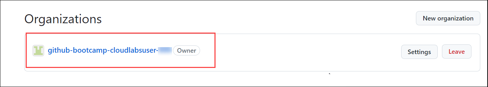
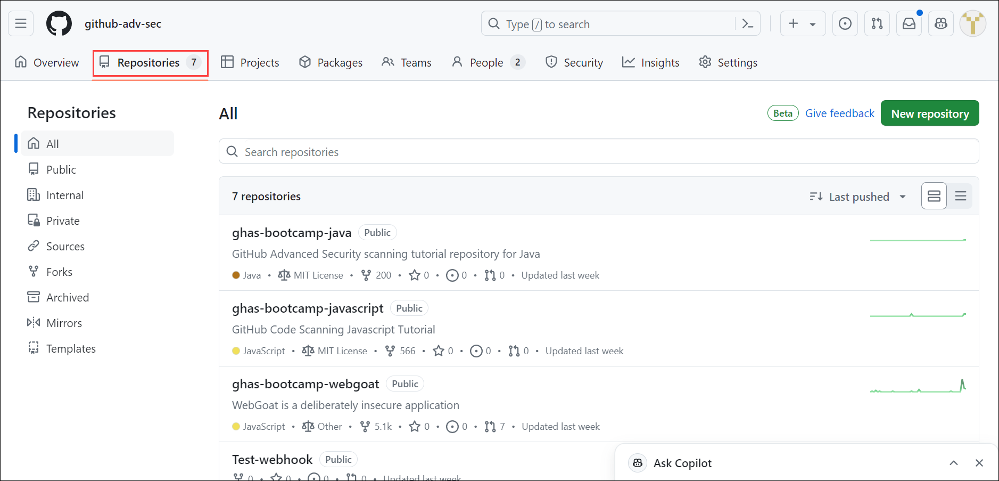
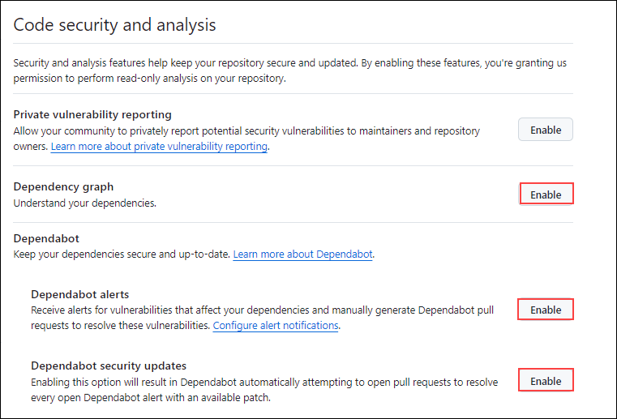
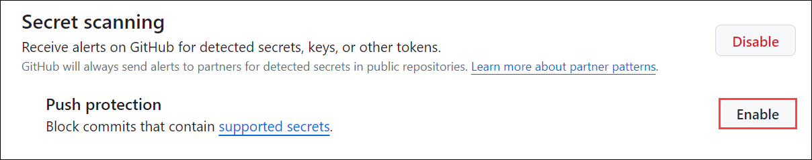
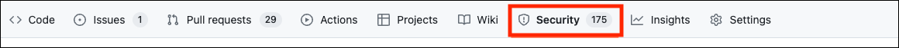
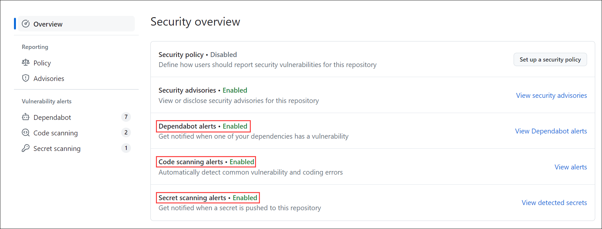

# Module 01: GitHub Advanced Security Overview [Read-Only]

## Lab Scenario

The lab scenario provides an overview of GitHub Advanced Security (GHAS) and its key components, along with instructions on how to enable them in a GitHub repository.

## Lab Objectives
In this lab, you will perform:

- Task 1: What is GitHub Advanced Security? 
- Task 2: What are the components of GitHub Advanced Security?  
- Task 3: Where to turn on the different components of GitHub Advanced Security?  

## Estimated Timing: 20 minutes

## Architecture Diagram

   

### Task 1: What is GitHub Advanced Security?

GitHub Advanced Security is an integrated security suite tailored to enhance your GitHub repositories against potential threats, vulnerabilities, and credential leaks without slowing development. It empowers developers with a robust set of tools and features to proactively identify, mitigate, and resolve security issues throughout the development lifecycle. 

### Task 2: What are the components of GitHub Advanced Security?  
Here are some of the components of GitHub Advanced Security:

1. **Secret Scanning:** The secret scanning is a critical security mechanism present in the GitHub Advanced Security that helps automate the detection and mitigation of inadvertent exposure of sensitive information like API keys, tokens in the source code.

    To prevent unauthorized access and protect confidential information. Secret scanning searches for known patterns and signatures of sensitive information and ensures that responsible parties rectify potential vulnerabilities. By default, secret scanning uses highly reliable patterns from a GitHub partner. However, custom patterns can be created for other use cases. Custom patterns can be defined as patterns that secret scanning is programmed to detect irrespective of its default pattern. We can define custom patterns for our enterprise, organization or repository.

   Refer to the link for more information. [Secret scanning](https://docs.github.com/en/code-security/secret-scanning/about-secret-scanning)

   **Secret scanning includes:**
    - Push protection proactively prevents secret leaks by scanning code on commits and blocking a push if a secret is present.
    - The ability to easily view alerts and remediate them.

1. **Code Scanning:** One of the key features of code scanning is its analysis of the source code for security vulnerabilities and errors. GHAS uses static analysis to detect possible occurrences of types of problems like SQL injection, cross-site scripting, and buffer overflows. Automated feedback is also included in the pull request workflow for developers to correct these vulnerabilities in the early stages of development.

    Overall security of a software development project is improved by code scanning. This is because it identifies and addresses vulnerabilities in the code base before they go into production. Code scanning helps to create a proactive approach towards security, reduce the potential impact of security threats, enhance the quality of code as well as speeding up the software development life cycle through minimizing time spent resolving post deployment issues.

   Refer to the link for more information. [Code Scanning](https://docs.github.com/en/code-security/code-scanning/introduction-to-code-scanning/about-code-scanning)

1. **Dependabot:** Dependabot is an automated dependency management tool that ensures a constant update of project dependencies. It frequently inspects libraries and frameworks applied in the project to open for them pull requests automatically for updating dependencies to their latest secure versions. Dependabot keeps the development environment safe and steady by fixing bugs found in outdated dependencies.

    In a secure software development life cycle, managing dependencies is crucial to minimizing the risk of exploiting known vulnerabilities. Dependabot ensures that projects stay updated with the most recent security patches or other enhancements by making it easier to update dependencies. This allows Dependabot to promote building a stable and resilient foundation for every stage in the development process.

    GitHub Advanced Security also extends the ability of Dependabot; this means it can review dependencies too. Hence you can readily identify vulnerable components within your pull request. The advantage of this check is also detecting weaknesses before they merge into shared branches.

   Refer to the link for more information. [Dependabot](https://docs.github.com/en/code-security/getting-started/dependabot-quickstart-guide)

### Task 3: Where to turn on the different components of GitHub Advanced Security?  

1. On the **Home** page, click on your **profile** on top of the right hand.

    

1. Select **Your organizations**.

    

1. Select **ghas-bootcamp-xxxx-xx-xx-cloudlabsxxx** from organizations.

    

1. Click on the **Repositories** and select any repository.

    

1. In your repository, and click on **Settings**.

   

1. In the left sidebar, click on **Code security and analysis**.

1. Make sure to enable **Dependabot**, **Code Scanning** and **Secret Scanning**, for repository if not enabled. Under **Dependabot**, enable **Dependency graph**, **Dependabot Alerts**, **Dependabot security updates**, **Grouped security updates**, and **Dependabot on Actions runners**.

   
   
1. Under **Code Scanning** option. Click on the **Setup** button and we have two options to configure code scanning. That is **Default** and **Advanced** as depicted in the screenshot below. For now, click on **Default**

   

1. Leave the query suite on Default and click the **Enable CodeQL** button.

   

1. Under **Secret Scanning**, click on **enable**.

   

1. Select **enable** to activate Push Protection.

   

1. To review, navigate to your repository’s Security tab.

   

1. Here, you can review your alerts in the security overview.

   
   
Please feel free to go through the links for further understanding:[GitHub Advanced Security](https://docs.github.com/en/get-started/learning-about-github/about-github-advanced-security) and [Spot Light on GitHub Advanced Security](https://developer.microsoft.com/en-us/reactor/series/S-1311/?wt.mc_id=promotional_S-1311_email_reactor)

## Review
 
In this lab, you have completed the following:
+ What is GitHub Advanced Security?
+ What are the components of GitHub Advanced Security?
+ Where to turn on the different components of GitHub Advanced Security? 
