# Module 01: GitHub Advanced Security Overview

## Lab Scenario

The lab scenario provides an overview of GitHub Advanced Security (GHAS) and its key components, along with instructions on how to enable them in a GitHub repository.

## Lab Objectives
In this lab, you will perform:

- Task 1: What is GitHub Advanced Security? 
- Task 2: What are the components of GitHub Advanced Security?  
- Task 3: Where to turn on the different components of GitHub Advanced Security at the repository level?  

## Estimated Timing: 20 minutes

## Architecture Diagram

   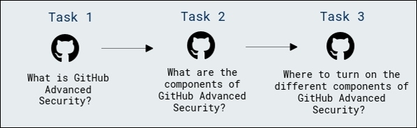

### Task 1: What is GitHub Advanced Security?

GitHub Advanced Security is an integrated security suite tailored to enhance your GitHub repositories against potential threats, vulnerabilities, and credential leaks without slowing development. It empowers developers with a robust set of tools and features to proactively identify, mitigate, and resolve security issues throughout the development lifecycle. 

### Task 2: What are the components of GitHub Advanced Security?  
Here are some of the components of GitHub Advanced Security:

1. **Secret Scanning:** The secret scanning is a critical security mechanism present in the GitHub Advanced Security that helps automate the detection and mitigation of inadvertent exposure of sensitive information like API keys, tokens in the source code.

    To prevent unauthorized access and protect confidential information. Secret scanning searches for known patterns and signatures of sensitive information and ensures that responsible parties rectify potential vulnerabilities. By default, secret scanning uses highly reliable patterns from a GitHub partner. However, custom patterns can be created for other use cases. Custom patterns can be defined as patterns that secret scanning is programmed to detect irrespective of its default pattern. We can define custom patterns for our enterprise, organization or repository.

   Refer to the link for more information. [Secret scanning](https://docs.github.com/en/code-security/secret-scanning/about-secret-scanning)

   **Secret scanning includes:**
    - Push protection proactively prevents secret leaks by scanning code on commits and blocking a push if a secret is present.
    - The ability to easily view alerts and remediate them.

1. **Code Scanning:** One of the key features of code scanning is its analysis of the source code for security vulnerabilities and errors. GHAS uses static analysis to detect possible occurrences of types of problems like SQL injection, cross-site scripting, and buffer overflows. Automated feedback is also included in the pull request workflow for developers to correct these vulnerabilities in the early stages of development.

    Overall security of a software development project is improved by code scanning. This is because it identifies and addresses vulnerabilities in the code base before they go into production. Code scanning helps to create a proactive approach towards security, reduce the potential impact of security threats, enhance the quality of code as well as speeding up the software development life cycle through minimizing time spent resolving post deployment issues.

   Refer to the link for more information. [Code Scanning](https://docs.github.com/en/code-security/code-scanning/introduction-to-code-scanning/about-code-scanning)

1. **Dependabot:** Dependabot is an automated dependency management tool that ensures a constant update of project dependencies. It frequently inspects libraries and frameworks applied in the project to open for them pull requests automatically for updating dependencies to their latest secure versions. Dependabot keeps the development environment safe and steady by fixing bugs found in outdated dependencies.

    In a secure software development life cycle, managing dependencies is crucial to minimizing the risk of exploiting known vulnerabilities. Dependabot ensures that projects stay updated with the most recent security patches or other enhancements by making it easier to update dependencies. This allows Dependabot to promote building a stable and resilient foundation for every stage in the development process.

    GitHub Advanced Security also extends the ability of Dependabot; this means it can review dependencies too. Hence you can readily identify vulnerable components within your pull request. The advantage of this check is also detecting weaknesses before they merge into shared branches.

   Refer to the link for more information. [Dependabot](https://docs.github.com/en/code-security/getting-started/dependabot-quickstart-guide)

### Security Updates

**Purpose**:
   - Security updates are specifically designed to address vulnerabilities and security flaws in code. They focus on fixing issues that could potentially be exploited by attackers to compromise the system or data.
   -  It focused on fixing vulnerabilities to protect against security threats. They address specific security issues and are critical for maintaining the security of the system.

**Key Aspects**:
   - **Security Patches**: These updates often involve applying patches to fix known vulnerabilities. For example, if a library you use has a security flaw, a security update will address this vulnerability.
   - **Automatic Alerts**: GitHub can automatically notify repository maintainers about security vulnerabilities in dependencies using tools like Dependabot. These alerts provide details about the vulnerability and suggest updates.
   - **Security Advisories**: GitHub allows maintainers to publish security advisories that disclose vulnerabilities and offer guidance on mitigating them. These advisories are often accompanied by a patch or update recommendation.

### Version Updates

**Purpose**:
   - Version updates refer to changes or upgrades to the software or dependencies in the repository. They are about improving functionality, adding new features, or fixing bugs not necessarily related to security.
   - Concerned with improving functionality, adding new features, or fixing non-security-related bugs. They enhance the overall capability and performance of the software.

**Key Aspects**:
   - **Feature Enhancements**: Version updates often include new features or enhancements to existing ones. For example, upgrading a library might include new functionalities or performance improvements.
   - **Bug Fixes**: These updates address bugs and issues that may not be security-related but improve the overall stability and usability of the software.
   - **Release Versions**: Version updates typically follow semantic versioning (e.g., major, minor, patch) to indicate the nature of changes (e.g., breaking changes, new features, or bug fixes).

### Task 3: Where to turn on the different components of GitHub Advanced Security at the repository level?  

In this task, we will learn how to enable GitHub Advanced Security features for a repository, including Dependabot, Code Scanning, and Secret Scanning. We will explore how to activate and configure essential security features such as the Dependency Graph, Dependabot Alerts, CodeQL analysis, and Push Protection, ensuring comprehensive security coverage for our repository. Additionally, we will review the alerts generated in the Security tab, gaining insights into potential vulnerabilities and securing our code.

1. On the **Home** page, click on your **profile** on top of the right hand.

   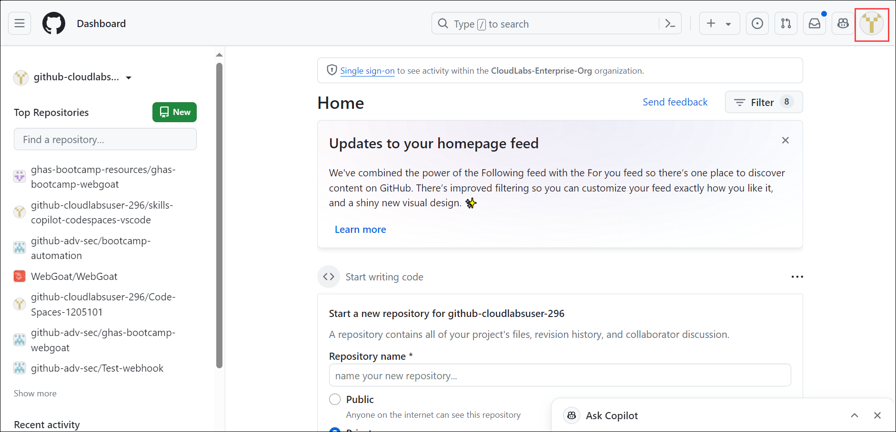 

1. Select **Your organizations**.

   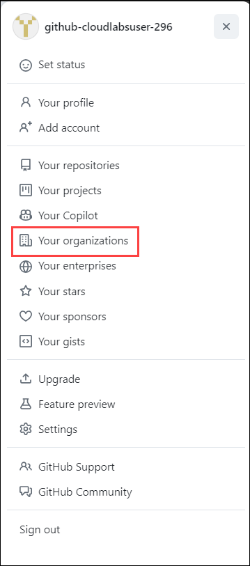 

1. Select **ghas-bootcamp-xxxx-xx-xx-cloudlabsxxx** from organizations.

   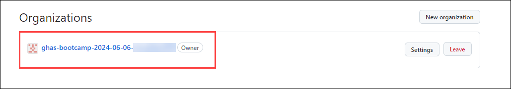 

1. Click on the **Repositories** **(1)** and select **.github** **(2)**.

   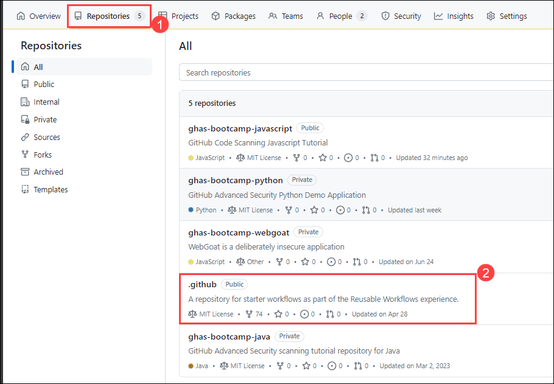 

1. In your repository, and click on **Settings**.

   

1. In the left sidebar, click on **Code security and analysis**.

1. Here, you can enable the features of **Dependabot**, **Code Scanning**, and **Secret Scanning** for the repository.

1. Click on the **Enable** option next to **Dependency Graph (1)** if it is not already enabled.

   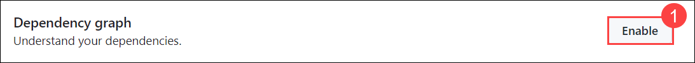      

   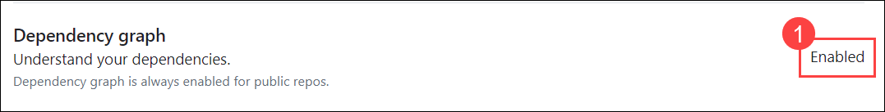

   > **Note:** By default, the **Dependency Graph** is enabled for public repositories. However, in this environment,if its not appear enabled initially. simply click **Enable** to activate it.

1. Click on **enable** button next to the, **Dependabot Alerts** **(2)**, **Dependabot security updates** **(3)**, **Grouped security updates** **(4)**, and **Dependabot on Actions runners** **(5)**.

   
   
1. Under **Code Scanning** option. Click on the **Setup** **(1)** button next to the CodeQL analysis from the drop down select **Default** **(2)** option.

   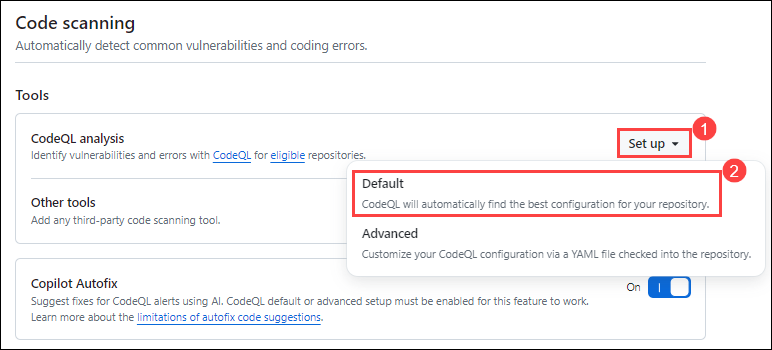

1. In the **CodeQL default configuration** pop-up, click on **Enable CodeQL** button.

   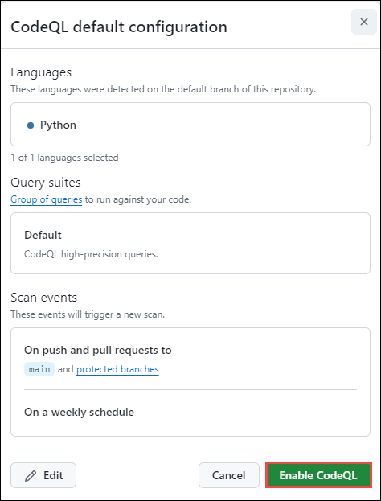

1. Under **Secret Scanning**, click on **enable**.

   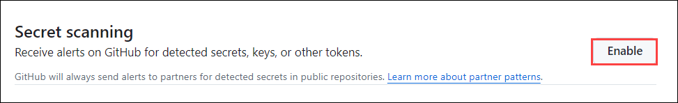

1. Select **Enable** butoon next to the activate Push Protection.

   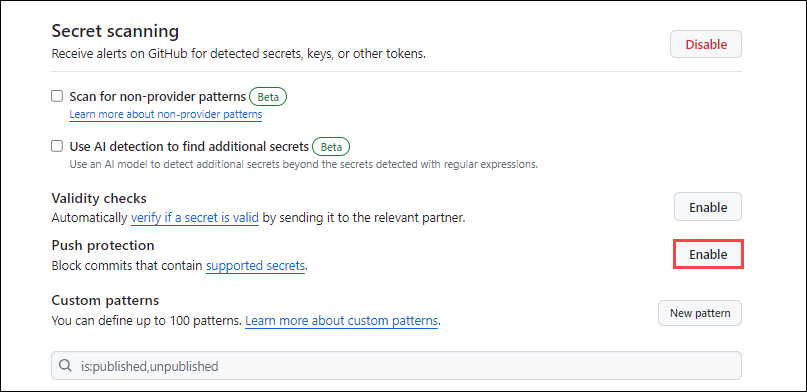

1. To review, navigate to your repository’s **Security** tab.

   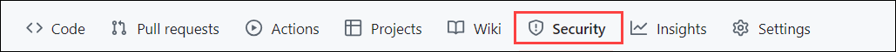

1. Here, you can review your alerts in the security overview.

   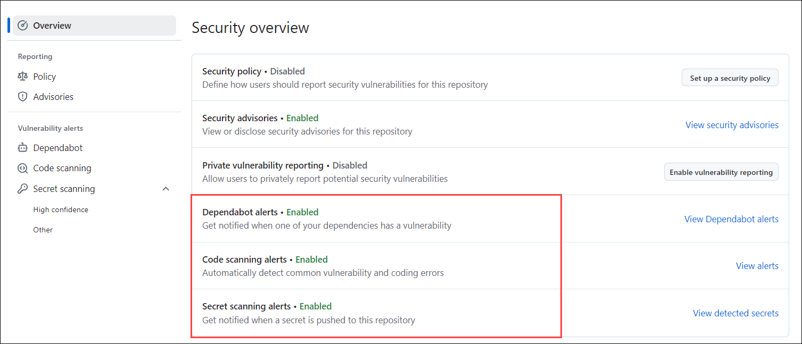

   >**Note:** Currently, we're demonstrating this process using a sample repository. Since the repository does not contain any files, thats leads to generate any security alerts. Refer to the screenshot below to understand how the alerts will appear when they are triggered in a repository containing relevant files.

   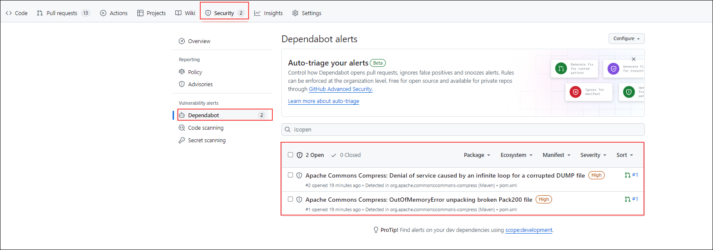
   
   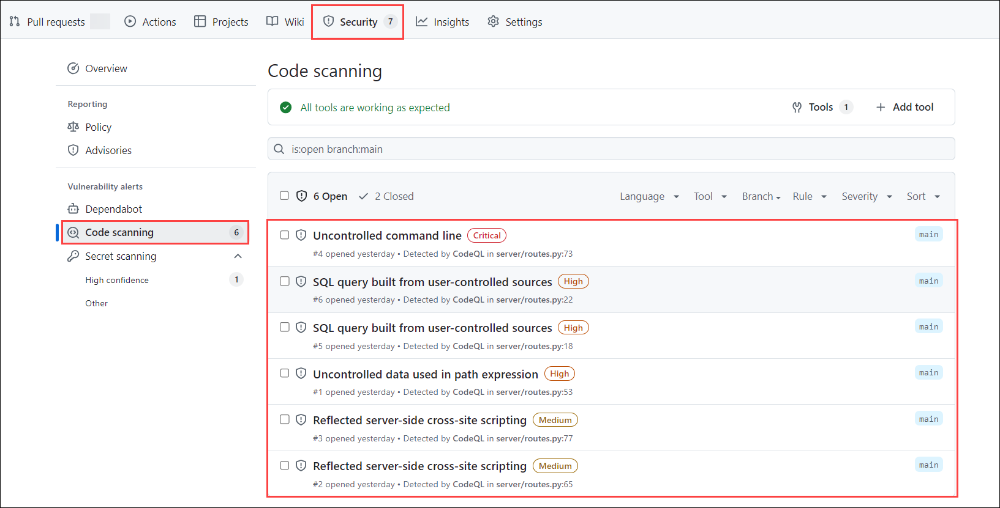

   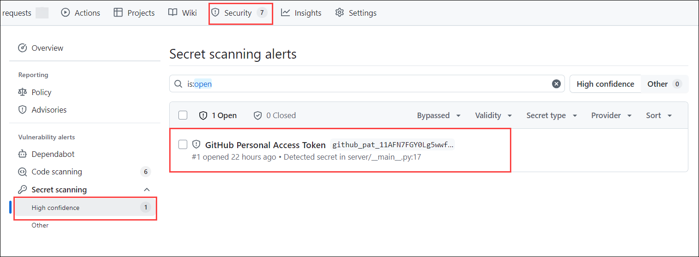

Please feel free to go through the links for further understanding:[GitHub Advanced Security](https://docs.github.com/en/get-started/learning-about-github/about-github-advanced-security) and [Spot Light on GitHub Advanced Security](https://developer.microsoft.com/en-us/reactor/series/S-1311/?wt.mc_id=promotional_S-1311_email_reactor)

## Review
 
In this lab, you have completed the following:
+ What is GitHub Advanced Security?
+ What are the components of GitHub Advanced Security?
+ Where to turn on the different components of GitHub Advanced Security at the repository level? 
