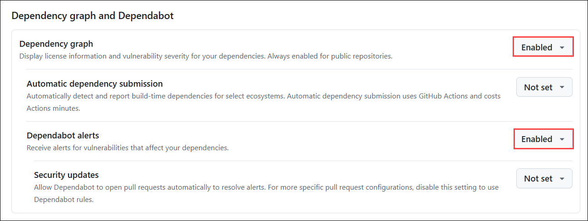
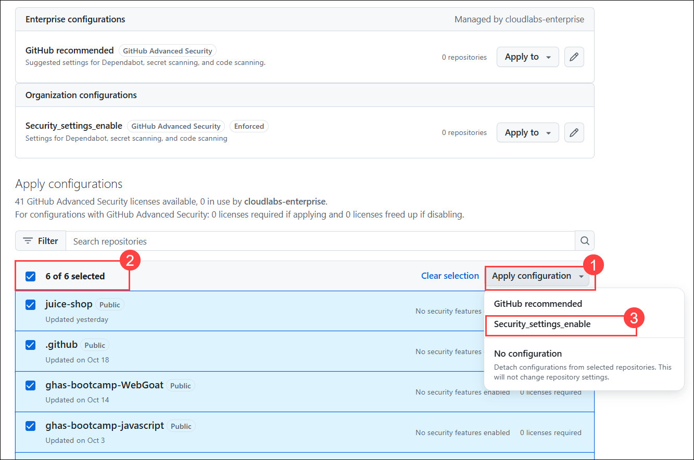

# Module 02:Enable Github Security configuration on your Organisation

## Lab Scenario

## Lab Objectives
In this lab, you will perform:

- Task 1: Applying GitHub-recommended security settings in your organization.
- Task 2: What are the components of GitHub Advanced Security?  
- Task 3: Where to turn on the different components of GitHub Advanced Security at the repository level?  

## Estimated Timing: 20 minutes

### Task 1: Applying GitHub-recommended security settings in your organization.

## About the GitHub-recommended security configuration

The GitHub-recommended security configuration is a collection of enablement settings for GitHub's security features that is created and maintained by subject matter experts at GitHub. The GitHub-recommended security configuration is designed to successfully reduce the security risks for low- and high-impact repositories. We recommend you apply this configuration to all the repositories in your organization.

Applying the GitHub-recommended security configuration to all repositories in your organization

1. On the **Home** page, click on your profile icon in the top right corner.

   

1. Select **Your organizations** from the dropdown menu.

   

1. Choose **ghas-bootcamp-xxxx-xx-xx-cloudlabsxxx** from the list of organizations.

   

1. Navigate to the repository and click on the **Settings** tab.

   

1. In the Settings menu, click-on **Configurations** under Code Security from the Security section.

   

1. Click on **New Configuration** to start creating a new security configuration for the repository.

   

1. The **Name** field should be filled with `Security_settings_enable`, which identifies the configuration's purpose. The **Description** should be `Settings for Dependabot, secret scanning, and code scanning`, offering a brief overview of what the configuration will accomplish.

   

1. Scroll down to the **Dependency graph and Dependabot** section. You'll find that all options are enabled by default. However, you have the flexibility to adjust these settings. You can modify the options to **Enable**, **Disable**, or leave them as **Not set** based on our requirements or preferences.

   
   

   >**Note:** Here, we are keeping this as default, enabled for Dependency Graph and Dependabot alerts.

1. In the **Code Scanning** section, the default setup for Code Scanning is enabled.

   

1. Scroll down to the **Secret scanning** section. You'll find that all options are enabled by default.

   

1. Leave the **Alerts** option set to **Enable**, and change the remaining options to **Not set**.

   

1. Finally, click **Save Configurations** to apply your changes.

   

1. On the **Apply Configuration** page, Click on **Apply Configuration (1),** select **All repositories (2)** to ensure the configuration applies universally. Next, click on the **Secret_Scanning_Enable (3)** configuration to select it. When prompted, click on **Apply** to implement the changes across all repositories in your organization. This will activate the secret scanning alerts for all repositories, helping to detect any exposed secrets or sensitive information.

   
