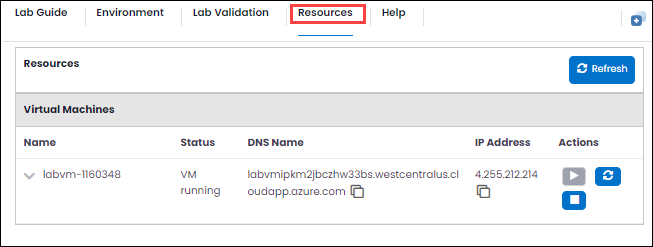
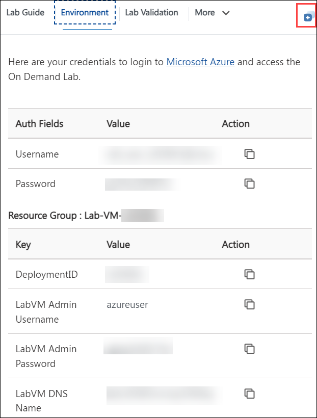

# Getting Started

**Duration:** 10 minutes

1. Once the environment is provisioned, a virtual machine and lab guide will be loaded into your browser. To complete the lab, utilize this virtual machine during the session.
 
   

1. To get lab environment details, you can select the **Environment Details** tab.

    

1. Also, you can **start, stop, and restart** the virtual machines from the **Resources** tab.

        

1. Click on **Next** from the bottom right and follow the instructions to perform the lab.

      

1. For convenience, you can open the lab guide in a separate window by selecting the **Split Window** button from the top right corner.

     

1. Feel free to use the **Zoom in/Zoom out** option in your respective browser to view the integrated environment clearly and to get the complete options in GitHub & VS Code.

    

## Login to GitHub

1. On the LABVM desktop, search for **Microsoft Edge** **(1)** and click on the **Microsoft Edge** **(2)** browser.

   

   >**Note**: On the **Welcome to Microsoft Edge** page, select **Start without your data**. On **Stay current with your browsing data**, select **Confirm and continue**. Then, on the **help for importing Google browsing data** page, select the **Continue without this data** button. Now, proceed to select **Confirm and start browsing** on the next page. It has a context menu.

1. Copy the link and open it in a browser window to log in to GitHub. 

   ```
   https://github.com/login.
   ```

2. In the sign-in to GitHub page in the Edge browser, enter the **GitHub UserEmail** and **GitHub Password** and click on **Sign in**.

   

   >**Note:** Navigate to the **Environment** tab to view the key-value pairs of the **GitHub Org User** and **GitHub Org Password**. You can use the copy buttons under the actions column to have the values copied instantly. Alternatively, it is suggested to have the values copied over onto a notepad for easy accessibility. 

    

1. Next, to get the authentication code, sign in to Outlook in the Lab VM through an **inPrivate** window (https://outlook.office365.com/mail/) with the GitHub credentials that were copied over to Notepad in the previous step. After logging into Outlook within the Lab Virtual Machine, locate the most recent email that contains the verification code, and then select **Verify** to return to the login screen.

   >**Note:** The email containing the verification code can sometimes creep into the archive/spam folders within your Outlook.
   
   
