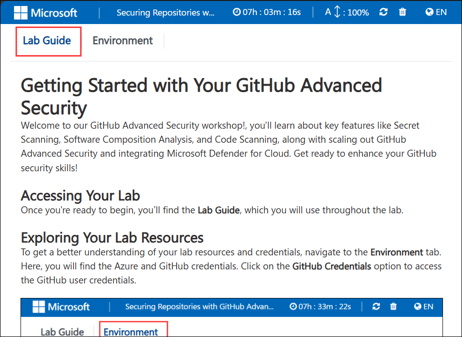
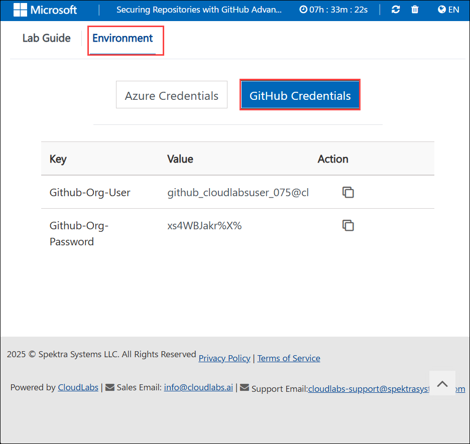
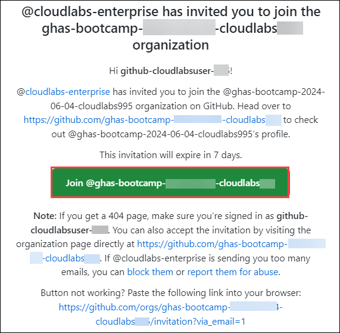
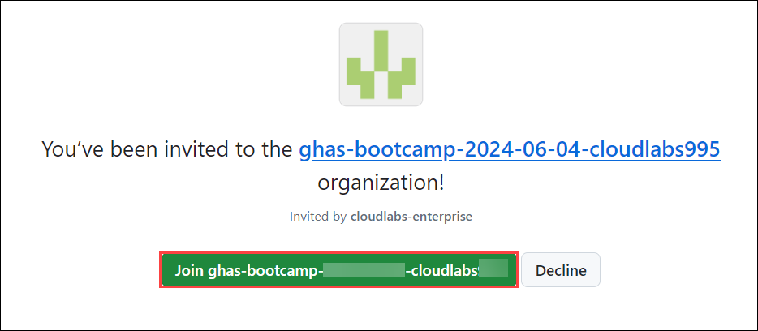
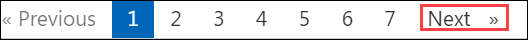

# Getting Started with Your GitHub Advanced Security


Welcome to our GitHub Advanced Security workshop!, you'll learn about key features like Secret Scanning, Software Composition Analysis, and Code Scanning, along with scaling out GitHub Advanced Security and integrating Microsoft Defender for Cloud. Get ready to enhance your GitHub security skills!

## Accessing Your Lab
 
Once you're ready to begin, you’ll find the **Lab Guide**, which you will use throughout the lab.

   

## Exploring Your Lab Resources
 
To get a better understanding of your lab resources and credentials, navigate to the **Environment** tab. Here, you will find the Azure and GitHub credentials. Click on the **GitHub Credentials** option to access the GitHub user credentials.

   

## Lab Guide Zoom In/Zoom Out
 
To adjust the zoom level for the environment page, click the **A↕ : 100%** icon located next to the timer in the lab environment.


## Login to GitHub

1. On your **computer or desktop**, search for any browser and open it. You can use any browser of your choice.

1. Copy the link and open it in a browser window to log in to GitHub 

   > **Note:** Open the link in a **New Private Window** and use only the provided GitHub credentials. Do not use your personal GitHub account.

   ```
   https://github.com/login
   ```

2. In the sign-in to GitHub page in the Edge browser, enter the **GitHub UserEmail** and **GitHub Password** and click on **Sign in**.

   

   >**Note:** Make sure to use the **GitHub credentials** allotted to you from the environment details page of your lab.
   
   >**Note:** Navigate to the **Environment** tab to view the key-value pairs of the **GitHub Org User**, and **GitHub Org Password**. You can use the copy buttons under the actions column to have the values copied instantly. Alternatively, it is suggested to have the values copied over onto a notepad for easy accessibility. 

    

1. Next, to get the authentication code, sign in to Outlook through opening a new tab with the **GitHub** credentials that were copied over to Notepad in the previous step. After logging into Outlook, locate the most recent email that contains the verification code, and then select **Verify** to return to the login screen.

   ```
   https://outlook.office365.com/mail/
   ```

   >**Note:** The email containing the verification code can sometimes creep into the archive/spam folders within your Outlook.
   
   

   >**Note:** Please do not enable Two-Factor Authentication (2FA) after logging into GitHub for this lab. To avoid complications, use GitHub user accounts as outlined in the lab instructions. This will help prevent any issues related to 2FA validation during the exercise.

1. Accept the GitHub invitation using the same Outlook account.

    

1. Click the invitation link to join, once it opens in Github.

    

1. Click "Next" from the bottom right corner to embark on your Lab journey!

   
