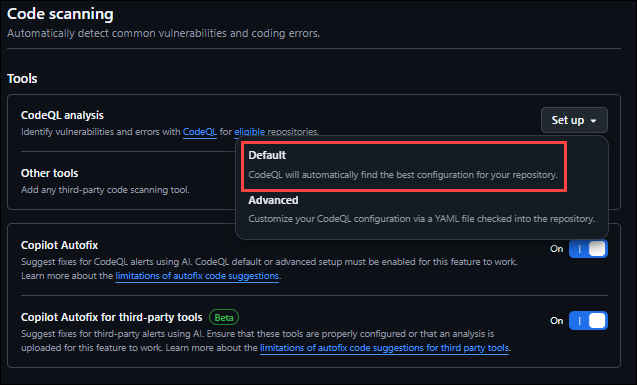
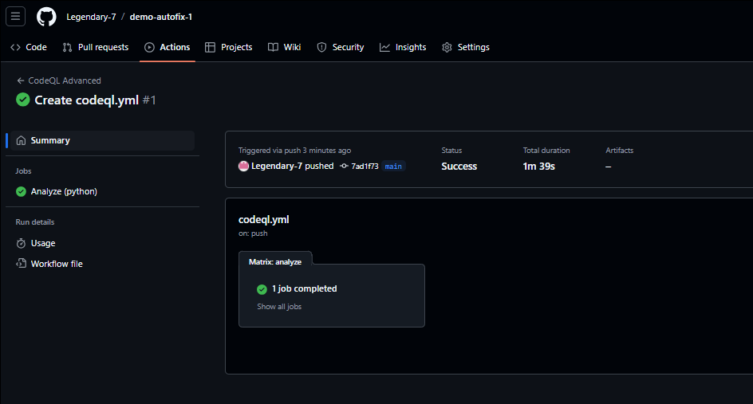
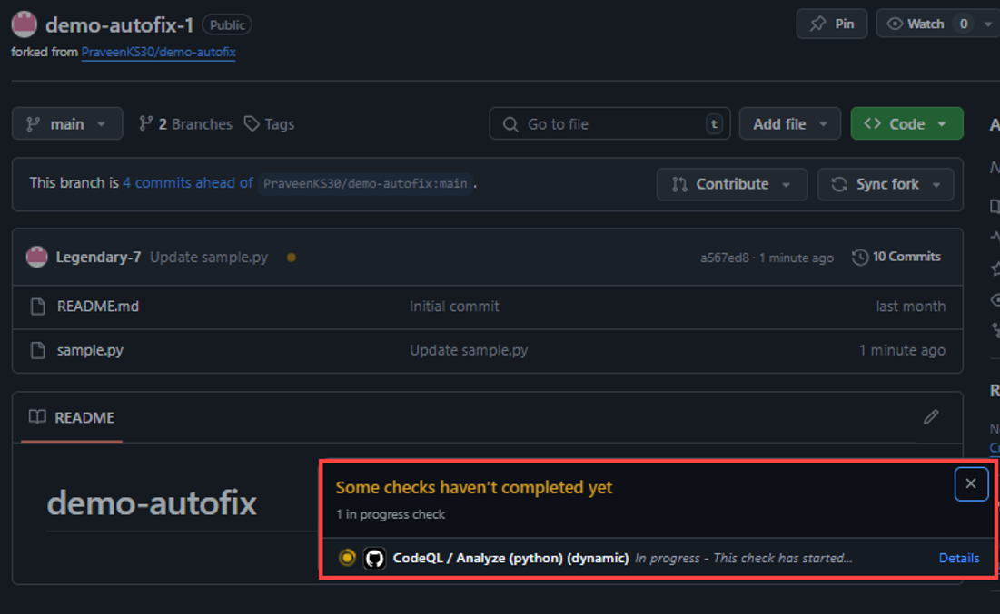
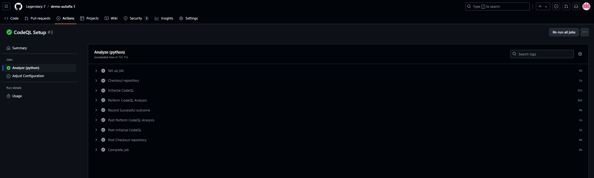
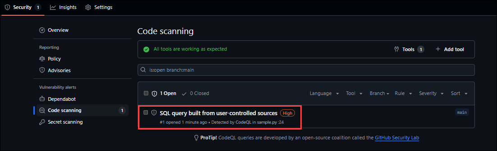
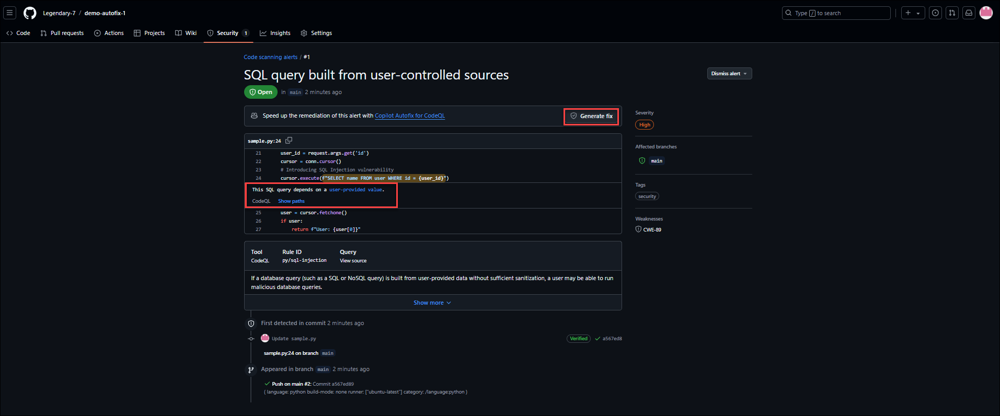
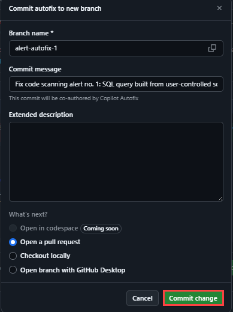
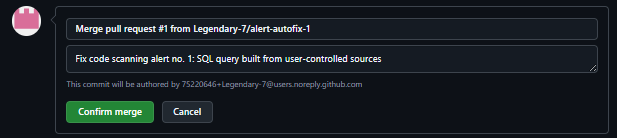
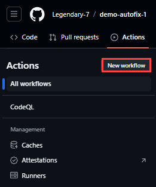
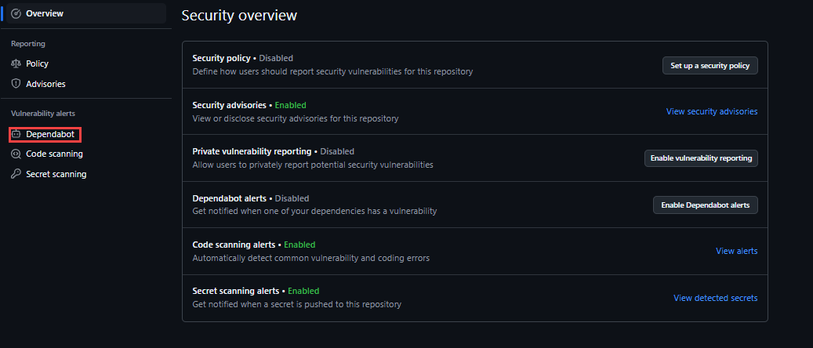

## GitHub Copilot Autofix 

## Overall Estimated Duration: 2 hour 

## Overview

In this lab, you’ll explore GitHub Autofix, a feature that provides automatic fixes for vulnerabilities found by CodeQL in your codebase. You will configure GitHub Autofix, run a code scan, and apply autofixes to identified vulnerabilities. The lab will guide you through setting up the necessary infrastructure, automating workflows using GitHub Actions, and leveraging GitHub Enterprise security features such as Code scanning, CodeQL alerts, and Dependabot. Additionally, you will implement monitoring and logging to enhance the security and performance of your application.

## Objectives

1. **Enable CodeQL code scanning**: Set up CodeQL in your GitHub repository to identify vulnerabilities by configuring the workflow and ensuring it runs successfully.

1. **Run a code scan**: Manually trigger a CodeQL scan to detect vulnerabilities and ensure the analysis is functioning correctly.

1. **Apply autofixes to vulnerabilities**: Review and apply autofixes suggested by GitHub Autofix, validate the fixes, and commit the changes.

1. **Automate workflows using GitHub Actions**: Set up GitHub Actions to automate workflows like building, testing, and deploying your application.

1. **Leverage GitHub Enterprise security features**: Explore features like Dependabot to manage dependencies and enhance your codebase security.

## Task 1: Enable CodeQL code scanning

1. In your GitHub repository, navigate to the Security tab,and then click on Code scanning alerts.

1. Click on configure scanning tool, click Set up code scanning, and then select Set up this workflow under CodeQL Analysis.

   

3. Click on Default and proceed

    

4. Review the workflow configuration in the .github/workflows/codeql.yml file, and then click on Start commit.

5. Commit the workflow file to your repository by clicking Commit new file.

> Note: Ensure that the CodeQL workflow is successfully added and the initial scan is completed.  


## Task 2: Create a code with potencial security vulnerabilities

1. Create a new file in the repository:
1. Navigate to your GitHub repository.
1. Click on the Add file button and select Create new file.
1. Name your file (e.g., app.py).
1. Write the code:

In the new file, write the code that includes potential security vulnerabilities. For example, you can use the following code snippet:
Python
 ```
from flask import Flask, request
import sqlite3
import os

app = Flask(__name__)

def init_db():
    conn = sqlite3.connect(':memory:')
    cursor = conn.cursor()
    cursor.execute("CREATE TABLE user (id INTEGER PRIMARY KEY, name TEXT)")
    cursor.execute("INSERT INTO user (name) VALUES ('Alice')")
    cursor.execute("INSERT INTO user (name) VALUES ('Bob')")
    conn.commit()
    return conn

conn = init_db()

@app.route('/user')
def get_user():
    user_id = request.args.get('id')
    cursor = conn.cursor()
    # Introducing SQL Injection vulnerability
    cursor.execute(f"SELECT name FROM user WHERE id = {user_id}")
    user = cursor.fetchone()
    if user:
        return f"User: {user[0]}"
    else:
        return "User not found", 404

if __name__ == '__main__':
    debug_mode = os.getenv('FLASK_DEBUG', 'False').lower() in ['true', '1', 't']
    app.run(debug=debug_mode)

```

6. Commit the changes:
- Scroll down to the Commit new file section. 
- Add a commit message describing the changes (e.g., “Add app.py with potential SQL Injection vulnerability”).
- Choose whether to commit directly to the main branch or create a new branch for this commit.
- Click on Commit new file to save your changes.

7. Verify the file:
Ensure that the file is created and the code is correctly saved in your repository.

## Task 3: Run a code scan

1. Navigate to the repository page and click on the yellow dot • and click on details which will navigate you to the workflow

    

2. Check the CodeQL workflow:
- Look for the CodeQL workflow in the list of workflows.
- Ensure that the workflow has run automatically after committing 
the changes.

3. Review the scan results:
- Click on the latest run of the CodeQL workflow to view the details.
- Check the results to see if any vulnerabilities were identified.

   

> Note: Ensure that the CodeQL scan completes successfully and identifies any vulnerabilities.

## Task 4: Apply autofixes to vulnerabilities

1. Navigate to the Security tab in your repository, and then click on Code scanning.

1. Review the list of vulnerabilities and click on an alert to view details.

    

3. If an autofix is available, click on Apply fix to automatically apply the suggested fix.

    

4. Commit the changes to your repository.

    

5. Make sure to merge and pull the request.

    

6. Autofix generates an updated text, just click confirm merge

    


> Note: Ensure that the autofixes are applied successfully and the vulnerabilities are resolved.

## Task 5: Automate workflows using GitHub Actions

1. Navigate to the Actions tab in your repository, and then click on New workflow.

    
1. Select a template or create a new workflow file.
1. Define the steps for your workflow, such as building, testing, and deploying your application.
> Here is an example for a workflow to run a Node.js application.
```
name: CI/CD Pipeline

on:
  push:
    branches:
      - main
  pull_request:
    branches:
      - main

jobs:
  build:
    runs-on: windows-latest

    steps:
      - name: Checkout code
        uses: actions/checkout@v2

      - name: Set up Node.js
        uses: actions/setup-node@v2
        with:
          node-version: '14'

      - name: Install dependencies
        run: npm install
        working-directory: ./path/to/your/project

      - name: Run tests
        run: npm test
        working-directory: ./path/to/your/project

  deploy:
    runs-on: windows-latest
    needs: build

    steps:
      - name: Checkout code
        uses: actions/checkout@v2

      - name: Deploy to server
        run: |
          echo "Deploying to server..."
          # Add your deployment commands here
        working-directory: ./path/to/your/project

```
4. Commit the workflow file to your repository.

> Note: Ensure that the workflow runs successfully and automates the desired tasks.

## Task 6: Leverage GitHub Enterprise security features

1. Navigate to the Security tab in your repository, and then click on Dependabot alerts.
> Note: If the alerts are disable for Dependabot, please follow these steps 
   - Click on Settings.
   - Click on Code security.
   - Enable Dependabot alerts.
    
   
2. Review the list of dependencies with known vulnerabilities.
3. Click on an alert to view details and follow the instructions to update the dependency.

>Note: Ensure that dependencies are updated and vulnerabilities are resolved.

## Summary
In this exercise, you have enabled CodeQL code scanning, configured GitHub Autofix, ran a code scan, applied autofixes to identified vulnerabilities, automated workflows using GitHub Actions, and leveraged GitHub Enterprise security features. 

## You have successfully completed the lab.
