# Module 02: Enable Github Security configuration on your Organisation

## Lab Scenario

In this task, you will apply the Security configuration to repositories within your organization. This configuration helps enable key security features such as Dependabot, Code Scanning, and Secret Scanning to reduce security risks.

The steps will guide you through enabling these settings, creating a security configuration, and applying it across all repositories.

## Lab Objectives
In this lab, you will perform:

- Task 1: Applying security settings in your organization.

- Task 2: Activate Actions for All Repositories

## Estimated Timing: 20 minutes

### Task 1: Applying security settings in your organization.

### About the security configuration

The GitHub-recommended security configuration is a collection of enablement settings for GitHub's security features that is created and maintained by subject matter experts at GitHub. The GitHub-recommended security configuration is designed to successfully reduce the security risks for low- and high-impact repositories. We recommend you apply this configuration to all the repositories in your organization.

Applying the security configuration to all repositories in your organization

1. On the **Home** page, click on your profile icon in the top right corner.

   

1. Select **Your organizations** from the dropdown menu.

   

1. Choose **ghas-bootcamp-xxxx-xx-xx-cloudlabsxxx** from the list of organizations.

   

1. Click on the **Settings** tab.

   

1. In the Settings menu, click-on **Configurations** under Code Security from the Security section.

   

1. Click on **New Configuration** to start creating a new security configuration for the repository.

   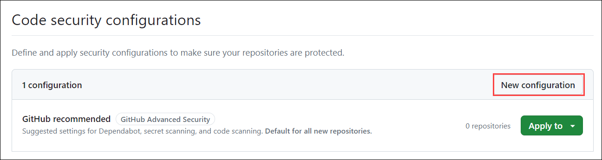

1. The **Name** field should be filled with `Security_settings_enable`, which identifies the configuration's purpose. The **Description** should be `Settings for Dependabot, secret scanning, and code scanning`, offering a brief overview of what the configuration will accomplish.

   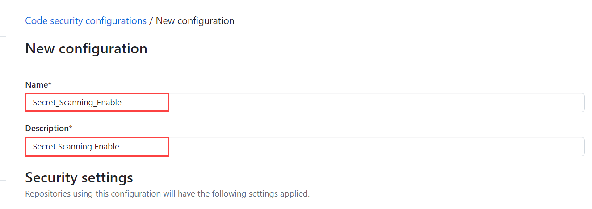

1. Scroll down to the **Dependency graph and Dependabot** section. You'll find that all options are enabled by default. However, you have the flexibility to adjust these settings. You can modify the options to **Enable**, **Disable**, or leave them as **Not set** based on our requirements or preferences.

   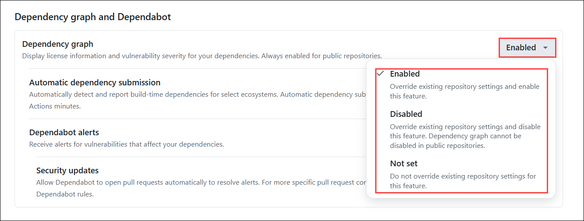
   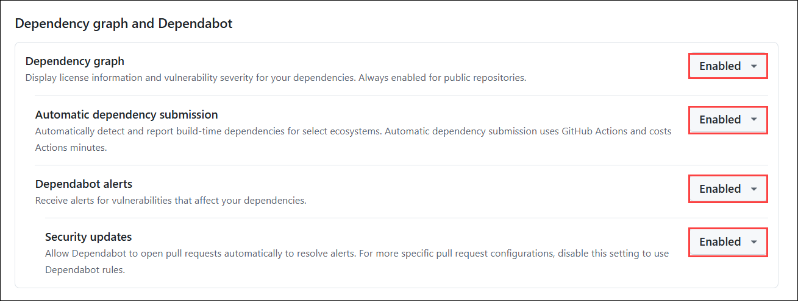

   >**Note:** Here, we will leave it set to the default.

1. In the **Code Scanning** section, the default setup for Code Scanning is enabled.

   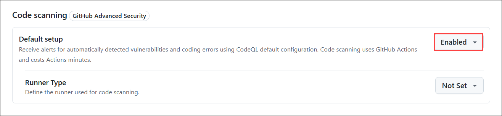

1. Scroll down to the **Secret scanning** section. You'll find that all options are enabled by default.

   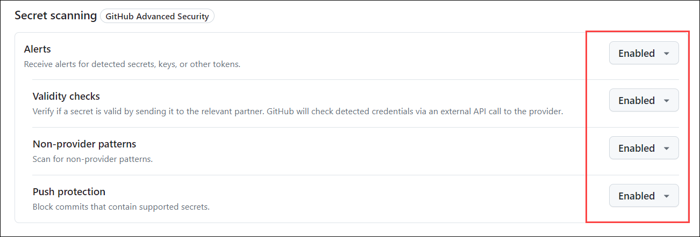

1. Leave the **Alerts** option set to **Enable**, and change the remaining options to **Not set**.

   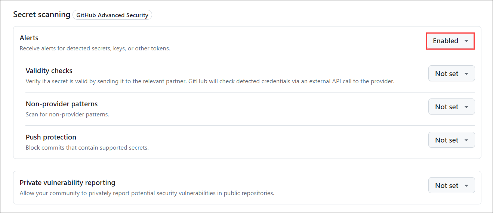

1. In the **Policy** section, next to **Enforce configuration**, select **Don't enforce** from the dropdown menu.

   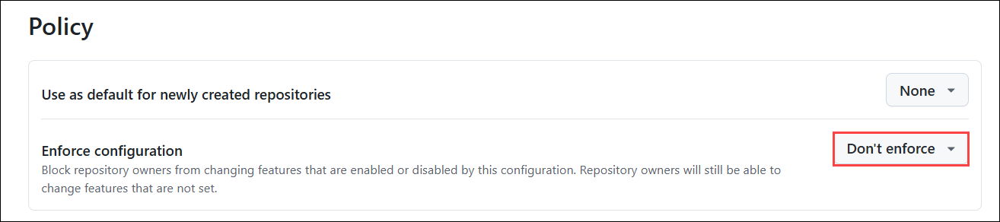

1. Finally, click **Save Configurations** to apply your changes.

   

1. On the **Apply Configuration** page, Click on **Select All (1)** , select **Apply Configuration (2)** to ensure the configuration applies universally. Next, click on the **Security_settings_enable (3)** configuration to select it. When prompted, click on **Apply** to implement the changes across all repositories in your organization. This will activate the secret scanning alerts for all repositories, helping to detect any exposed secrets or sensitive information.

   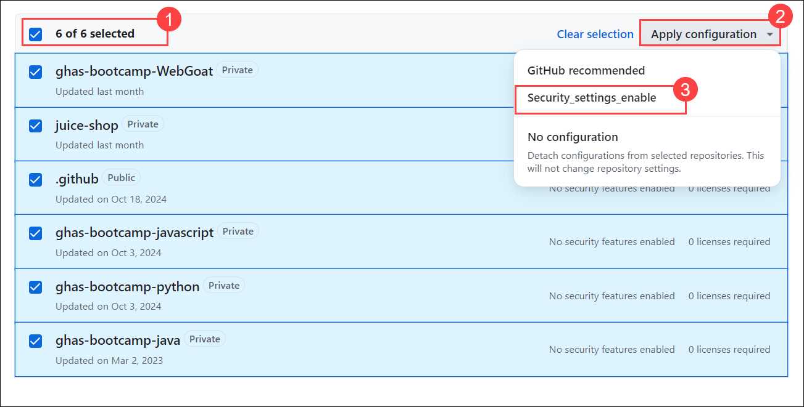

1. You will find that the organization configurations for **Security_settings_enable** are enforced on 6 repositories.

   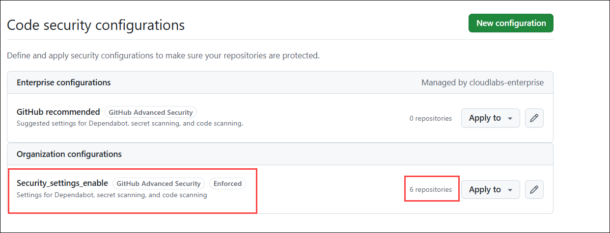

   >**Note:** If it’s not visible, please refresh your page.

1. In the **ghas-bootcamp-xxxx-xx-xx-cloudlabsxxx** organization, click on **Repositories** from the top navigation pane.

   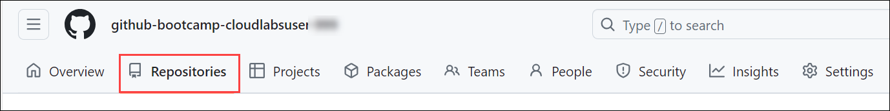

1. From the list of repositories, click on **ghas-bootcamp-WebGoat** to begin working through this module. 

   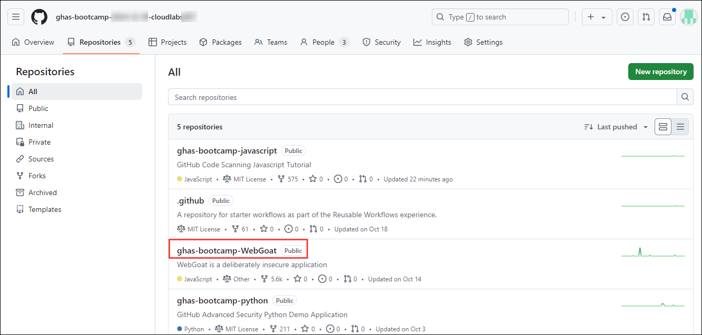

1. To review, navigate to your repository’s **Security** tab.

   

1. Here, you can review your alerts in the security overview.

   

   >**Note:** Here, you will find that the security features are enabled for the repository present in the organization. You will also find this in other repositories, and you are free to check them as well.

## Task 2: Activate Actions for All Repositories

GitHub Actions is a continuous integration and continuous delivery (CI/CD) platform that allows you to automate your build, test, and deployment pipeline. You can create workflows that run tests whenever you push a change to your repository, or that deploy merged pull requests to production. You will learn how to enable GitHub Actions for repositories to ensure workflows run seamlessly. This includes configuring the settings to allow all actions and reusable workflows.

1. Choose **ghas-bootcamp-xxxx-xx-xx-cloudlabsxxx** from the list of organizations.

   

1. Navigate to the repository and click on the **Settings** tab.

   

1. In the Settings menu, click-on **General** under **Actions** from the **Code, planning, and automation** section.

   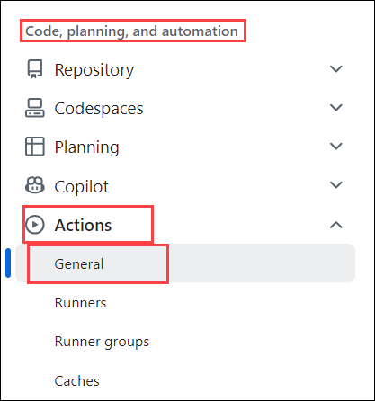

1. Select **Allow all actions and reusable workflows (1)**, and then click **Save (2)** to apply the changes.

   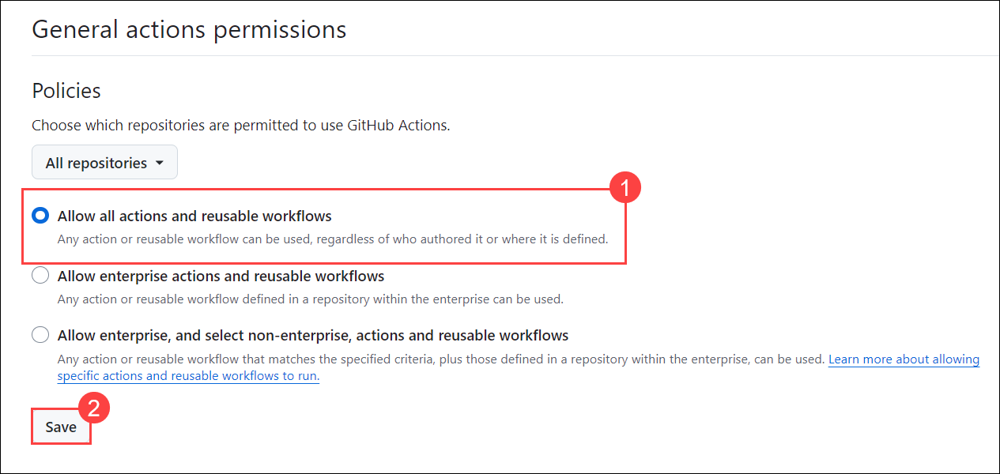

## Review

In this module, we have completed the following:

- Applying security settings in your organization
- Activate Actions for All Repositories
