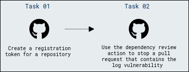
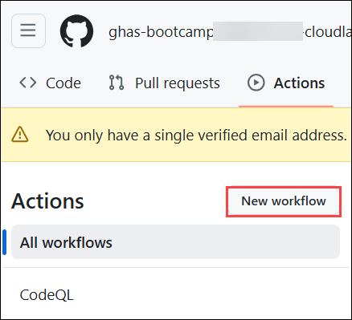
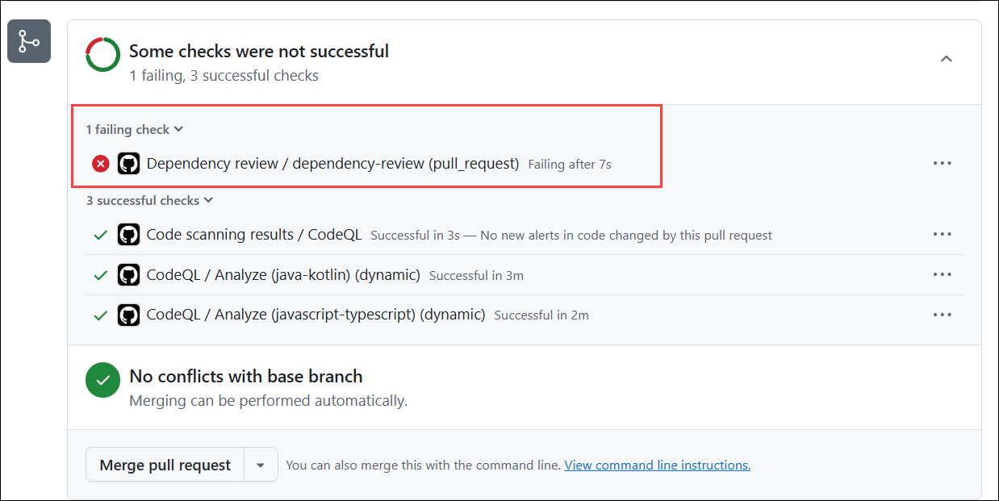
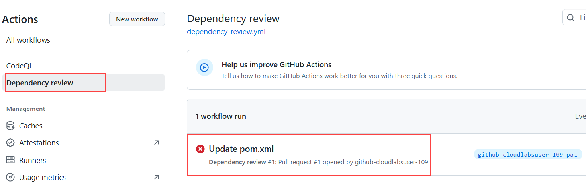

# Module 04: Software Composition Analysis

## Lab Scenario

In this lab, you will be focusing on improving security within your GitHub repositories using Dependabot and Software Composition Analysis (SCA) features.

## Lab Objectives

In this lab, you will perform:

- Task 1: Use the dependency review action to stop a pull request that contains the log vulnerability. 

## Architecture Diagram



## Estimated Timing: 40 minutes

## Task 1: Use the dependency review action to stop a pull request that contains the log vulnerability

### Dependency Review Action

The dependency review action is a GitHub Action designed for this purpose, preventing vulnerable dependencies from being merged into a repository. This action serves as a proactive measure to maintain the integrity and security of the repository by identifying and mitigating potential risks associated with third-party dependencies.

1. In the **ghas-bootcamp-webgoat** repo navigate to **Actions**, and in the **Actions**, click on **New workflow** from the left navigation pane.

   

   
 
1. Now, search **Dependency Review** to find and configure the action by clicking the **Configure** button.
   
   

1. In the  `fail-on-severity` in the workflow file and make sure you uncomment the line removing **#** as shown in the below screenshot and click on **Commit Changes** in the top right corner.

   >**Note**: Please ensure that the indentation is correct according to the provided screenshots. Make sure that the **fail-on-severity: low, moderate, high, critical** is directly below the **comment-summary-in-pr: always** line, as shown below:

   >**Note:** The default value of **fail-on-severity** will work as well, but here we demonstrate how to modify your severity level.

   
   

1. To ensure there are no mistakes in the code, as even a small indentation error can cause issues, you can use the code below and replace it with the existing one.

	```
	# Dependency Review Action
	#
	# This Action will scan dependency manifest files that change as part of a Pull Request,
	# surfacing known-vulnerable versions of the packages declared or updated in the PR.
	# Once installed, if the workflow run is marked as required, PRs introducing known-vulnerable
	# packages will be blocked from merging.
	#
	# Source repository: https://github.com/actions/dependency-review-action
	# Public documentation: https://docs.github.com/en/code-security/supply-chain-security/understanding-your-software-supply-chain/about-dependency-review#dependency-review-enforcement
	name: 'Dependency review'
	on:
	  pull_request:
	    branches: [ "main" ]
	
	# If using a dependency submission action in this workflow this permission will need to be set to:
	#
	# permissions:
	#   contents: write
	#
	# https://docs.github.com/en/enterprise-cloud@latest/code-security/supply-chain-security/understanding-your-software-supply-chain/using-the-dependency-submission-api
	permissions:
	  contents: read
	  # Write permissions for pull-requests are required for using the `comment-summary-in-pr` option, comment out if you aren't using this option
	  pull-requests: write
	
	jobs:
	  dependency-review:
	    runs-on: ubuntu-latest
	    steps:
	      - name: 'Checkout repository'
	        uses: actions/checkout@v4
	      - name: 'Dependency Review'
	        uses: actions/dependency-review-action@v4
	        # Commonly enabled options, see https://github.com/actions/dependency-review-action#configuration-options for all available options.
	        with:
	          comment-summary-in-pr: always
	          fail-on-severity: moderate
	        #   deny-licenses: GPL-1.0-or-later, LGPL-2.0-or-later
	        #   retry-on-snapshot-warnings: true
	
	```

1. If prompted, click on **Commit Changes** once again in the pop-up that appears.

   

1. Now back in the **ghas-bootcamp-webgoat** repository, go to the **pom.xml** file.

   
   
1. Add the provided code to the **WebGoat/pom.xml** file as shown in the screenshot by clicking on the pencil icon and delete the existing lines as mentioned.

   - **Security Vulnerabilities:** Log4j has been known to have critical security vulnerabilities. This vulnerability allowed attackers to execute arbitrary code on a server or other computer running Log4j, leading to severe security risks such as remote code execution.

   - **Impact:** If a project uses a vulnerable version of Log4j, it can be exploited by attackers to compromise the application or the server it runs on. This can lead to unauthorized access, data breaches, and other security issues. 

		```xml
		<dependency>
		   <groupId>org.apache.logging.log4j</groupId>
		   <artifactId>log4j-core</artifactId>
		   <version>2.13.1</version>
		</dependency>
		```

      

      

1. Click on **Commit Changes** and make sure you select **create a new branch** option and click on **Propose Changes** .

   

1. Click on **Create pull request**. 

   

1. On the **Open a pull request** tab, click on **Create pull request**. No need to merge the PR.   

   

1. Scroll down, You will see after few seconds that all the checks got failed due to the dependency review action.

   - **Dependency Review Action:** The Dependency Review action in GitHub Actions is designed to identify and mitigate risks associated with third-party dependencies, including libraries like `Log4j`. When a pull request introduces or updates a dependency, the action checks if the dependency has known vulnerabilities.

   - **Failure of Pull Requests:** If the Dependency Review action detects that a pull request introduces a version of `Log4j` (or any other dependency) that has known vulnerabilities, it will mark the pull request as failed. This is done to prevent merging code that could introduce security risks into the main codebase.

      

1. You can also see the error details on *Actions* section, navigate to **Action** section and from the left navigation pane, click on **Dependency review**. Notice the failed **Dependency review** due to the dependency review finding the introduction of a vulnerable `Log4j` version.

   

## Review

In this module, we have completed the following:
-  Used the dependency review action to stop a Pull Request that contains the log vulnerability
