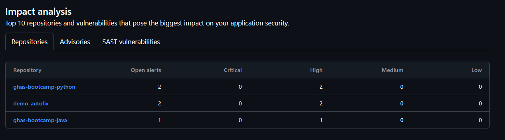

# Module 08: Security Campaign

## Lab Scenario

 In this lab, we’ll cover a series of tasks designed to provide a comprehensive understanding of creating, launching, tracking, and managing security campaigns.

## Lab Objectives
In this lab, you will perform:

- Task 1: Creating security camapaign
- Task 2: Launch a security campaign
- Task 3: Tracking Security Campaign
- Task 4: Editing and Closing/deleting Security Campigns

## Estimated Timing: 40 minutes

## Architecture Diagram

## Implementing a Comprehensive Security Campaign

### Task 1: Creating Security Camapaign

**Security Campaigns:** [GitHub Security Campaigns](https://docs.github.com/ja/enterprise-cloud@latest/code-security/code-scanning/managing-code-scanning-alerts/fixing-alerts-in-security-campaign) are a feature within GitHub Advanced Security designed to help teams address security vulnerabilities at scale. These campaigns use Copilot Autofix to suggest fixes for up to 1,000 code scanning alerts at a time, allowing developers and security teams to collaborate efficiently. By prioritizing and fixing these alerts, teams can significantly reduce security debt and improve the overall security of their codebase

1. On the **Home** page, click on your **profile** on top of the right hand.

    

1. Select **Your organizations**.

    

1. Select **ghas-bootcamp-xxxx-xx-xx-cloudlabsxxx** from organizations.

    

1. Navigate to your repository’s **Security** tab.

   

1. In the left sidebar, click on the **Start a new security campaign** next to "Campaigns" to begin creating a new campaign.

    

1. Choose a **Critical CodeQL Alert** template to use for the campaign.

- **Critical CodeQL Alert:** It indicates a severe security vulnerability detected by GitHub's CodeQL analysis. CodeQL is a powerful semantic code analysis engine that identifies potential security issues in your codebase. Critical alerts often require immediate attention to prevent exploitation12.

- **MITRE Top 10 KEV:** The MITRE Top 10 Known Exploited Vulnerabilities (KEV) list highlights the most critical and frequently exploited software weaknesses. These weaknesses are prioritized based on their prevalence and potential impact34. This reduces risk, prevents breaches and can help protect sensitive data.

- **SQL Injection (CWE-89):** It occurs when an application improperly neutralizes special elements in SQL commands. This allows attackers to manipulate SQL queries, potentially leading to unauthorized data access or modification. Mitigations include using parameterized queries, prepared statements, and input validation

- **Cross-Site Scripting (CWE-79):** It involves injecting malicious scripts into web pages viewed by other users. This can lead to data theft, session hijacking, or defacement. Preventing XSS involves proper input validation, output encoding, and using security frameworks that automatically handle these issues78.

    

7. Edit the **Campaign name** and **Short description**, define a **Campaign due date**, assign a **Campaign manager** as the primary contact, and finally, click **Create campaign** to initiate it.

    

8. It will display all the CodeQL Critical Alerts; next, open the dropdown for **juice-shop** to view its alerts.

    

9. Open **juice-shop**, select all its alerts, and from the right-hand panel, click **Commit autofix** and choose **Commit to new branch**.

    

10. Select the option to open a pull request, then click **Commit changes**.

    

11. Click on **Ready for review**.

    

12. Click on **Merge pull request** to finalize and integrate the changes into the main branch, then click on **Confirm merge**.

    
    

### Task 2: Launch a security campaign (Read only)

When you create a campaign all the alerts are automatically submitted to GitHub Copilot Autofix
to be processed as capacity allows. This ensures that suggestions for alerts found in pull requests
aren't delayed by a new campaign. In most cases, you should find that all suggestions that can be
created are ready within an hour. At busy times of day, or for particularly complex alerts, it will
take longer.

### Task 3: Tracking Security Campaign

When you create a campaign, the campaign tracking view is displayed and the campaign is listed in the sidebar of the **Security** tab for the organization. You can redisplay the campaign tracking view at any time by selecting it in the sidebar under "Campaigns".

1. Here, you can view the details of the **Campaign's progress** and **Status**, along with the alerts supported by **Copilot Autofix**.

- **In progress:** when at least one branch or pull request is created to fix the alert through the campaign view or the alert page.
- **Closed:** when the alert is fixed or dismissed, even if the development work was done outside the campaign framework.

    

1. Click on *Security* in the left sidebar.

1. In the sidebar, look for the Campaigns section. Here, you’ll see a list of active security campaigns.

1. Click on the specific campaign you want to check. This will take you to the campaign overview page.

1. On the campaign page, you can view the security alerts associated with that campaign. This includes details about the alerts, their status, and any actions taken.

  

### Task 4: Editing and Closing/deleting Security Campigns

There is a limit of 10 active campaigns. When a campaign is complete, or if you want to pause it, you should close it. When you close a campaign, it's no longer displayed for developers in the repository Security tab but you can still display the campaign tracking view to develop best practice. In addition, you can reopen a closed campaign from the "Closed campaigns" view, which is accessible from the sidebar in the Security tab of the organization.

1. On GitHub, navigate to the main page of the organization.

1. Under your organization name, click **Security**.

   

1. In the sidebar, under "Campaigns" click the name of the campaign to display the campaign tracking view.

1. In the campaign title row, click and select **Edit campaign**.

   

1. In the **Edit Campaign** section, you can update the **Campaign name**, **Short description**, **Campaign due date**, and **Campaign manager**. Once done, click on **Save changes** to apply the updates.

   

1. For deleting or closing the campaign select the required option **close campaign** or **delete campaign** by selecting the campaign.

- **Close campaign** to remove it from the active campaigns list and display it on the Closed campaigns view.
- **Delete campaign** to delete the campaign permanently. In the "Delete campaign" dialog, click Delete to confirm that you want to delete the campaign.

   

## Review

In this lab you have completed the following:

- Create a campaign from a template
- Create a campagin using custom filters
- Track Security Campaigns
- Edit and Close/delete Security Campigns
