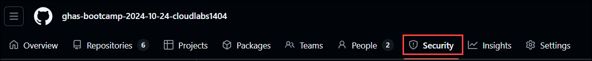
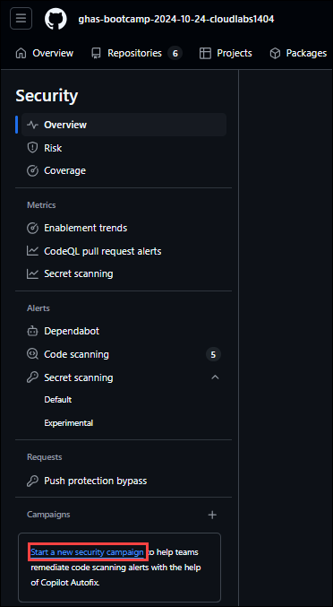
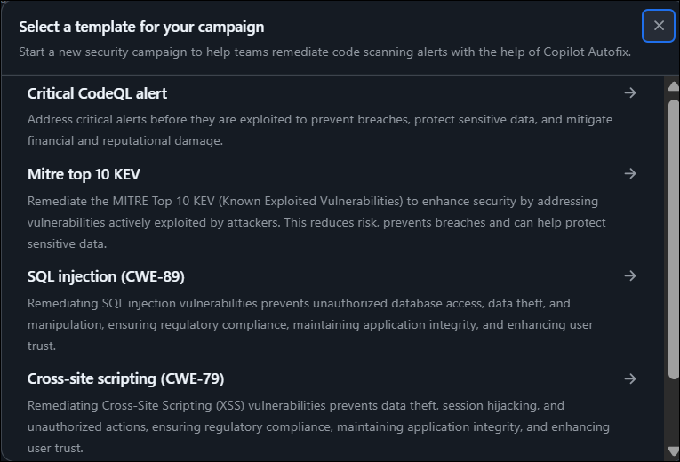
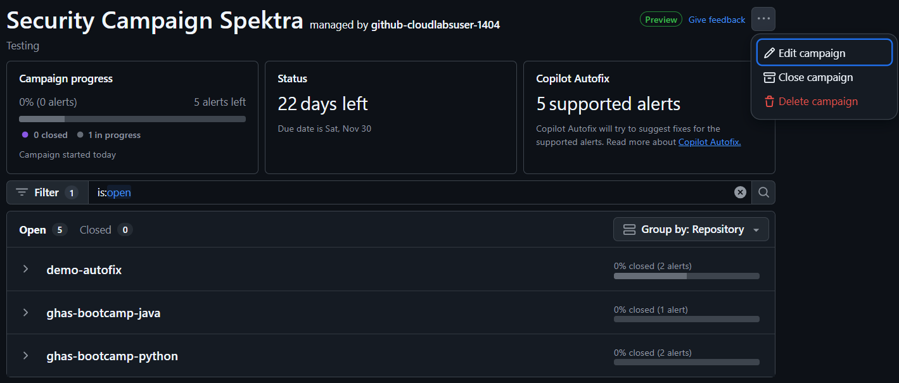

# Module 08: Security Campaign

## Lab Scenario

 In this lab, we’ll cover a series of tasks designed to provide a comprehensive understanding of creating, launching, tracking, and managing security campaigns.

## Lab Objectives

### Implementing a Comprehensive Security Campaign

- Task 1: Creating security camapaign
- Task 2: Launch a security campaign
- Task 3: Tracking Security Campaign
- Task 4: Editing and Closing/deleting Security Campigns

## Implementing a Comprehensive Security Campaign

### Task 1: creating security camapaign

#### 1. Creating a campaign 

1. On GitHub, navigate to the main page of the organization.
1. Under your organization name, click Security.

   

1. In the left sidebar, next to "Campaigns", click the icon to start creating a campaign.

    

1. Select a template for the campaign which suits best.

    

1. Edit the "Campaign name" and "Short description" to match your campaign needs and to link
to any resources that support the campaign.
1. Define a "Campaign due date" and select a "Campaign manager" as the primary contact for
the campaign (an owner or security manager of this organization).
1. When you're ready to create the campaign, click Create campaign.

### Task 2: Launch a security campaign (Read only)

When you create a campaign all the alerts are automatically submitted to GitHub Copilot Autofix
to be processed as capacity allows. This ensures that suggestions for alerts found in pull requests
aren't delayed by a new campaign. In most cases, you should find that all suggestions that can be
created are ready within an hour. At busy times of day, or for particularly complex alerts, it will
take longer.

### Task 3: Tracking Security Campaign

1. Click on *Security* in the left sidebar.
1. In the sidebar, look for the Campaigns section. Here, you’ll see a list of active security campaigns. 
1. Click on the specific campaign you want to check. This will take you to the campaign overview page.
1. On the campaign page, you can view the security alerts associated with that campaign. This includes details about the alerts, their status, and any actions taken

  

### Task 4: Editing and Closing/deleting Security Campigns

1. Click on *Security* in the left sidebar.
1. In the sidebar, under "Campaigns" click the name of the campaign to display the campaign
tracking view.
1. In the campaign title row, click and select Edit campaign.
1. In the "Edit campaign" dialog make your changes and then click Save changes.
1. For deleting or closing the campaign select the required option **close campaign** or **delete campaign** by selecting the campaign.

   

## Review

In this lab you have completed the following:

- Create a campaign from a template
- Create a campagin using custom filters
- Track Security Campaigns
- Edit and Close/delete Security Campigns
