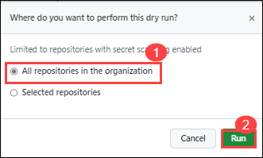
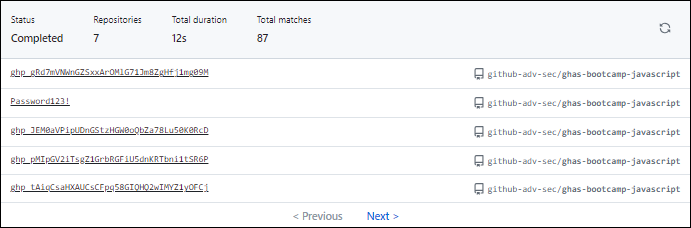

# Module 2: Secret Scanning

## Lab Scenario

## Lab Objectives
In this lab, you will perform:

- Task 1: Turn on secret scanning for the entire organization. Review results
- Task 2: Turn on push protection and try pushing a new secret (GitHub token) in a repository
- Task 3: Create a custom secret pattern and view the results 
- Task 4: Understanding the results 

## Getting Started

If you followed `Module 0 - Setup and Automation` you will have already enabled _GitHub Advanced Security_ at both the repository and the organization level. If you are starting this module without having taken these steps, below are the instructions for turning on these features at the organization level:

- Go to the Organization (`ghas-bc-HANDLE`) and then **Settings** -> **Code Security and Analysis** and click `Enable all` for _GitHub Advanced Security_. It may take several minutes for the repositories to all be flagged with GHAS enabled, so you may need to fill the time by discussing what Secret Scanning does before working through the module.

At the Organization level, `Enable all` for _Secret Scanning_. Also choose the checkboxes to opt in for new repos, validity checks, and non-provider patterns.

Once this is enabled, navigate to the `ghas-bootcamp-javascript` repository to begin working through this module. This repository should have at-least 4 secret scanning findings (as of Dec 12th, 2023).

## Task 1: Turn on secret scanning for the entire organization. Review results

## What is Secret Scanning?

In GitHub, secrets are any authentication credentials—like tokens or private keys—you might be using in a project to connect to an external service. If you commit a secret into a repository, anyone with read access to the repository can use it to access the external service with your privileges. That's where secret scanning comes into play.

Secret scanning is a GitHub Advanced Security feature that scans repositories for known types of secrets. It prevents the fraudulent use of secrets that were committed accidentally.

Secret scanning automatically scans your entire Git history on all branches present in your GitHub repository for any secrets. When a secret with a known pattern is committed into a private or public repository in your project, secret scanning sends a notification to all repository administrators about the commit that contains the secret. Repository administrators can then view the list of all detected secrets in the Security tab of the repository.

Before you share your screen, you'll want to start with a baseline understanding by first asking students what _they_ think Secret Scanning is. More often than not, students expect Secret Scanning to discover everything from AWS Credentials to hard-coded passwords like `Password123!`. Start by sharing what Secret Scanning can do out-of-the-box, and then mention _Custom Secret Patterns_ with plans to discuss it later in the module (time permitting).

  - As you walk through what Secret Scanning finds out-of-the-box, pull up the [Secret Scanning Patterns](https://docs.github.com/en/enterprise-cloud@latest/code-security/secret-scanning/secret-scanning-patterns) page to show which partner alerts we identify today. Make sure you are on the correct `Version` of the docs page when sharing this!

  - Next, show Secret Scanning in action by first reviewing the findings in `ghas-bootcamp-javascript`, followed by creating your own GitHub PAT and adding it to the code to show _Active Secrets_ detection.

1. To create a GitHub PAT token, go to your profile, and then select **Settings** -> **Developer settings** -> **Personal access tokens** -> **Tokens (classic)** and then clicking on **Generate new token** at the top and selecting **Generate new token (classic)**

  

2. Give your secret a name **Secret scanning** and set the **Expiration** to _"Custom..."_ and select the next calendar day. By default, no permissions are granted so scroll to the bottom and click **Generate token**. Once you've generated the token, click the "Copy" icon to the right of the secret value, and return to the `ghas-bootcamp-javascript` repository.

3. Open _index.js_ file and click the pencil icon on the top-right of the code block to edit it and add ` var secret = "Your-Secret-Value"` to the code.

   **Note:** Replace "Your-Secret-Value" with the secret value copied in the previous step. 

4. Commit this to the default branch (Click on I'll fix this later if asked), and then **navigate to the Security -> Secret Scanning** section to show how this is an active secret. **Please note** that it may take a moment for this secret to be discovered, and the commit author will receive an email once it has been found (as long as you are not ignoring the repository in your watch settings).

5. Once the secret is located in **Security** -> **Secret Scanning**, it's time to discuss validity checks for "Active" secrets. As of March 20th, 2023 we are currently working through the legal process to get agreement from our existing Secret Scanning partners on using endpoints to test whether key material is active. We have prioritized Cloud platforms first (Azure, AWS, and Google) as part of this process.

6. Validity checks help development and security teams prioritize remediation of known active secrets by rotating those credentials and updating the codebase. For secrets found in commit history, the Field Security team recommends using [BFG Repo Cleaner](https://rtyley.github.io/bfg-repo-cleaner/) to remove secrets in code history. The only _real_ way to secure a secret is to rotate that credential and leverage a secrets management platform to access that secret in code.

7. From here, go back to your profile, and then **Settings** -> **Developer settings** -> **Personal access tokens** -> **Tokens (classic)** and delete the secret you just pasted into the `ghas-bootcamp-javascript` repository. Once you've completed this step, go back to the **Security** -> **Secrets Scanning** section and review that the secret is now identified as a _"Possibly active secret"_.

## Task 2: Turn on push protection and try pushing a new secret (GitHub token) in a repository

1. Go to the `ghas-bootcamp-javascript` repository and enable Push Protection. Go to **Settings** -> **Code Security and Analysis** -> scroll down to **Push protection** and click **Enable**.

2. After this is enabled, we are going to go back through the process of creating a secret and pasting it into the codebase. Once again go to your profile, and then **Settings** -> **Developer settings** -> **Personal access tokens** -> **Tokens (classic)** and then clicking on **Generate new token** at the top and selecting **Generate new token (classic)**.

3. From here, give your secret a name **secret2** and set the **Expiration** to _"Custom..."_ and select the next calendar day. By default, no permissions are granted so it is safe to scroll to the bottom and click **Generate token**.

4. Once you've generated the token, click the "Copy" icon to the right of the secret value, and return to the `ghas-bootcamp-javascript` repository. Open up _index.js_, click the pencil icon on the top-right of the code block and add `var secret2 = "Your-Secret-Value"` to the code. Commit the changes with the default options to the to attempt to push the code. This will cause a **secret scanning** pop-up to appear, stopping you from committing your secret to the codebase.

    

    - This is a great opportunity to pause and discuss **WebHooks** - specifically how Security findings generate event driven outputs, which can be captured via Security Incident and Event Management (SIEM) integrations for monitoring and alerting. The important thing to mention here is that we take a "trust but verify" approach.

    - It's worth mentioning that we have all heard about companies experiencing outages when hard-coded secrets are removed, and in such situations business leaders are going to expect developers to bring the service back online. We allow for push protection bypasses to take place for exactly this reason. If this happens on a repository of consequence for a company - security teams are going to want to know about it, which is where **WebHooks** can make a difference.

5. Select the **It's used in tests** check box and click on **Allow secret** and commit the changes once again to push the code.

    

6. Finally, to show off how much importance we place on catching real secrets over modified / false positive secrets, we will go back through the process of creating a new personal acess token. Once again go to your profile, and then **Settings** -> **Developer settings** -> **Personal access tokens** -> **Tokens (classic)** and then clicking on **Generate new token** at the top and selecting **Generate new token (classic)**.

7. Once again, give your secret a name **secret3** and set the **Expiration** to _"Custom..."_ and select the next calendar day. By default, no permissions are granted so it is safe to scroll to the bottom and click **Generate token**.

8. Once you've generated the token, click the **Copy** icon to the right of the secret value, and return to the `ghas-bootcamp-javascript` repository. Open up _index.js_, click the pencil icon on the top-right of the code block and add `var secret3 = "Your-Secret-Value"` to the code. **BEFORE YOU COMMIT YOUR CODE** go ahead and add some random letters and numbers to the end of the GitHub Personal Access Token you've added.

    

9. Before you've committed your changes, ask the students what they expect to happen. Some will probably guess that you should see a **Secret scanning** pop-up. Other's will have clued into the importance of only flagging on real secrets, and will say that you should not see a pop-up. In the end, this will _NOT_ cause a **Secret scanning** pop-up to appear. It's important to once-again reiterate that we focus on Push Protecting against secrets that we are highly confident are real, and that match the patterns expected from the algorithms are partners use to generate their credential material.

## Task 3: Create a custom secret pattern and view the results 

1. Within the `ghas-bootcamp-javascript` repo there is a secret disclosed on line 27 of the file `index.js`. To discover secrets like this, we will go into this repository's **Settings** -> **Code Security and Analysis** -> **Secret Scanning** section and then click on the button **New pattern**.

    

1. When creating a new pattern, first supply a name **Test-Pattern(1)** and enter a test string for the pattern **api-password: "gH4#kP!2w_"(5)**. Because writing regular expression patterns can be challenging, we recommend using something like _GitHub Copilot_ or [Regex101.com](https://regex101.com/) to help with this process. You can also refer to the Field Security team's open source [custom-pattern-secrets](https://github.com/advanced-security/secret-scanning-custom-patterns) repository which contains a number of useful examples.

1. Using the [Generic Secrets / Passwords](https://github.com/advanced-security/secret-scanning-custom-patterns/tree/main/generic) from the Field Security team's repository, we grab the following pattern format:

    - ``[a-zA-Z0-9!.,$%&*+?^_`{|}()[\]\\/~-][a-zA-Z0-9\t !.,$%&*+?^_`{|}()[\]\\/~-]*``

    - You will also want to add a couple of values to the **Before secret** and **After secret** values. The following can be used for the **Before Secret(3)**:

    - `(?:\A|[^a-zA-Z0-9])(?i)(?:api|jwt|mysql)?[_.-]?(?:[Pp]ass?(?:wo?r?d|code|phrase)|[Pp]wd|secret)[\t ]*(={1,3}|:)[\t ]*(?:["']|b["'])?`

    - The **After secret(4)** that works in our example is as follows:

    - `(\z|[\r\n'"])`

     

1. Click **Save and dry run** to discover two values of concern - the first being the GitHub Personal Access Token we corrupted earlier, and the second being the `Password123!` value mentioned earlier.

    

1. This example captures everything we expect to see in a single repository - which can hold up to 100 patterns. Let's go ahead and apply this to the organization level by going to the `github-adv-sec` and clicking **Settings** -> **Code security and analysis** -> **Secret scanning** and click the green **New pattern** button. Please note that the Organization can hold up to 500 custom patterns.

1. Go ahead and apply the same pattern we used earlier at the repository level and click **Save and dry run**. You'll get a pop-up asking where to apply this secret; click the top radial that indicates **All repositories in this organization**. The UI will then indicate that the dry run is queued - which is usually a great time to take a 10 or 15 minute break.

    

    

1. Wrap up this section by refreshing the page and doing a cursory review of the findings. You'll notice there are some false positives identified with the custom pattern we've written - if you're doing this in a two day format, encourage the students to spend some time refining the pattern further using the **Add requirement** button and see what they can come up with.

1. Even if you're doing this in a one-day format, it's worth highlighting the value of performing the **Dry run** before publishing the pattern to avoid notifying developers of false positives.

    

## Task 4: Understanding the results 

In this task, we delve into comprehending the outcomes of secret scanning.

1. We navigated through the repository's findings and demonstrate how Secret Scanning identifies potential vulnerabilities, followed by a practical demonstration of adding a GitHub Personal Access Token (PAT) to the codebase to exemplify Active Secrets detection.

1. After identifying active secrets, we discuss the significance of validity checks in prioritizing remediation efforts.

1. Next, we enable Push Protection in the ghas-bootcamp-javascript repository and simulate attempting to push a new secret.

1. We created  custom secret patterns to uncover specific types of sensitive information.

## Review

In this lab we have completed the following:
 - Turned on secret scanning for the entire organization.
 - Turned on push protection and tried pushing a new secret (GitHub token) in a repository
 - Created a custom secret pattern 
