# Module 02: Secret Scanning

## Lab Scenario

This lab guides users through enabling GitHub secret scanning for an organization, implementing push protection, creating custom secret patterns, and understanding the scanning results. By simulating the addition of GitHub Personal Access Tokens to repositories, users witness how secret scanning identifies and blocks active secrets. Thus emphasizing the importance of securing sensitive information within codebases. Through practical exercises, users gain insights into the role of secret scanning in mitigating security risks and maintaining the integrity of repositories.

## Lab Objectives
In this lab, you will perform:

- Task 1: Turn on secret scanning for the entire organization and review results
- Task 2: Turn on push protection and try pushing a new secret (a GitHub token) into a repository
- Task 3: Create a custom secret pattern and view the results 
- Task 4: Understand the results 

## Estimated Timing: 60 minutes

## Architecture Diagram

   

## Task 1: Turn on secret scanning for the entire organization and review results

## What is secret scanning?

In GitHub, secrets are any authentication credentials—like tokens or private keys—you might be using in a project to connect to an external service. If you commit a secret to a repository, anyone with read access to the repository can use it to access an external service with your privileges. That's where secret scanning comes into play.

Secret scanning is a GitHub Advanced Security feature that scans repositories for known types of secrets. It prevents the fraudulent use of accidentally committed secrets.

Secret scanning automatically scans your entire Git history on all branches present in your GitHub repository for any secrets. When a secret with a known pattern is committed to a private or public repository in your project, secret scanning notifies all repository administrators about the commit that contains the secret. Repository administrators can then view the list of all detected secrets in the **Security** tab of the repository.

### Turn on Secret scanning for the entire organization. [Read Only]

1. On the **Home** page, click on your profile icon in the top right corner.

   

2. Select **Your organizations** from the dropdown menu.

   

3. Choose **ghas-bootcamp-xxxx-xx-xx-cloudlabsxxx** from the list of organizations.

   

4. Navigate to the repository and click on the **Settings**tab.

   

5. In the Settings menu, click-on **Configurations** under Code Security under Security section.

   

6. Click on **New Configuration** to start creating a new security configuration for the repository.

   

7. The **Name** field should be filled with `Secret_Scanning_Enable`, which identifies the configuration's purpose. The **Description** should be `Secret Scanning Enable`, offering a brief overview of what the configuration will accomplish.

   

8. Scroll down to the **Secret Scanning** section. You'll find that all options are enabled by default. However, you have the flexibility to adjust these settings. You can modify the options to **Enable**, **Disable**, or leave them as **Not set** based on our requirements or preferences.

   

   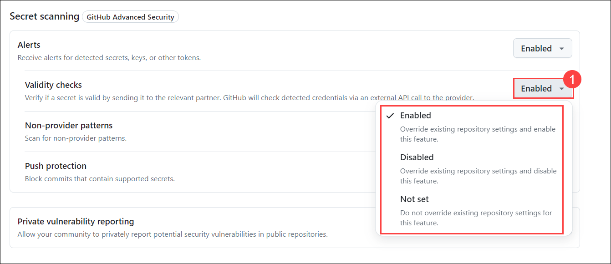   

9. Leave the **Alerts** option set to **Enable**, and change the remaining options to **Not set**. Finally, click **Save Configurations** to apply your changes.

   

9. On the **Apply Configuration** page, select **All repositories** to ensure the configuration applies universally. Next, click on the **Secret_Scanning_Enable** configuration to select it. When prompted, click on **Apply** to implement the changes across all repositories in your organization. This will activate the secret scanning alerts for all repositories, helping to detect any exposed secrets or sensitive information.

   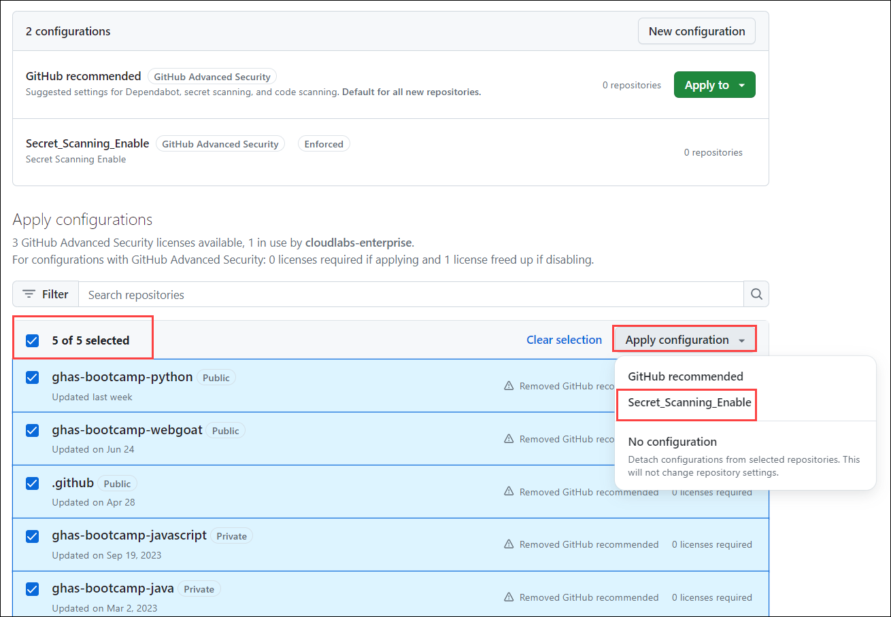

## What is Personal Access Tokens?

Personal access tokens or (PAT) are an alternative to using passwords for authentication to GitHub when using the GitHub API or the command line.

Personal access tokens are intended to access GitHub resources on behalf of yourself. Users can generate PATs in their GitHub account settings and configure the specific permissions and scopes for the token, limiting what actions it can perform.
 
Refer to the link for more information. [Personal Access Tokens](https://docs.github.com/en/authentication/keeping-your-account-and-data-secure/managing-your-personal-access-tokens)

## Why are we using PAT Tokens?

In this lab, Personal Access Tokens (PATs) are used as example secrets to demonstrate how GitHub’s secret scanning and push protection features work. Here’s why PATs are chosen for this exercise:

- **Common Sensitive Data**: PATs are a common type of sensitive data that developers often accidentally commit to repositories. They provide a clear example of the kind of secrets that secret scanning is designed to detect and protect against.

- **Realistic Scenario**: Using PATs creates a realistic scenario. PATs are real credentials that can be used to access GitHub’s API and perform actions on behalf of the user. This makes them a tangible example of how secret scanning prevents unauthorized access.

- **Demonstration of Detection**: By using PATs, you can easily show how secret scanning identifies sensitive information in the codebase. This demonstrates the effectiveness of GitHub's security features in detecting and alerting on potential security risks.

- **Educational Purpose**: PATs are widely understood by developers, making it easier for them to grasp the concept and importance of secret scanning. The exercise involves generating PATs, which helps users learn how to manage and secure their own tokens and other secrets.

  >**Note:** Make it clear that generating a PAT is a prerequisite for testing secret detection, but it's not required for setting up secret scanning itself.

  >**Note:** If you haven't already **signed in** to GitHub, proceed to the Getting Started page and complete steps **1** through **4** of the **Login to Github** form.

1. To create a GitHub PAT token, go to your profile on top of the right hand, and then select **Settings**.

   

1. Go to **Developer settings** -> **Personal access tokens (1)** -> **Tokens (classic) (2)**, and then click on **Generate new token (3)** and select **Generate new token (classic) (4)**.

   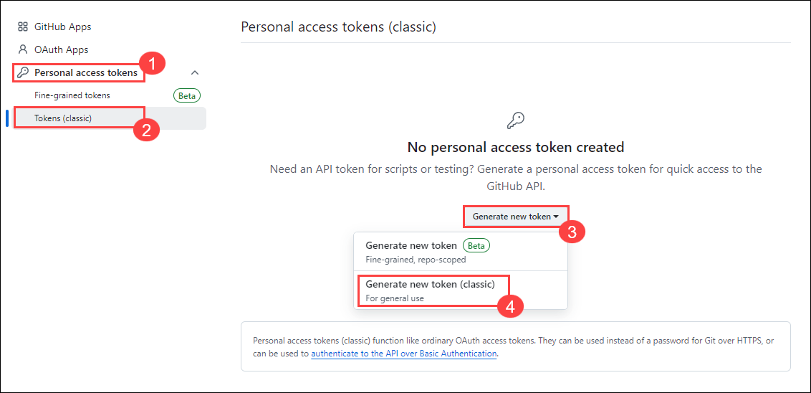

1. Give your secret a name **Secret01**, and set the **Expiration** to **_"Custom..."_** and select the next calendar day. By default, no permissions are granted, so scroll to the bottom and click on **Generate token**. Once you've generated the token, click the **"Copy"** icon to the right of the secret value.

   

     

1. Go to your profile on top of the right hand, and then select **Your organizations**.

    

1. Select **ghas-bootcamp-xxxx-xx-xx-cloudlabsxxx** from organizations.

    

1. Click on **Repositories** and select **ghas-bootcamp-javascript**.

    

1. In the ghas-bootcamp-javascript repository navigate to **Settings** from the top navigation pane.

   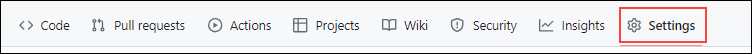

1. From the left navigation pane, click on **Code Security**.

   

1. Scroll down to **Secret Scanning**, click on **enable**.

   

   > **Note:** Ensure that **Push Protection** is disabled to properly perform and understand the task.

1. Navigate to **Code** from the top navigation pane.

   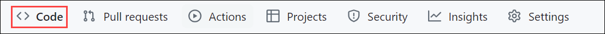
   
1. Open the **_index.js_** file and click the pencil icon at the top-right of the code block to edit it. Add **` var secret = "Your-Secret-Value"`** to the code, and click on **Commit changes**.

   

     

   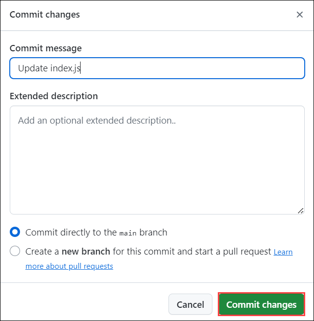      

   >**Note:** Replace **"Your-Secret-Value"** with the secret value copied in the step 3.  

1. When pop-up is prompted select **Allow Secret** **(1)**.

   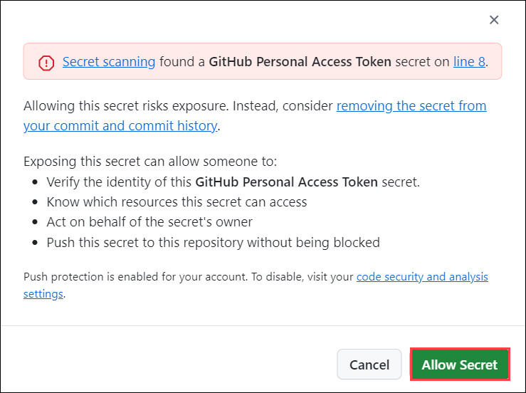

1. Click on **Commit changes** again and commit directly to default branch.

   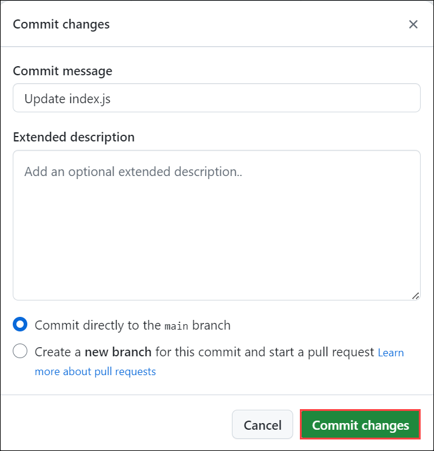    

1. Then navigate to the **Security**, expand **Secret Scanning** section and select **Default** to show how this is an active secret.

   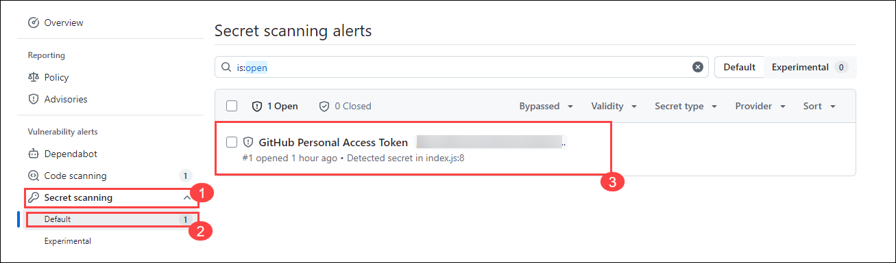

   > **Note:** If secret scanning is not enabled in your repository, go to the **Settings** tab in the repository and click on **Code Security** option from the left navigation pane to view the option.
   
   > **Note:** It may take a moment for this secret to be discovered, and the commit author will receive an email once it has been found (as long as you are not ignoring the repository in your watch settings).

1. Review the secret is identified as  _"Possibly active secret"_. You will be able to see the secret value and other details related to the same. and get to know how you can remediate the secret. 

   

   > **Note:** This indicates that the secret is currently in use or could be actively exploited. It is important to address these findings promptly. To Remove the Secret from the Codebase: Edit the repository to remove the secret from the codebase and commit the changes. For now there is no need of removing the secret in this task.

   > **Congratulations** on completing the task! Now, it's time to validate it. Here are the steps:
	
   - Hit the Validate button for the corresponding task. If you receive a success message, you can proceed to the next task.

   > **Note:** Upon clicking the **Validate** button for this exercise, you'll receive a prompt to input your Organization name. Provide your **Organization name** which looks like **ghas-bootcamp-xxxx-xx-xx-cloudlabsxxx**.
    
   > **Note:** Make sure to update the name of your organization, **ghas-bootcamp-xxxx-xx-xx-cloudlabsxxx**.
    
   
   
   - If not, carefully read the error message and retry the step, following the instructions in the lab guide.
   - If you need any assistance, please contact us at labs-support@spektrasystems.com. We are available 24/7 to help you out.
    
<validation step="48341224-6086-4ce1-a337-9ec19e1e9582" />

## Task 2: Turn on push protection and try pushing a new secret (GitHub token) in a repository

In this task, you will enable push protection to prevent secrets from being committed to a repository and test its effectiveness. Begin by verifying if push protection is already enabled in the repository; if not, enable it in the repository settings. Generate a new PAT to use as a test secret for push protection. Modify the repository code to include the new PAT and attempt to commit the changes. Observe how push protection detects the secret and blocks the commit. Discuss how push protection behaves in different scenarios, including the handling of bypasses.

   >**Note:** Reusing the same secret from Task 1 may not trigger push protection if it was already committed; consider demonstrating with a new, slightly altered secret.

In this task, you will enable push protection to prevent secrets from being committed to a repository and test its effectiveness. Begin by verifying if push protection is already enabled in the repository; if not, enable it in the repository settings. Generate a new PAT to use as a test secret for push protection. Modify the repository code to include the new PAT and attempt to commit the changes. Observe how push protection detects the secret and blocks the commit. Discuss how push protection behaves in different scenarios, including the handling of bypasses.

1. Go to the **`ghas-bootcamp-javascript`** repository and enable push protection. Navigate to **Settings**, click on **Code security** under Securilty. 
   
   

1. scroll down to **Push protection** under Secret scanning and click **Enable**.

   

   >**Note**: If it's already enabled, then there is no need to change it.

1. After this is enabled, we are going back through the process of creating a secret and pasting it into the codebase.

1. Navigate back to your profile, which is at the top of your right hand, and then select **Settings**.

   

1. Scroll down and select **Developer settings**.

1. In the Developer Settings page expand **Personal access tokens** **(1)**, click-on **Tokens (classic) (2)**, then click on **Generate new token** **(3)** , and click-on **Generate new token (classic) (4)**.

   

1. In the New personal access token, provide secret a name, **secret2**, set the **Expiration** to **_"Custom..."_** and select the next calendar day. By default, no permissions are granted, so it is safe to scroll to the bottom and click on **Generate token**.

   

1. Once you've generated the token, click on the **"Copy"** icon to the right of the secret value.

     

1. Navigate to the **`ghas-bootcamp-javascript`** repository.
  
1. Click on **_index.js_**, click the edit icon on the top-right of the code block, and add **`var secret2 = "Your-Secret-Value"`** to the code. Commit the changes with the default options to the attempt to push the code. 

    

       

    >**Note**: This will cause a **secret scanning** pop-up to appear, stopping you from committing your secret to the codebase.

    

10. Select the **It's used in tests** check box, click on **Allow secret**, and commit the changes once again to push the code.

    

11. Navigate to the **Security** -> **Secret Scanning** -> **Default**. Change the finding option to the **Closed** section to demonstrate that this is a secret.

    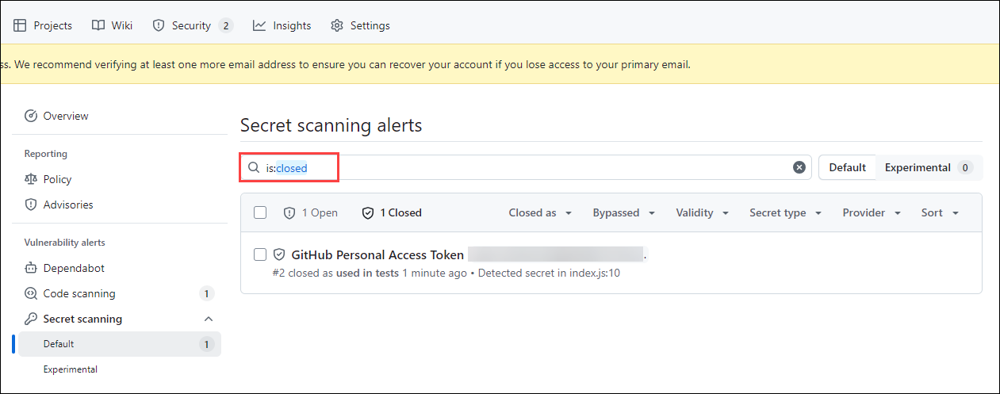

    >**Note:** If you bypass push protection by selecting options such as "It's used in tests" and still commit the secret, it will not prevent the commit entirely. However, GitHub will generate a security finding under the "Closed" section in the Security tab. This finding is crucial because it allows you to track and review secrets that were committed despite push protection. Even though the commit was allowed, the security finding helps identify and address potential issues, ensuring that any committed secrets are still reviewed and remediated.    

12. Finally, to show off how much importance we place on catching real secrets over modified / false positive secrets, we will go back to our **index.js** file.

13. Modified your secret by adding some random letters and numbers to the end of the GitHub Personal Access Token you've added.

14. In the end, this will _NOT_ cause a **Secret scanning** pop-up to appear. It's important to once again reiterate that we focus on push protecting against secrets that we are highly confident about and that are real. They should also match the patterns expected from the algorithms partners use to generate their credential material.

## Task 3: Create a custom secret pattern and view the results 

In this task, you will create and apply a custom secret pattern to detect specific types of sensitive information. Access the secret scanning settings in the repository and define a new secret pattern, including a name and regular expression, to identify specific secrets. Test the pattern using a known secret and a modified PAT to evaluate its effectiveness. Save and publish the custom pattern, then review the results to see how it identifies secrets based on the pattern.

1. In the **`ghas-bootcamp-javascript`** repo, there is a secret disclosed in the file **`index.js`**. To discover secrets like this, navigate to the **Settings** tab of the repo, click on **Code security**.

   

1. Scroll down to **Secret Scanning** section and then click on the **New pattern** button.

    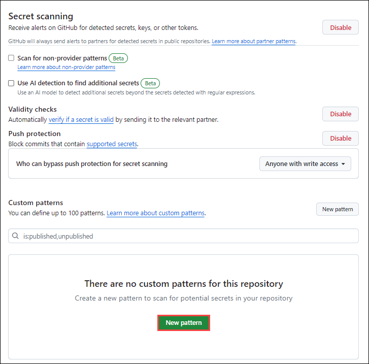

1. In New custom pattern, proivde following details and click **Save and dry run** **(7)** to discover two values of concern - the first being the GitHub Personal Access Token we corrupted earlier, and the second being the `Password123!` value mentioned earlier. 

   - **Pattern name**: **Test-Pattern** **(1)**. 
   - **Secret format** (specified as a regular expression): provide regular expression patterns as ``[a-zA-Z0-9!.,$%&*+?^_`{|}()[\]\\/~-][a-zA-Z0-9\t !.,$%&*+?^_`{|}()[\]\\/~-]*`` **(2)**.
   - Expand **More options** **(3)**, as you need **Before secret** and **After secret** values. 
   - **Before Secret**:  provide regular expression patterns as `(?:\A|[^a-zA-Z0-9])(?i)(?:api|jwt|mysql)?[_.-]?(?:[Pp]ass?(?:wo?r?d|code|phrase)|[Pp]wd|secret)[\t ]*(={1,3}|:)[\t ]*(?:["']|b["'])?` **(4)**.
   - **After secret**:  provide regular expression patterns as `(\z|[\r\n'"])` **(5)**.
   - **Test string**:  `gH4$kP!2w_ ` **(6)**

     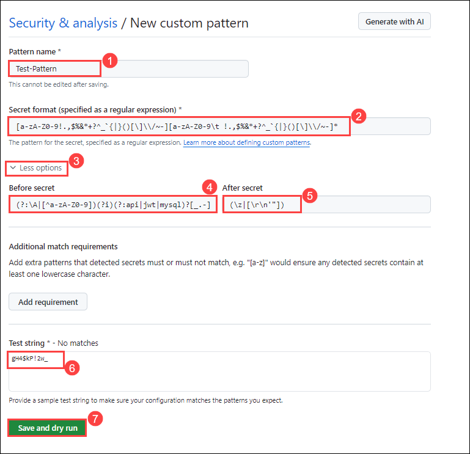
      
      > **Note:** Writing regular expression patterns can be challenging, we recommend using something like _GitHub Copilot_ or [Regex101.com](https://regex101.com/) to help with this process.
      
      > **Note:** Using the [Generic Secrets / Passwords](https://github.com/advanced-security/secret-scanning-custom-patterns/tree/main/generic) from the field security team's repository, we grab the following pattern format: 
      
      > **Note:** You can also refer to the Field Security team's open-source [custom-pattern-secrets](https://github.com/advanced-security/secret-scanning-custom-patterns) repository, which contains several useful examples.

1. Click on **Pubish pattern**.

   

   >**Note:** Please click **reload** if you are unable to see the **Publish pattern**.

1. This example captures everything we expect to see in a single repository, which can hold up to 100 patterns.
   
## Task 4: Understanding the results 

In this task, we delved into comprehending the outcomes of secret scanning.

1. We navigated through the repository's findings and demonstrated how secret scanning identifies potential vulnerabilities, followed by a practical demonstration of adding a GitHub Personal Access Token (PAT) to the codebase to exemplify active secret detection.

1. After identifying active secrets, we discussed the significance of validity checks in prioritizing remediation efforts.

1. Next, we enabled push protection in the **ghas-bootcamp-javascript** repository and simulated attempting to push a new secret.

1. We created custom secret patterns to uncover specific types of sensitive information.

Please feel free to go through the documents for further understanding:[Security](https://github.blog/category/security/)

## Review

In this lab, we have completed the following:
 - Turned on secret scanning for the entire organization
 - Turned on push protection and tried pushing a new secret (a GitHub token) into a repository
 - Created a custom secret pattern
 - Understanding the results 
 
