# Module 3: Software Composition Analysis

## Lab Scenario

 In this lab, you will be focusing on improving security within your GitHub repositories using Dependabot and Software Composition Analysis (SCA) features.

## Lab Objectives
In this lab, you will perform:
- Task 1: Turn on dependabot and other SCA features. Review results. 
- Task 2: Use the dependency submission action on a Java project. Review results. 
- Task 3: Use the dependency review action to stop a pull request that contains the log vulnerability. 


## Getting Started with GHAS

If you followed `Module 0 - Setup and Automation`, you will have already enabled _Dependency graph_, _Dependabot alerts_, and _Dependabot security updates_ at both the repository and the organization level. If you are starting this module without having taken these steps, below are the instructions for turning on these features at the organization level:

- Go to the Organization (`ghas-bootcamp-DATE-HANDLE`) and then **Settings** -> **Code Security and Analysis** and click `Enable all` for _Dependency graph_, _Dependablot alerts_, _Dependabot security updates_, and _GitHub Advanced Security_.

- Once this is enabled, navigate to the `WebGoat` repository to begin working through this module.

Open the [GitHub Advisory Database](https://github.com/advisories) in a new browser window and work through the talk track below, which is taken from comments made by @Moose0621 in [this issue](https://github.com/github/field-security-specialists/issues/177#issuecomment-1440704862) related to the GHAS Bootcamp Renovation project.

  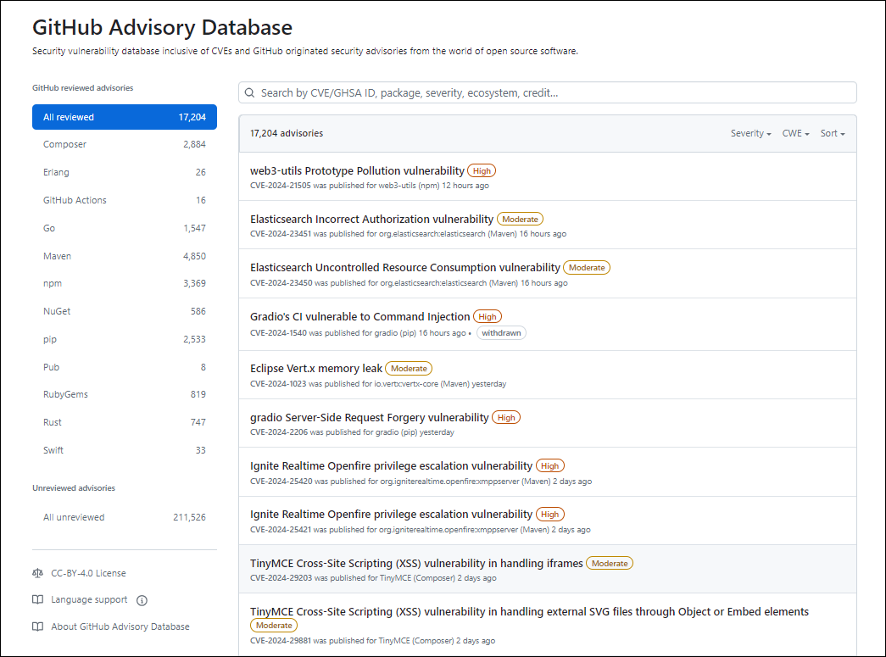

- **Now let us analyze the problem**

    This talk track is intended to guide the reader through the analysis of a problem related to open-source security and the role of organizations in ensuring safe usage of open-source software. 

- **What is the GitHub Advisory Database?**

 1. **Curated DB of known security vulnerabilities**: The GitHub Advisory Database is a curated database that catalogues known security vulnerabilities across the open-source ecosystem. It serves as a centralized resource for developers to stay informed about security issues affecting the 
  software libraries and packages they use in their projects.

 1. **Community-driven effort**: The GitHub Advisory Database is maintained through a community-driven effort, with contributions from security researchers, developers, and organizations. This collaborative approach helps ensure the accuracy and comprehensiveness of the database.

 1. **GitHub as a Certified CVE Numbering Authority**: GitHub is designated as a Certified CVE Numbering Authority, responsible for assigning CVEs (Common Vulnerabilities and Exposures) to vulnerabilities discovered in the open source ecosystem. This accreditation highlights GitHub's role in the cybersecurity landscape and its commitment to enhancing the security of open-source software.
  
    Overall, the GitHub Advisory Database plays a crucial role in enhancing the security of open-source software by providing developers with timely and comprehensive information about security vulnerabilities and advisories.

- **How does it work?**

1.  The **GitHub Advisory Database** utilizes the GitHub API to fetch the latest information about security vulnerabilities. This API provides access to various data related to repositories, including vulnerability information, which the database leverages to stay updated with the latest security advisories.
1.  By accessing the GitHub API, the database can determine if there are any known vulnerabilities associated with the repositories being monitored. It scans the codebase and dependencies of projects to identify any vulnerabilities that have been reported and documented in the database.
1.  **Dependabot**, a GitHub automation tool, plays a crucial role in the process. When vulnerabilities are detected within a repository, Dependabot generates alerts to notify the repository maintainers about the security issues.
1.  In addition to generating alerts, Dependabot may take proactive steps to address the identified vulnerabilities. 

## Task 1: Turn on dependabot and other SCA features. Review results. 

1. In the WebGoat repository navigate to **Settings** from the top navigation pane.

   

1. From the left navigation pane, click on **Code Security and Analysis**

   

1. Under **Dependabot** enable **Dependency graph**,**Dependabot Alerts** and **Dependabot security updates**.

   

1. Dependabot raises pull requests to update dependencies. Depending on how your repository is configured, Dependabot may raise pull requests for version updates and/or for security updates. You manage these pull requests in the same way as any other pull request.

1. You can check the Pull requests that are automatically getting triggered through the Depandabot by navigating to the **Security** tab from the top menu and under **Vulnerabilities** click on **Dependabot**.Notice the pull requests that were triggered automatically in the repository.

   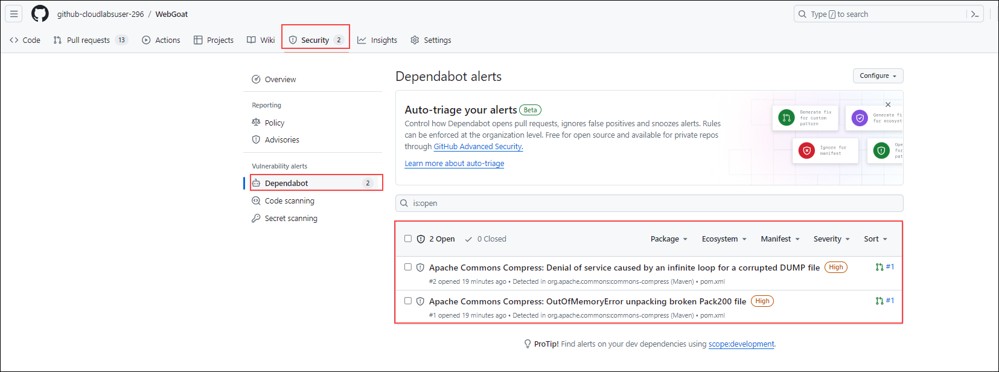

## Task 2: Use the dependency submission action on a Java project. Review results.

GitHub's dependency submission API supports Software Composition Analysis (SCA). It provides a GitHub API that allows uploading a complete list of the dependencies used by a repository (or, more precisely, a particular build of the application in the repository).
The process involves adding all dependencies from a repository to the dependency graph, particularly those resolved during software compilation or building, even if not listed in a manifest file like pom.xml. When new dependency versions are released, Dependabot utilizes data submitted via the dependency submission API to generate pull requests.


1. In the `WebGoat` repository, go to the `.github/workflows/DepGraph.yml` file.

   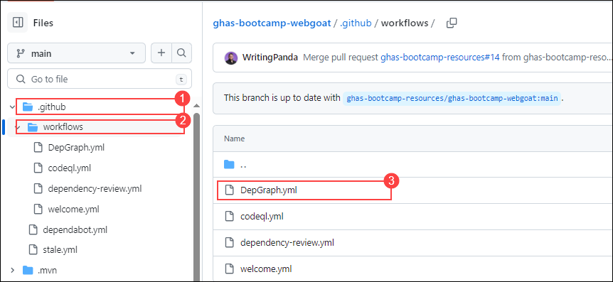

1.  This explains how this file will use the **Maven Dependency Tree Submission** action to identify the transitive dependencies.Transitive dependencies are pulled in as part of the build process for this project

1.  Go to the **Actions** section,from the top navigation pane and click on click on the **Dependency Graph Upload** action.

    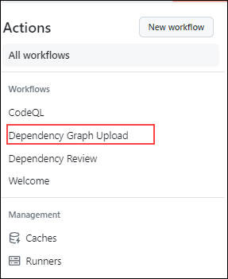

1.  Click the **Run workflow** -> **Run workflow**  button

    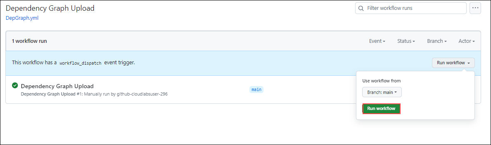

1.  Once this is completed, go to the **Dependency Graph** tab, under the **Insights** section

    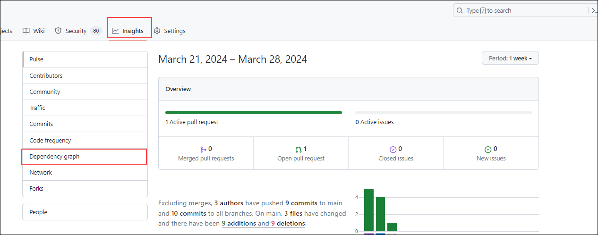

1.  This will show the new critical vulnerabilities that have been identified in transitive dependencies.

    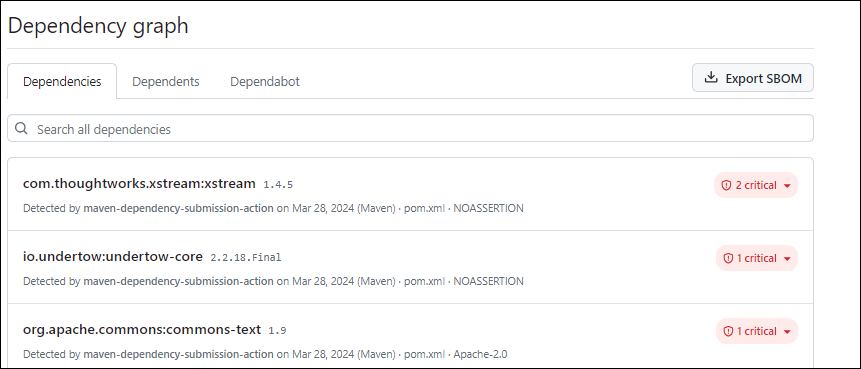


## Task 3: Use the dependency review action to stop a pull request that contains the log vulnerability.
## Dependency Review Action

The dependency review action is a GitHub Action designed for this purpose, preventing vulnerable dependencies from being merged into a repository. This action serves as a proactive measure to maintain the integrity and security of the repository by identifying and mitigating potential risks associated with third-party dependencies.

1. In the WebGoat repo navigate to **Actions** and in the **Actions** click on **New workflow** from the left navigation pane.

    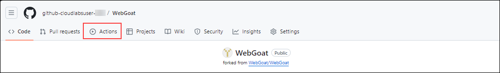

    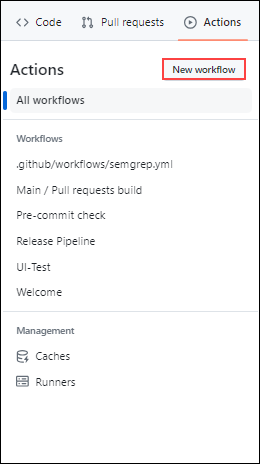
 
 
 1. Now, search **Dependency Review** to find and configure the action by clicking the **Configure** button.
   
    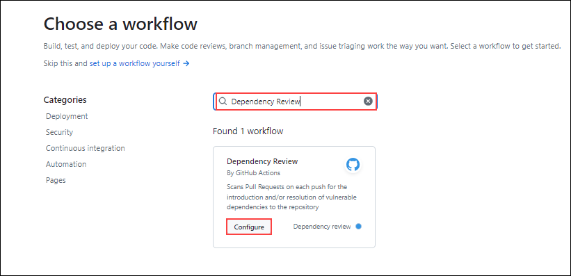

1. On `Line 5` of the Action workflow configuration there is a [link to the Action's repository](https://github.com/actions/dependency-review-action). Highlight this and open it in a new tab

   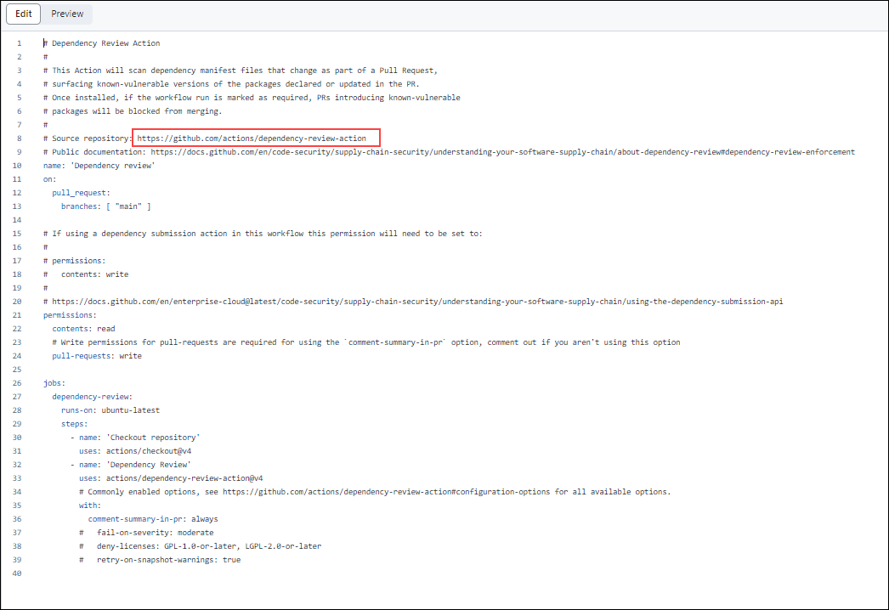

4. Now in this repository, scroll down to the **Configuration options**. We can copy  the example that includes the `fail-on-severity`.

   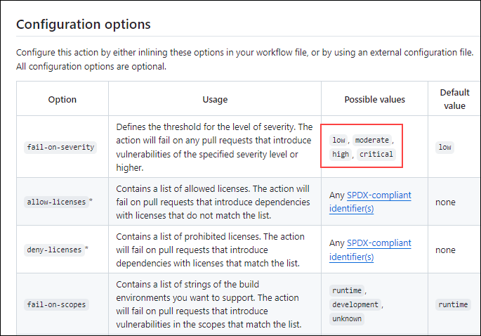

5. Paste the example next to the  `fail-on-severity`(line number 37) in the workflow file and click on **Commit Changes** in the right corner.

    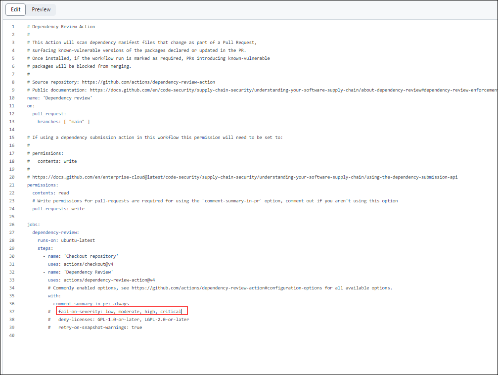

6. Click on **Commit Changes** once again in the pop-up that appears.

   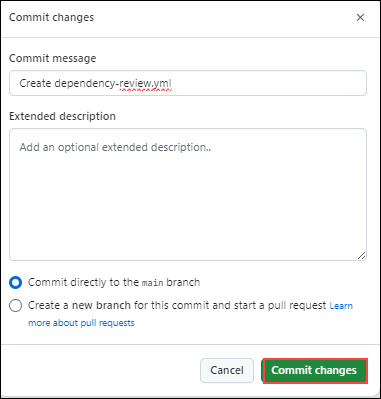

5. Now back in the **WebGoat** repository go to the **pom.xml** file.

   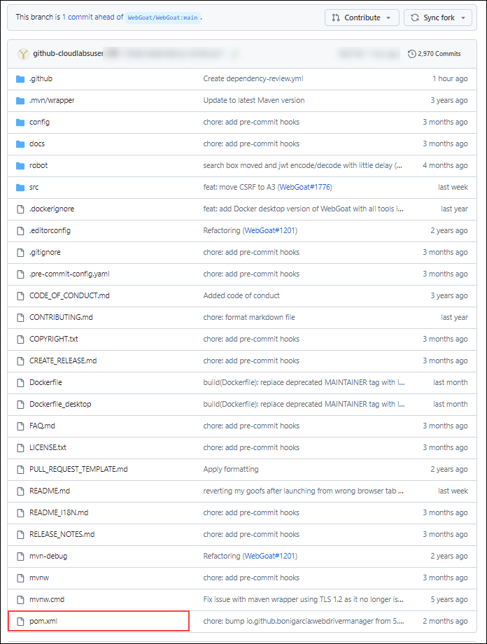
   
6. Replace the `WebGoat/pom.xml` file between `Line 154` and `Line 161 with the below code`:
 
      ```xml
        <dependency>
            <groupId>org.apache.logging.log4j</groupId>
            <artifactId>log4j-core</artifactId>
            <version>2.13.1</version>
        </dependency>
     ```

7. Click on **Commit Changes** twice.

8. Now,click on **Pull Request** from the top navigation pane.

   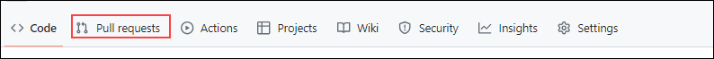

9. Now, click on **New Pull Request** to create a Pull Request. 

10. Navigate to the **Actions** section and notice the failed **Dependency review** due to the dependency review finding the introduction of a vulnerable `Log4j` version.

    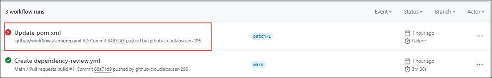

11. Navigate to **Settings** click on **Branches** under code and automation and review the **Status check** that is required.


## Review

In this module we have completed the following:
 - Turned on dependabot and other SCA features
-  Used the dependency submission action on a Java project.
-  Used the dependency review action to stop a pull request that contains the log vulnerability. 


