# Module 03: Software Composition Analysis

## Lab Scenario

In this lab, you will be focusing on improving security within your GitHub repositories using Dependabot and Software Composition Analysis (SCA) features.

## Lab Objectives
In this lab, you will perform:
- Task 1: Turn on Dependabot and other SCA features. Review results. 
- Task 2: Use the dependency submission action on a Java project. Review results. 
- Task 3: Use the dependency review action to stop a pull request that contains the log vulnerability. 

## Estimated Timing: 40 minutes

## Architecture Diagram

   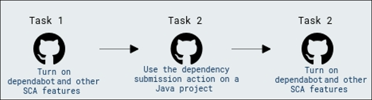

## Task 1: Turn on Dependabot and other SCA features. Review results. 

1. In the **ghas-bootcamp-xxxx-xx-xx-cloudlabsxxx** organization, click on **Repositories** from the top navigation pane.

   

1. From the list of repositories, click on **ghas-bootcamp-webgoat** to begin working through this module. 

   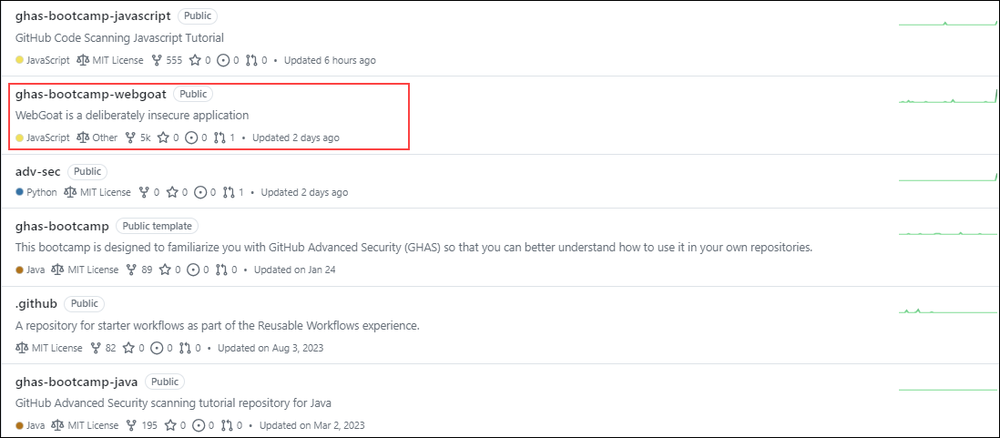

1. In the WebGoat repository navigate to **Settings** from the top navigation pane.

   

1. From the left navigation pane, click on **Code security and analysis**.

   

1. Now enable all the dependecy requirments, **Dependency graph**, **Dependabot Alerts**, **Dependabot security updates**, **Grouped security updates**, and **Dependabot version updates** under **Dependabot** if not enabled.

   

   >**Info:** Dependabot raises Pull requests to update dependencies. Depending on how your repository is configured, Dependabot may raise Pull requests for version updates and/or security updates. You manage these Pull requests in the same way as any other pull request.

1. Now you can check the Pull requests that are automatically getting triggered through the Depandabot by navigating to the **Security** tab from the top menu and under **Vulnerabilities** click on **Dependabot**. Notice the pull requests that were triggered automatically in the repository.

   >**Note:** The number of dependency alerts can be differ for you as it takes some time to scan the whole repositry. 

   
   
   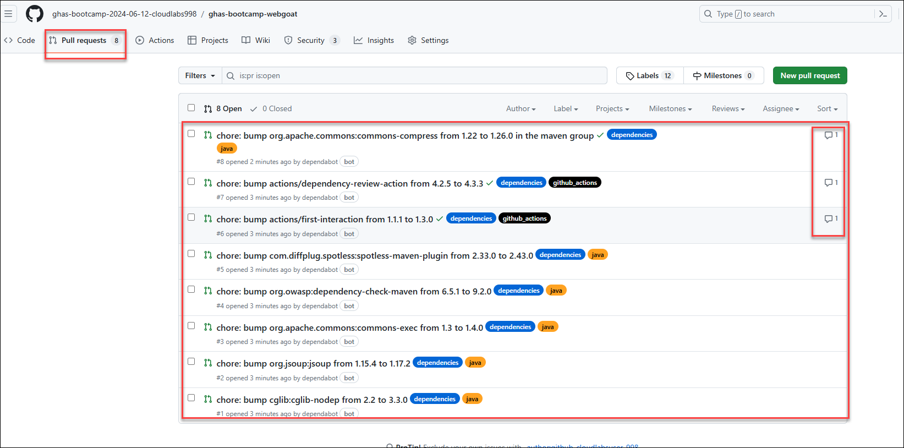

## Task 2: Use the dependency submission action on a Java project. Review results

GitHub's dependency submission API supports Software Composition Analysis (SCA). It provides a GitHub API that allows uploading a complete list of the dependencies used by a repository (or, more precisely, a particular build of the application in the repository).
The process involves adding all dependencies from a repository to the dependency graph. Particularly those resolved during software compilation or building. Even if they are not listed in a manifest file like pom.xml. When new dependency versions are released, Dependabot utilizes data submitted via the dependency submission API to generate Pull requests.

1. In the **`ghas-bootcamp-webgoat`** repository, go to the **`.github/workflows/DepGraph.yml`** file.

   
       
   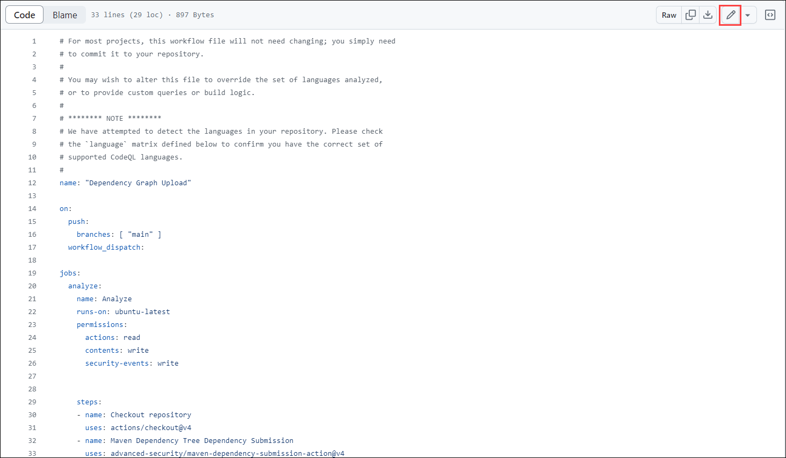

1.  This explains how this file will use the **Maven Dependency Tree Submission** action to identify the transitive dependencies. Transitive dependencies are pulled in as part of the build process for this project.

1.  Go to the **Actions** section from the top navigation pane and click on the **Dependency Graph Upload** action from the left navigation pane.

    

 	 > **Note:** If you don't see the **Dependency Graph Upload** action under workflows, then edit the **`.github/workflows/DepGraph.yml`** file and just change the extenion with **DepGraph.txt** and then revert it back to save as **DepGraph.yml** file. Also you might see that the action already completed, this happened because we have edited the file and it got triggered automatically. You can rerun it to get the more details. 
 
1.  Click on the **Run workflow** -> **Run workflow**  button located in the middle of the screen.

    

1.  Once this is completed, go to the **Dependency Graph** tab under the **Insights** section in the top navigation pane.

    

1.  This will show the new critical vulnerabilities that have been identified in transitive dependencies.

    

## Task 3: Use the dependency review action to stop a pull request that contains the log vulnerability

## Dependency Review Action

The dependency review action is a GitHub Action designed for this purpose, preventing vulnerable dependencies from being merged into a repository. This action serves as a proactive measure to maintain the integrity and security of the repository by identifying and mitigating potential risks associated with third-party dependencies.

1. In the **ghas-bootcamp-webgoat** repo navigate to **Actions**, and in the **Actions**, click on **New workflow** from the left navigation pane.

    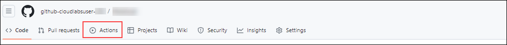

    
 
 
1. Now, search **Dependency Review** to find and configure the action by clicking the **Configure** button.
   
    

1. In the Action workflow configuration there is a [link to the Action's repository](https://github.com/actions/dependency-review-action) as shown in the below screenshot. Copy this link and open it in a new tab.

   

1. Now, in this repository, scroll down to the **Configuration options**. We can copy the example that includes the **`fail-on-severity`** possible values.

   

1. Paste the example next to the  `fail-on-severity` in the workflow file and make sure you uncomment the line removing **#** as shown in the below screenshot and click on **Commit Changes** in the top right corner.

	>**Note**: Please ensure that the indentation is correct according to the provided screenshots. Make sure that the **fail-on-severity: low, moderate, high, critical** is directly below the **comment-summary-in-pr: always** line, as shown below:

    
   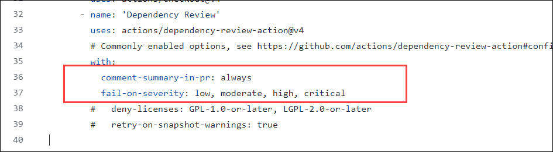

1. Click on **Commit Changes** once again in the pop-up that appears.

   

    >**Note:** If you get an error while commiting changes as file could not be edited. to fix that, rename the file **dependency-review.yml** to **dependency-review1.yml** and then try again to commit the changes in new action file.

1. Now back in the **ghas-bootcamp-webgoat** repository, go to the **pom.xml** file.

   
   
1. Add the provided code to the **WebGoat/pom.xml** file as shown in the screenshot and delete the existing lines as mentioned.
 
      ```xml
        <dependency>
            <groupId>org.apache.logging.log4j</groupId>
            <artifactId>log4j-core</artifactId>
            <version>2.13.1</version>
        </dependency>
     ```

    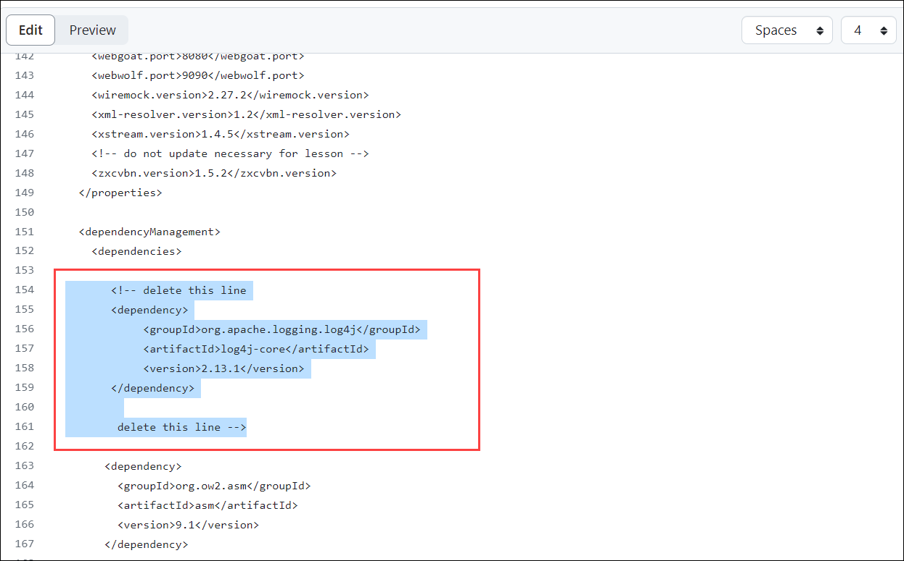

    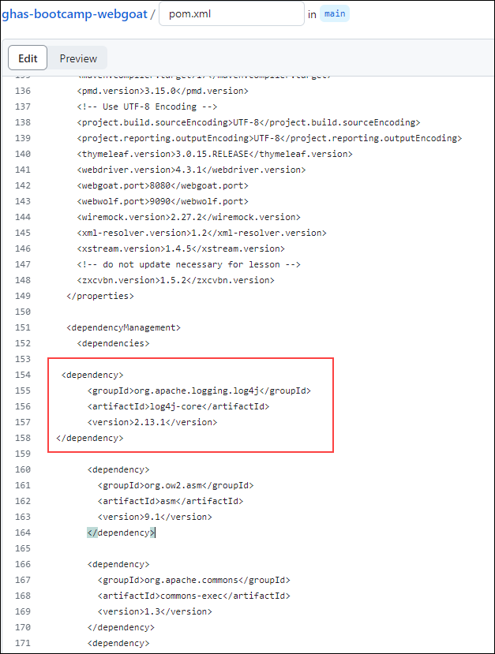

1. Click on **Commit Changes** and make sure you select **create a new branch** option and click on **Propose Changes** .

   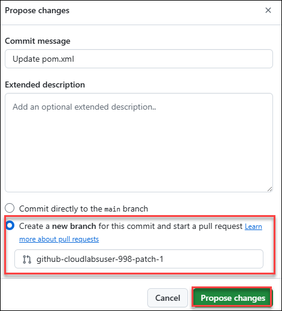

1. Now, click on raise **Pull requests**. No need to merge the PR.

   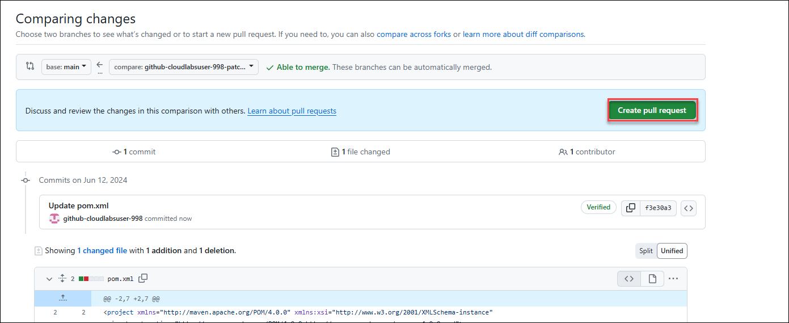

1. You will see after few seconds that all the checks got failed due to the dependency review action.

   

1. You can also see the error details on **Actions** section, navigate to action section and from the left navigation pane, click on **Dependency Review**. Notice the failed **Dependency review** due to the dependency review finding the introduction of a vulnerable `Log4j` version.

    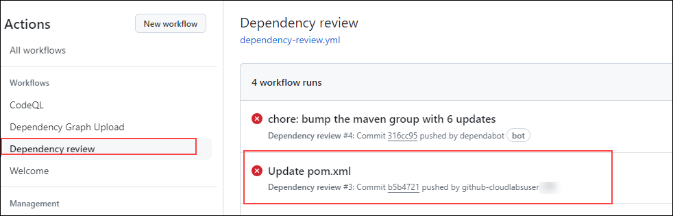

  > **Congratulations** on completing the task! Now, it's time to validate it. Here are the steps:
	
  - Hit the Validate button for the corresponding task. If you receive a success message, you can proceed to the next task.
    >**Note:** Upon clicking the **Validate** button for this exercise, you'll receive a prompt to input your Organization name. Provide your **Organization name** which looks like **github-bootcamp-cloudlabsuser-xxx**.
    
    >**Note:** Make sure to update the name of your organization, **ghas-bootcamp-xxxx-xx-xx-cloudlabsxxx**.
    
  	 
   
  - If not, carefully read the error message and retry the step, following the instructions in the lab guide.
  - If you need any assistance, please contact us at labs-support@spektrasystems.com. We are available 24/7 to help you out.

   <validation step="401a8107-d558-4bed-a5b6-4b1e5ca50132" />

## Review

In this module, we have completed the following:
 - Turned on Dependabot and other SCA features
-  Used the dependency submission action on a Java project
-  Used the dependency review action to stop a Pull Request that contains the log vulnerability
