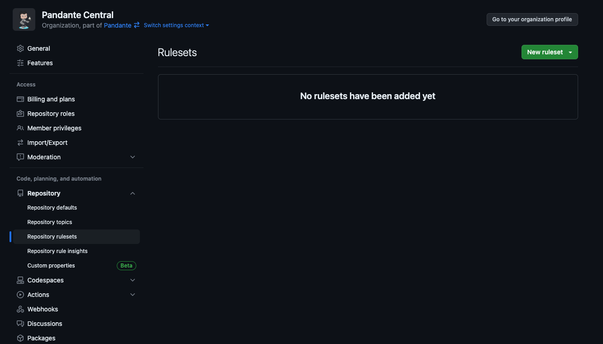
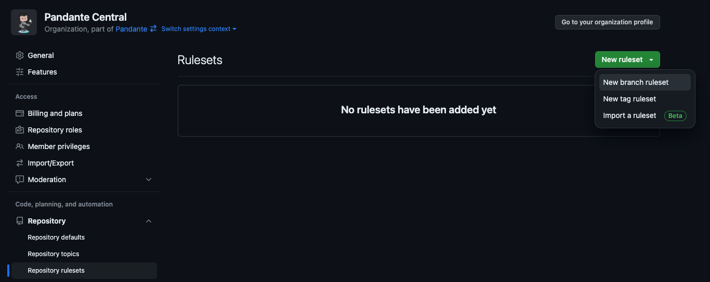
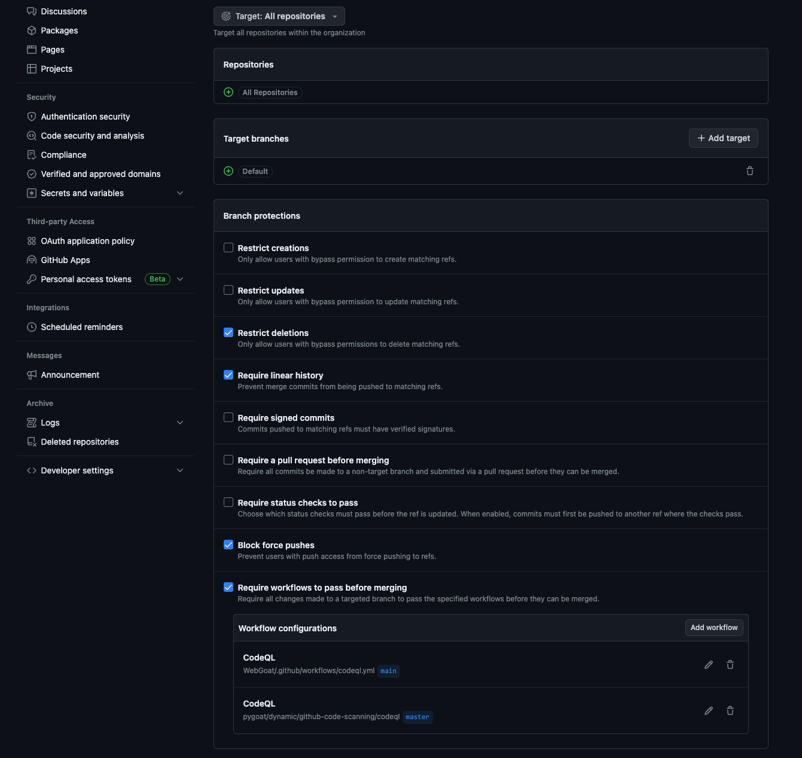

# Module 04: Building a DevSecOps Program

## Getting Started

It is expected that you have either completed **Module 2: Secret Scanning** and/or **Module 3: Code Scanning** prior to this module, as security findings are required to highlight the value of _Security Overview_ and other features discussed in this module.

<!-- CODEOWNERS - add this part to here

Branch protection rules for CodeQL -- how to implement CodeQL using those rules 

Branch protection rules can be modified in the repo or at the org level 

Makes more sense to manage them at the org level for standard things and then at the repo level for project specific needs -->

## Scaling Up: Repository Rules

- Repo rulesets are a list of rules that apply to a repository. The purpose of these rules is to ensure standards, security, and quality of code added to the repository.
- Repo rulesets can be applied at the organization level
- Limit of 75 rules per repository
- Value: enforce protections of repositories from the organization level, providing consistency and insights how rules could impact development, all at scale

### Ruleset Features

- Who can push commits to a certain branch
- Who can delete or rename a branch or tag
- What workflows are required to run (Required Workflows)
- Who can delete branches or tags
- Require linear history -> prevents merge commits to the targeted branches or tags -> must squash a merge or rebase a merge
  - Linear history makes it easier to reverse changes more easily
- Require signed commits -> requires all commits to be signed with GPG
- Require a pull request before merging
  - Prevents direct pushes to branches
  - Can require reviews on code prior to accepting pull request
- Require status checks to pass before merging
- Block force pushes

<!-- We'll do the activity once we have confirmed that CodeQL can be used as a required workflow. For now, we can skip this part and move on to the rest of the module. 

CodeQL cannot be a required workflow. The way the yaml files are read, CodeQL scans are ignored. Not all repos that have code scanning are using advanced setup, which causes a conflict as the branch protection rules don't know if CodeQL is being run.

Need to confirm this further.-->

### Code Owners

- File that lists the code owners of a particular repository
- Used to request automatically a PR review from the users in the list
- File lives in the CODEOWNERS file in the `.github` or `docs` directory
- Syntax: the pattern is followed by one or more GitHub usernames or team names using the standard @username or @org/team-name format
  - Similar to the `.gitignore` file syntax
  - In most cases, you can also refer to a user by an email address that has been added to their account on GitHub.com, for example [user@example.com](user@example.com). You cannot use an email address to refer to a managed user account
  - [Example of CODEOWNERS file](https://docs.github.com/en/enterprise-cloud@latest/repositories/managing-your-repositorys-settings-and-features/customizing-your-repository/about-code-owners#example-of-a-codeowners-file)
- Big help when it comes to governance of a repository

### Activity: Creating a Repository Ruleset

1. Navigate to the `ghas-bootcamp-DATE-USER` organization
2. Click on **_Settings_** -> **_Repository_** -> **_Repository rulesets_**
  
3. Click on **_New ruleset_** and select **_New branch ruleset_**
  
4. Name the ruleset `Require status check to pass`
5. Target all repositories
6. Target all default branches
7. Select `Restrict deletions`, `Require linear history`, `Block force pushes`, and `Require workflows to pass before merging`
8. Under `Require workflows to pass before merging`, click `Add workflow`
9. Select a CodeQL workflow from any of the repositories (this is only an example of how easy this is for people to do)
  
10. Click `Create`
11. Scroll up to `Enforcement status` and show that it is `Disabled`. Keep it disabled, but for testing purposes, the group can try it out on their own using the organization we have temporarily provided them
12. End with discussion on the customizability of repo rulesets that go beyond GitHub Advanced Security. See [Ruleset Features](#ruleset-features) above

## Reviewing Results: Security Overview

- To see the results of your repositories security findings at scale, you can go to the organization view by clicking on the `ghas-bc-HANDLE` link and then selecting the **_Security_** tab along the top. This brings you to the `Risk` page of the **_Security Overview_**, which highlights which repositories are affected by a vulnerability, and allows you to sort and filter findings by vulneraiblity type (_Dependabot_, _Code Scanning_ and _Secret Scanning_), as well as by criticality.

- Next we can click on the **_Coverage_** section to see which repositories are protected by the GitHub Advanced Security features. Similar to the **_Risk_** section, this section allows you to sort and filter by the status of repositories, and how features have been are enabled across your organization for all GHAS features.

- Finally, you can review each of the GHAS features to see a roll-up of findings across all enabled repositories. Depending on the feature, you can also filter and/or sort based on the repository where a finding is located, the tool used to identify the finding, the rule the finding is categorized under, and severity of the finding.

## Sharing data with other platforms: WebHooks

- While we won't spend time during the bootcamp integrating data via WebHooks, it's important to walk through the process so that students can try this in their own environment after the class ends. Likewise, it's important to reiterate that **_every event_** (finding generated) as part of GitHub Advanced Security can send out a WebHook.

- WebHooks allow companies to setup event driven processes, such as collaborating between the Application Security and Security Operations team to address situations where developers bypass push protection - or a zero day is released and findings are generated.

- While you _can_ setup WebHooks at the repository level, most companies set them up at an Organization level. To setup an **_Organization WebHook_** you can go to `ghas-bootcamp-DATE-HANDLE` and then **_Settings_**. On the left-hand side, scroll down to **_Webhooks_** and click on the `Add webhook` button on the top-right of the page. Once the page has loaded, click on the _Let me select individual events._ radial to review all of the events you can signal from the platform.

- The events are sorted alphabetically, with _Code scanning alerts_ being the first GHAS-related event. There are also _Dependabot_, _Secret scanning_ and other security-related features that can generate events.

- To give customers an example of what an Event Driven process might look like, pull open the `GitHub App for Splunk` via the [Splunk Octodemo](https://splunk-octodemo.com/) and review the **_Advanced Security_** ->  **_Code Scanning_** and/or **_Secret Scanning_** findings.

## Deploying GitHub Advanced Security across your Enterprise

- At this point we will walk students through the GitHub Docs page "[Introduction to adopting GitHub Advanced Security at scale](https://docs.github.com/en/enterprise-cloud@latest/code-security/adopting-github-advanced-security-at-scale/introduction-to-adopting-github-advanced-security-at-scale)". As the trainer, spend some time in advance of the training absorbing this content and mapping it back to how you've heard others speak about GitHub Advanced Security during the sales process.

The **_TL;DR_** of the GitHub Docs page can be summarized with the core tenants of DevOps:

- Communication
- Coordination
- Collaboration

Successfully deploying any security solution starts by **_Communicating_** changes to Application Security practices in advance of their deployment. Identifying and working with development teams that want to be early adopters for GitHub Advanced Security - and the new business processes that can be built around it - is often a lot easier than security teams might think (so long as communication is taking place). The documentation recommends that you [lead your rollout with both your security and development groups](https://docs.github.com/en/enterprise-cloud@latest/code-security/adopting-github-advanced-security-at-scale/phase-1-align-on-your-rollout-strategy-and-goals#lead-your-rollout-with-both-your-security-and-development-groups).

The [preparing to enable at scale](https://docs.github.com/en/enterprise-cloud@latest/code-security/adopting-github-advanced-security-at-scale/phase-2-preparing-to-enable-at-scale) section of the document has a lot of useful tools for auditing an organization's footprint to gather information about the programming language landscape.

The best way to deploy GHAS is to start with a [pilot program](https://docs.github.com/en/enterprise-cloud@latest/code-security/adopting-github-advanced-security-at-scale/phase-3-pilot-programs) where eager development teams coordinate with security team(s) to get the GHAS turned on for their repositories. This is a great opportunity to [capture lessons learned](https://docs.github.com/en/enterprise-cloud@latest/code-security/adopting-github-advanced-security-at-scale/phase-4-create-internal-documentation) and document the process, challenges, and solutions for integrating GHAS into the software engineering process. This requries good **_Communication_** and **_Coordionation_**

From here, the path diverges a bit depending on the security practices you are employing - whether it's a **_Pull_** model where development teams utilize templates and other tools / scripting / resources built by the security team, or a **_Push_** model where the security team is imposing security on the development process.

Generally speaking, the `Pull` model is more successful at scale because it usually means that the security team is **_Collaborating_** with development teams to turn on security features and streamline business processes. This means the security team is generally solving for problems at a high level, and then providing assistance to development teams that experience an edge case and need additional support. The security team then documents these edge cases and how they were resolved, so that other development teams can learn from the process.

That said, the `Push` model for implementing security practice works well for smaller organizations with a limited number of repositories. The Security and Engineering teams tend to work closely together due to the social relationships that form in companies of less than 150 people, and sharing technology capabilities and practices happens much more naturally under these conditions. The challenge with the `Push` model largely occurs when too much complexity is involved - such as software build processes needing to be customized for hundres or thousands of engineering projects, or lack of consistent exception and remediation practices shared across teams.

Finally, to reiterate: successful security deployments require **_Communication_**, **_Coordination_** and **_Collaboration_** between Development and Security teams; or as our fellow Hubber @securingdev likes to say - you [can't do DevSecOps without doing DevOps](https://securing.dev/posts/no-devsecops-without-devops/).

You don't have to quote him directly, but securingdev would appreciate it if you did. 😃
