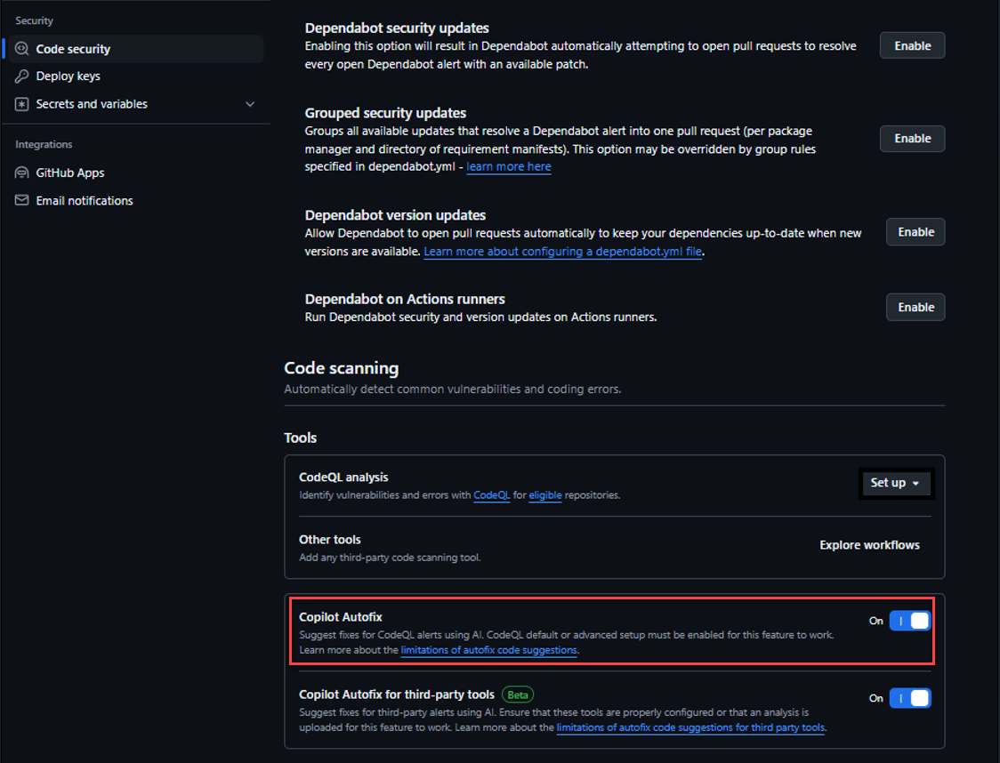
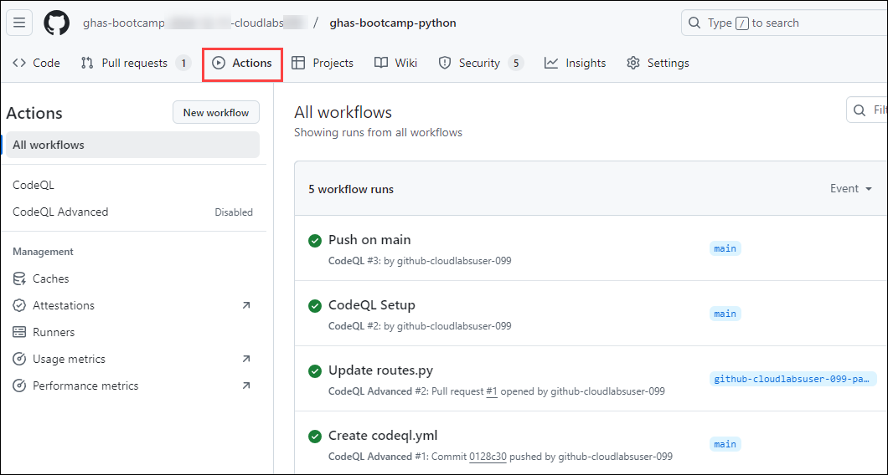

# Module 05: Code Scanning

## Lab Scenario

 In this lab, we'll cover a series of tasks designed to provide a comprehensive understanding of code scanning in GitHub. 

## Lab Objectives

### Implementing GitHub Advanced Security for Your Organization

In this lab, you will learn and perform:

- Introduction to Code Scanning
- What is CodeQL and how is it different from other static analysis tools? 
- Task 1: Add some vulnerable code via a pull request and view the scan results in the PR 
- Task 2: Verify Github Autofix is enabled
- Task 3: Create a code with potential security vulnerabilities
- Task 4: Run a code scan
- Task 5: Apply autofixes to vulnerabilities

## Estimated timing: 90 minutes
   
## Introduction to Code Scanning 

Code scanning in GitHub is a powerful feature designed to enhance the security of your software projects by automatically identifying and alerting you to potential security vulnerabilities in your codebase. Leveraging advanced static analysis techniques, and code scanning helps detect security flaws, bugs, and other issues early in the development process, enabling developers to address them proactively before they escalate into larger problems. 

### What is CodeQL and how is it different from other static analysis tools?

1. Code Scanning, powered by the CodeQL engine, performs thorough static analysis by accessing source code and integrating with the build process for compiled languages (or simulating compilation for interpreted languages). This approach ensures precise mapping of data flow and the ability to differentiate between remote and local sources. 

1. The fundamental difference is that all of the information about the application is aggregated in a relational database that allows for tracing complete data flows across the entire application.

1. For `compiled` languages, the CodeQL engine running under the hood of the Code Scanning process will hook into the compiler at build time. The CodeQL engine will then listen for the creation of data flows by the compiler, such as linkers and callbacks, and map those data flows as nodes in the database -- aptly called `DataFlow` nodes.
1.  This process allows CodeQL to avoid false positive vulnerability findings from dead code that has no existing dataflows. This is a common problem with other Static Analysis tools that do not have access to the compiler and instead rely on pattern matching and other techniques to identify vulnerabilities.
1. Once the data flow analysis is complete, an extraction of the code is then performed. Every variable, expression (combination or modification of variable(s)), method/function/class declaration, etc. is extracted as individual nodes in the database.

1. CodeQL then performs analysis by querying the database for _Remote_ flow sources that lead to sinks (where data is stored or executed) in ways that are exploitable and are otherwise not sanitized as part of that data flow.

1. For `interpreted` languages, like Javascript and Python, the CodeQL engine performs a depth-first, recursive extraction of the code where `DataFlow` nodes are created from things like `return` statements and passing variables from one function to another. We can gain a comprehensive view of the application and avoid flagging false positive vulnerabilities in code that is never called or executed.

## Task 1: Add some vulnerable code via a pull request and view the scan results in the PR  

### Task 1.1: Pull Request scans and Accurate Findings

In this task, you will learn how to enhance CodeQL's security analysis by enabling advanced query configurations and integrating extended security queries. You will gain experience in modifying CodeQL workflows, committing changes related to security vulnerabilities in code, and understanding how CodeQL will accurately identify specific issues, such as clear-text logging of sensitive information, while filtering out less relevant findings. This will depend your understanding of leveraging CodeQL for more precise and effective security scanning in your codebase.

1. we're going to enable _Advanced setup_ for one of our interpreted language repositories by going back to the `ghas-bootcamp-python` repository.

1. In the **ghas-bootcamp-xxxx-xx-xx-cloudlabsxxxx** organization, click on repositories from the top navigation pane.

   

1. From the list of repositories click on **ghas-bootcamp-python** to begin working through this module. This repository should have at least 2 code scanning findings with the **Default** and the **Extended** setup in this repository.

   

1. Now, head over to **Settings** -> **Code security** -> scroll down to **Code scanning** and click the `...` and then click _Switch to advanced_. This will prompt us to turn off the existing CodeQL workflow to avoid duplicating Action runs.Click on **Disable CodeQL**

   

   

1. We are going to make similar updates to the `codeql.yml` file as we did in the `Advanced Setup` section, we need to copy the string **queries: security-extended (1)** from the **codeql.yml** file  and append this to a new line at number 66 under **Initialize CodeQL** section , which will read as **queries: security-extended (2)** as shown in the below screenshot. Commit these changes to your **main branch (3)** by clickin on **Commit changes.**

   

   >**Note:** When updating the `codeql.yml` file, be aware that the line number for the `Initialize CodeQL` section may shift slightly, potentially changing from line 66 to one or two lines higher or lower. Ensure you append the string `queries: security-extended` to the correct location under this section based on the current line numbers in your file.

1. In the **Code** tab of the Python repository, navigate to the server folder to open the `routes.py` file and scroll down to **Line 40**.

   
 
  
1. Notice that this part of the code is related to the vulnerabilities that have to do with SQL.

1. Add a **space** at the end of line 73:
`data = subprocess.check_output(command, shell=True)`.This is necessary to trigger the CodeQL alert for the **user-controlled-sources vulnerability**. Click on **Commit changes**.

   

   

   >**Note:** Uncomment the lines of code.   

1. Click on commit to commit these changes to a **new branch** then click on **Propose changes.**  
 
   

1. Open a *Pull request* into the **main** branch, click on **Create pull request.**

   

1. Click on **Create pull request** again.   

   
     
1. It may take a moment for the Action to trigger and the **Merge pull request** button will display green until the Action kicks off.
   
   - CodeQL flag this pull request with a _Query built from user-controlled sources_ finding.

     

      

## Fix code vulnerabilities using Github Copilot Autofix

## Task 2:  Verify Github Autofix is enabled

1. Navigate to your repository.
2. Click on the Settings icon
3. In the left sidebar, find and click on Code security.
4. Under this section, look for Code scanning.
5. Locate the Copilot Autofix option.
6. Ensure that the toggle is set to Enabled. If it’s not, click to enable it.

    

## Task 3: Create a code with potential security vulnerabilities

1. Create a new file in the repository **ghas-bootcamp-python**
1. Click on the Add file button and select Create new file.
1. Name your file (e.g., app.py).
1. Copy and paste the below code:

In the new file, write the code that includes potential security vulnerabilities. For example, you can use the following code snippet:
Python

 ```
from flask import Flask, request
import sqlite3
import os

app = Flask(__name__)

def init_db():
    conn = sqlite3.connect(':memory:')
    cursor = conn.cursor()
    cursor.execute("CREATE TABLE user (id INTEGER PRIMARY KEY, name TEXT)")
    cursor.execute("INSERT INTO user (name) VALUES ('Alice')")
    cursor.execute("INSERT INTO user (name) VALUES ('Bob')")
    conn.commit()
    return conn

conn = init_db()

@app.route('/user')
def get_user():
    user_id = request.args.get('id')
    cursor = conn.cursor()
    # Introducing SQL Injection vulnerability
    cursor.execute(f"SELECT name FROM user WHERE id = {user_id}")
    user = cursor.fetchone()
    if user:
        return f"User: {user[0]}"
    else:
        return "User not found", 404

if __name__ == '__main__':
    debug_mode = os.getenv('FLASK_DEBUG', 'False').lower() in ['true', '1', 't']
    app.run(debug=debug_mode)

```

6. Commit the changes:
    - Scroll down to the Commit new file section. 
    - Add a commit message describing the changes (e.g., “Add app.py with potential SQL Injection vulnerability”).
    - Choose whether to commit directly to the main branch or create a new branch for this commit.
    - Click on Commit new file to save your changes.

7. Verify the file:
Ensure that the file is created and the code is correctly saved in your repository.

## Task 4: Run a code scan

1. In the repository page, navigate to **Actions** tab to view the workflow.

    

2. Check the CodeQL workflow:
   - Look for the CodeQL workflow in the list of workflows.
   - Ensure that the workflow has run automatically after committing the changes.

3. Review the scan results:
   - Click on the latest run of the CodeQL workflow to view the details.
   - Check the results to see if any vulnerabilities were identified.

     

    > Note: Ensure that the CodeQL scan completes successfully and identifies any vulnerabilities.

## Task 5: Apply autofixes to vulnerabilities

1. Navigate to the Security tab in your repository, and then click on Code scanning.

1. Review the list of vulnerabilities and click on an alert to view details.

    

3. If an autofix is available, click on Apply fix to automatically apply the suggested fix.

    

4. Commit the changes to your repository.

    

5. Make sure to merge and pull the request.

    

6. Autofix generates an updated text, just click confirm merge

    

   > Note: Ensure that the autofixes are applied successfully and the vulnerabilities are resolved.

## Review

In this lab you have completed the following:

- Learned how CodeQL is different from other static analysis tools
- Added some vulnerable code via a pull request and viewed the scan results in the PR.
- Create a code with potencial security vulnerabilities
- Run a code scan
- Apply autofixes to fix code vulnerabilities
