# Module 05: Scaling out GitHub Advanced Security

## Lab Scenario

The lab focuses on scaling out GitHub Advanced Security (GHAS) adoption, covering strategic approaches, security overview dashboards, webhooks integration, and repository rulesets. It emphasizes aligning GHAS rollout strategies, creating internal documentation, scaling code, and secret scanning. Additionally, it explores GHAS's security overview dashboard for insights and demonstrates webhook setup for external reporting tools like SIEM. Finally, it discusses the implementation of repository rulesets for enforcing branch and tag policies, enhancing security and compliance across repositories at scale.

## Lab Objectives
In this lab, you will perform:

- Task 1: How to grow adoption? How to communicate about GHAS internally?  
- Task 2: View the security overview dashboard and reports 
- Task 3: Review Webhooks and how they can be used to push events to an outside reporting tool, like a SIEM 
- Task 4: Talk about repository rulesets and how they can be used at scale 

## Estimated Timing: 60 minutes

## Architecture Diagram

   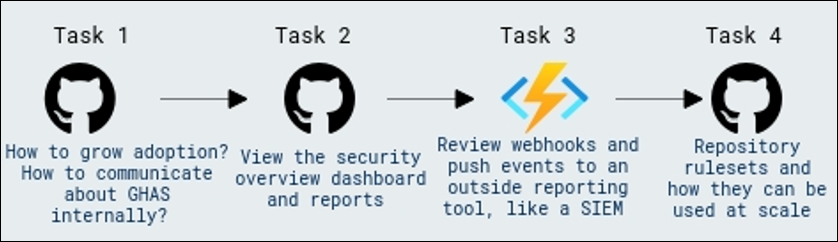 

## Task 1: How to grow adoption? How to communicate about GHAS internally? [Read Only]

Adopting GitHub Advanced Security can be approached in multiple ways. It requires a strategic approach for success, especially in larger enterprises and organizations with thousands of repositories. This aims to lay the foundation for enterprises on how to adopt GHAS, but most importantly, scale it quickly and efficiently. Enabling GitHub Advanced Security across a large organization can be broken down into **six** core phases:

1. **Align your rollout strategy and goals**: Think about what success will look like, and align on how GHAS will be implemented in your company. This phase may only take a few days or a week, but it lays a solid foundation for the rest of the rollout.

1. **Preparing to enable at scale:** Prepare developers, collect data about your repositories, and ensure you're ready for the next phase.

1. **Pilot programs:** Optionally, pilot an initial rollout to a few high-impact projects and teams. This will allow an initial group within your company to get familiar with GHAS before you roll it out to the remainder of your company.

1. **Create internal documentation:** Create and communicate internal documentation for the GHAS consumers. Without proper documentation provided to developers, security engineers, and others who will be using GHAS. The value will get lost in the rollout.

1. **Rollout and scale code scanning:** Leverage the available APIs, automatically rollout code scanning by team and by language across your enterprise using the repository data you collected earlier.

1. **Rollout and scale secret scanning:** Roll out secret scanning, which involves less configuration and is therefore simpler to adopt than code scanning. Still, it's critical to have a strategy for handling new and old results.
   
**Phase One - Strategic Enablement Alignment**

Although it's appealing to rush into the implementation phase, take the time to align on how GHAS will be implemented in your enterprise. Additionally, think about what success could look like in the 3, 6, and 9 months after adoption. This phase may only take a few days or a week, but it lays a solid foundation for the rest of the rollout.

**Phase Two - Create Internal Documentation**

Like the above phase, organizations tend to rush into the implementation phase, as that stage is perceived to provide the quickest time-to-value. However, without the proper documentation and asynchronous resources provided to aid developers, security engineers, etc, in consuming GHAS correctly, the value gets lost in the rollout due to people not correctly consuming GHAS. Take the time to create internal documentation (such as training, how to remediate, where to go for questions, etc.), and then communicate this documentation (email, teams, slack, etc.) to the consumers of GHAS. So once you roll out GHAS, teams and people know what to do.

**Phase Three - Enable & Scale Code Scanning**

GHAS is an ecosystem of multiple solutions. It's essential to start somewhere focused, not just with the rollout of GHAS. Typically, teams focus on code scanning to begin with. Leverage the APIs available and rollout code scanning by the team and by language across your organization automatically. This allows you to scale in an automated fashion and removes a lot of manual repeatable groundwork for developers and consumers of code scanning. Doing this will increase adoption.

### Mean Time to Resolution

MTTR, or **Mean Time to Resolution**, is a metric used to measure the average time it takes to resolve issues, bugs, or incidents in a software project. In the context of GitHub, MTTR can be applied to various scenarios, such as:

Issue Resolution: MTTR can track the average time from when an issue is reported to when it is closed. This helps teams gauge their efficiency in addressing and fixing problems reported by users or detected during development.

   - **Pull Requests:** MTTR can measure the average time taken to review, approve, and merge pull requests. This helps teams understand how quickly they are integrating new code changes and handling contributions.

   - **Incident Response:** For repositories using GitHub Actions or other integrations, MTTR can track how long it takes to resolve incidents or failures reported by these tools.

## Task 2: View the security overview dashboard and reports [Read Only]

In this task, you will explore the GHAS security overview dashboard and reports to gain insights into your repository's security posture.

1. Go to your **profile icon** in the top right corner, and then select **Your organizations**.

    
     
1. Select **ghas-bootcamp-xxxx-xx-xx-cloudlabsxxx** from **organizations**.

    

1. Navigate to the **security** tab of your **GitHub Organization**.

   

1. Explore the security overview dashboard. Use the options at the top of the **overview page** to filter the group of alerts for which you want to see metrics. As you adjust the filters, all of the data and metrics on the page will change.

   
   
1. For the alert trends graph at the top of the page, you can click **Open alerts or  Closed alerts** to toggle between showing the trends for Open or Closed alerts. The toggle will only affect the alert trends graph.

   

1. Click on the **Risk** option to view a comprehensive overview of all security risks across your repositories. This section provides detailed information about potential vulnerabilities, exposures, and other security concerns identified throughout your organization's repositories. It aggregates risk data, allowing you to assess and prioritize security issues at an organizational level, ensuring that you can address and mitigate risks effectively.

   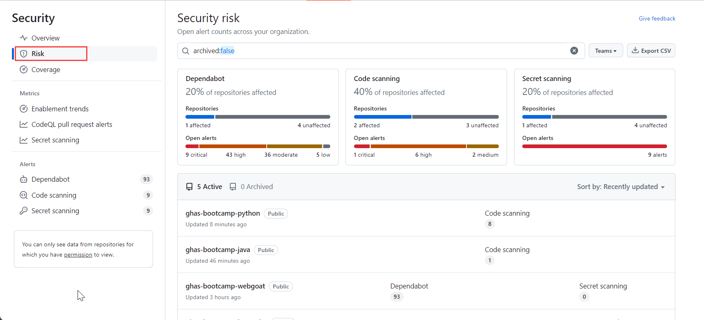

1. Click on the **Coverage** option to access detailed information about the security coverage for your repositories. This section provides insights into the extent to which your code is being analyzed for vulnerabilities, including the number of lines of code covered by security scans and the effectiveness of your security measures. By reviewing the coverage data, you can ensure that your security scanning is comprehensive and identify areas where additional coverage may be needed.

   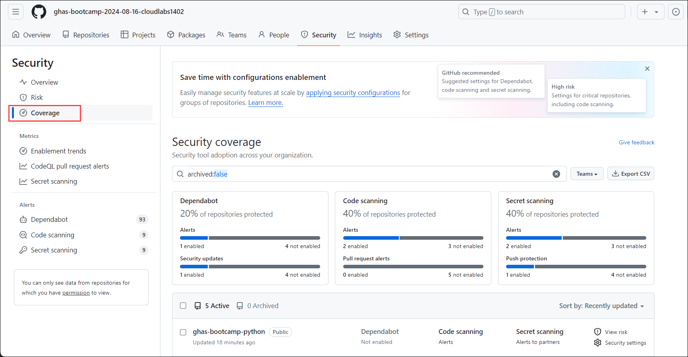
   
1. Analyze the metrics and data provided in the reports to identify areas for improvement and prioritize security efforts.

## Task 3: Review Webhooks and how they can be used to push events to an outside reporting tool, like an SIEM 

GitHub webhooks are a mechanism for automatically triggering actions or notifications in external systems when events occur within a GitHub repository. Users can configure webhooks to listen for specific events, such as pushes to a repository, pull request creation or closure, issue creation or comment, etc. When the specified event occurs, GitHub sends an HTTP POST payload to a designated URL, known as the payload URL, containing information about the event. This allows users to integrate GitHub with external services, such as CI/CD pipelines, issue trackers, or chat platforms. Thus enabling automated workflows and real-time notifications based on repository activities.


#### Push events to an outside reporting function in the App.

1. Open a new tab in your browser and navigate to the Azure Portal at `https://portal.azure.com`.

2. You'll see the **Sign into Microsoft Azure** tab. Here, enter your credentials:
 
   - **Email/Username:** <inject key="AzureAdUserEmail"></inject>
 
    
 
3. Next, provide your password to login:
 
   - **Password:** <inject key="AzureAdUserPassword"></inject>
 
   

1. In the search bar of the Azure portal, type **Function app (1)**. From the search results, select **Function App (2)**.

   

1. Click on **+ Create**.

1. From the Create Function App tab, select **Consumption** and select **Select**.

   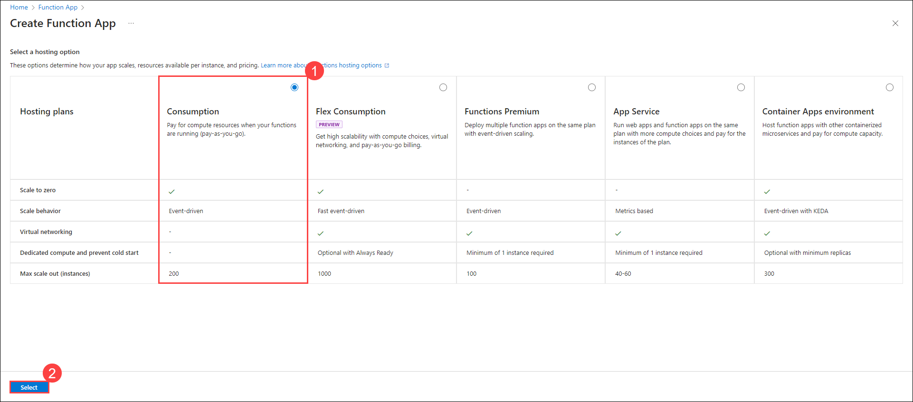

1. On the **Basics** tab of Create Function App, provide details as mentioned in the table below and select **Review + create** at the bottom of the page and subsequently click on **Create**.

    | Setting | Action |
    | -- | -- |
    | **Subscription** | Keep it as default |
    | **Resource Group** | Lab-VM |
    | **Function App name** | **function-webhooks-<inject key="DeploymentID" enableCopy="false"/>** |
    | **Runtime stack** | **Node.js** |
    | **Version** | **20 LTS** |
    | **Operating System** | **Windows** |

   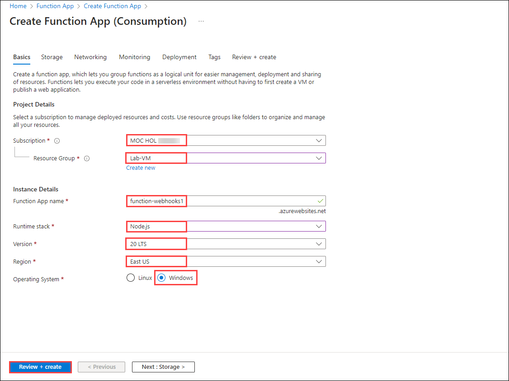

     >**Note:** Keep rest of the options as default.
 
1. Once the deployment is completed, click on **Go to resource**.

1. On the **Overview (1)** page of the **Function app**, under the  **Functions** tab, click on **Create function (2)**. It will open a  page for **Create function**. Search for and select **HTTP trigger (3)**. Click on **Next (4)**.

   

1. On Template details page, leave the default options and click on **Create**.

   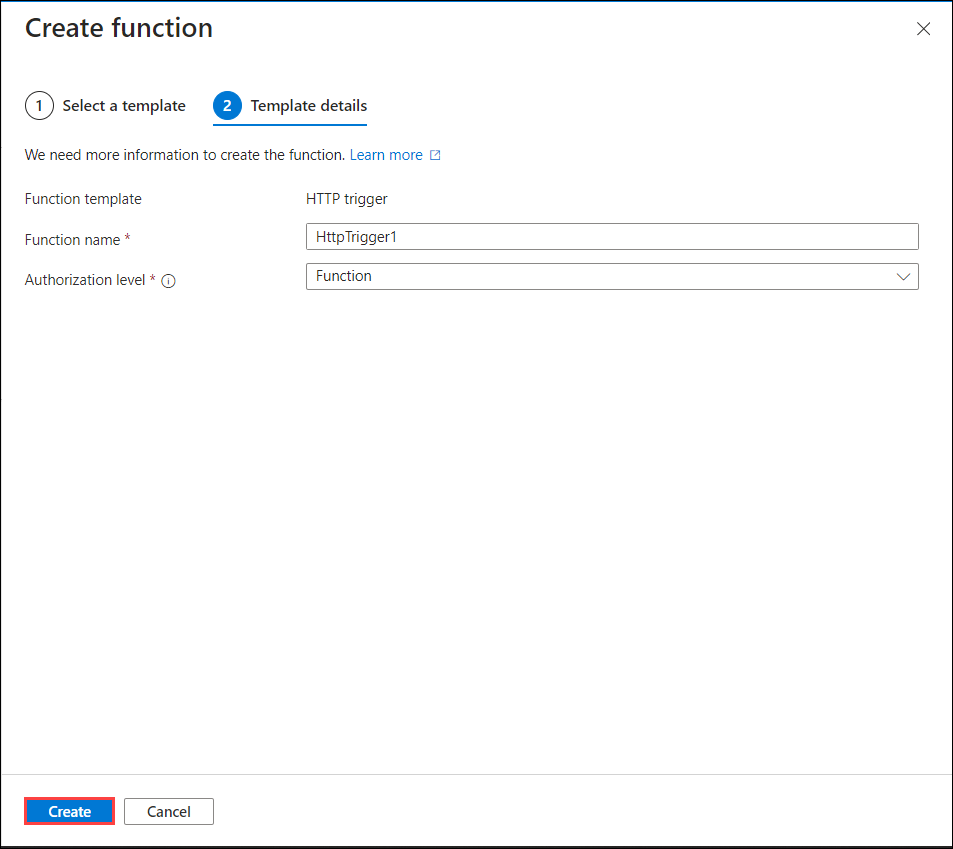

1. Go to the **Developer** section of your **HttpTrigger** function, click on **Code + Test (1)**, then click on **Get function URL (2)**. Copy the **default (Function key) (3)** URL from **copy (4)** icon.
   
    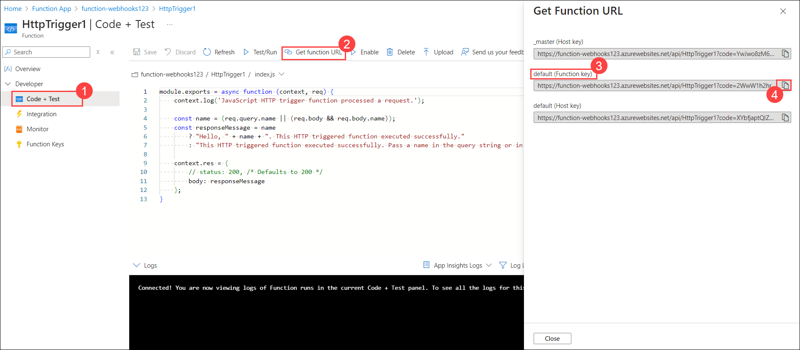

1. Navigate to the **setting** tab of your **GitHub Organization**..

   

1. Click on **Webhook**.

   

1. Click on **Add Webhooks** and give your GitHub password.

1. In the GitHub repository, navigate to the **Webhooks** settings. Paste the URL generated by the HttpTrigger function into the **Payload URL (1)** field. This URL will be used to send requests to your Azure Function whenever events occur in the repository.

   - **Content type**: Select **application/JSON (2)** so that you can receive the payload as a JSON object.
   - **Secret**: You can leave this blank.
   - **SSL verification**: Leave this as the default option of **Enable SSL verification (3)**.
   - **Which events would you like to trigger this webhook?** Select the **Just the push event option (4)**.
   - **Active (5)**: Leave this checked to receive event details when the GitHub Webhook is triggered.
   - Click on **Add Webhooks (6)**.

   

   >**Note**: You can also select **"Send me everything"** or **"Let me select individual events"** for your webhook instead of **just the push event**. This approach allows you to gain a deeper understanding and experiment with different types of events.

11. Now go to the **Repositories** section and click on **New Respsitories**.

    

12. To create the repositories, name them **Test-webhook** (1), select **Public** (2), and ensure to add a **README file** (3). Finally, click on **Create repository** (4) to complete the process.

    
  
    >**Note**: You can make some more changes to your repositories. It will send the PUSH request to the function app.

13. Click on **Add file** (1) and then click on **Create new file** (2).

     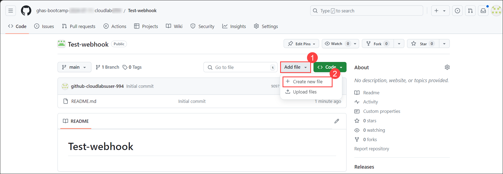

14. Create a file named **issue-template.md** (1), add the provided code into the file, and then click on **Commit changes** (3) to save.

    ```
    ## Build Failure

    **Workflow:** ${{ github.workflow }}  
    **Branch:** ${{ github.ref }}  
    **Commit:** ${{ github.sha }}  
    **Actor:** ${{ github.actor }}  

    ### Logs
    See the attached logs for more details.
    ```

     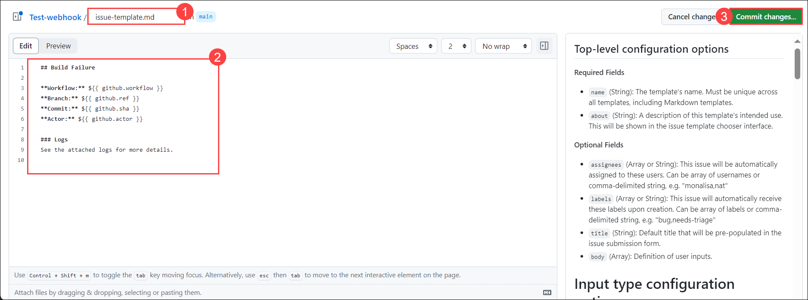

15. **Commit changes** the new file to your repository.

     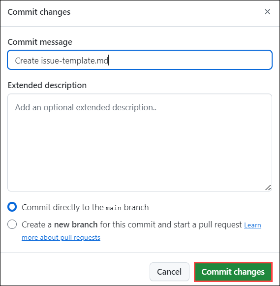

16. Navigate to the **Actions** tab to view and manage your GitHub Actions workflows.

     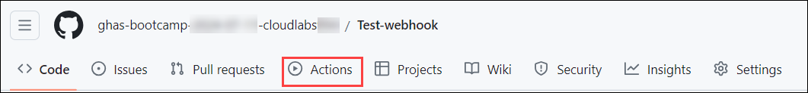

17. On the **Get Started with GitHub Actions** page, click on the **Configure** button for **Simple workflow** to begin setting up a workflow.

     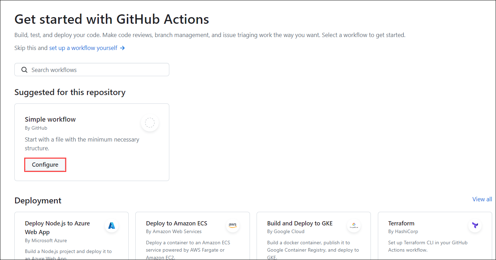

18. Change the file name of the YAML configuration file to **ci.yml** (1). Paste the provided **code** (2) into this file to define the workflow configuration. Finally, click on **Commit changes** (3) to save the file with these updates.

	```
	name: CI 
	
	on: [push, pull_request] 
	
	jobs: 
	  build: 
	    runs-on: ubuntu-latest 
	
	    steps: 
	      - name: Check out the repository 
	        uses: actions/checkout@v2 
	
	      - name: Set up Python 
	        uses: actions/setup-python@v2 
	        with: 
	          python-version: '3.x' 
	
	      - name: Install dependencies 
	        run: | 
	          python -m pip install --upgrade pip 
	          pip install -r requirements.txt 
	
	      - name: Run tests 
	        id: run-tests 
	        run: | 
	          pytest --junitxml=test-results.xml 
	        continue-on-error: true 
	
	      - name: Upload Test Results 
	        if: always() 
	        uses: actions/upload-artifact@v2 
	        with: 
	          name: test-results 
	          path: test-results.xml 
	
	      - name: Create GitHub Issue on Failure 
	        if: failure() 
	        uses: actions/create-issue@v2 
	        with: 
	          token: ${{ secrets.GITHUB_TOKEN }} 
	          title: Build Failure 
	          body-path: ./issue-template.md 
	          labels: bug 
	          assignees: your-github-username 
	 
	```

     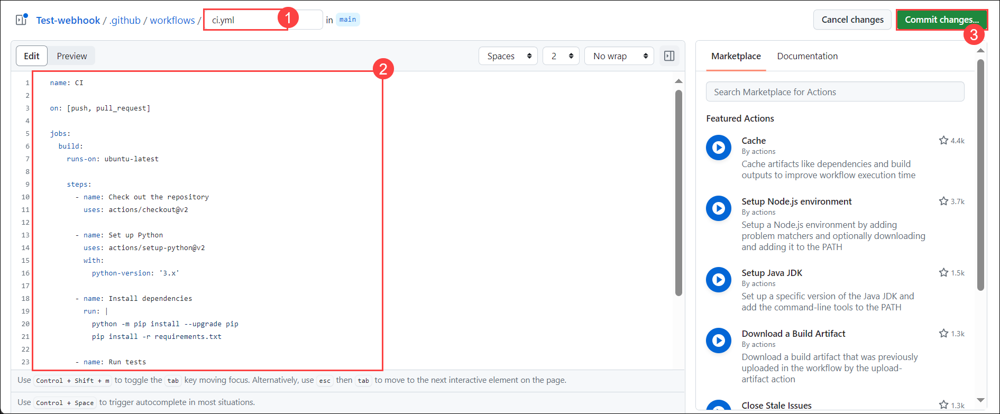

19. **Commit changes** the new file to your repository.

     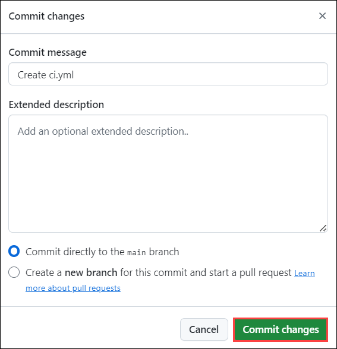

20. Navigate to the **Actions** tab (1) where you'll find that the creation of **ci.yml** (2) failed due to an issue.

     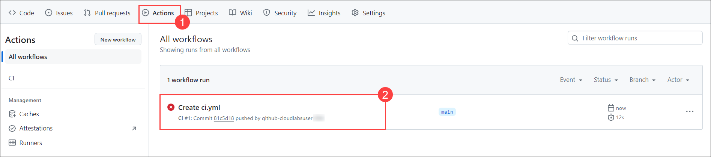

13. Navigate back to **your organization**, and click on **settings**.

     

14. Click on **Webhook** and select the Webhook you have created.

15. Scroll down to the bottom and you will find some **Recent Deliveries**.

    

16.  Click on any deliveries. You will see their **Request** and **Response** column for more information.

     

     

17. Navigate back to your **Function app** in the Azure portal and select the HTTP trigger function you created. Click on **Invocations (1)**. This section provides the most recent invocation traces, allowing you to review and analyze the function's execution history.

    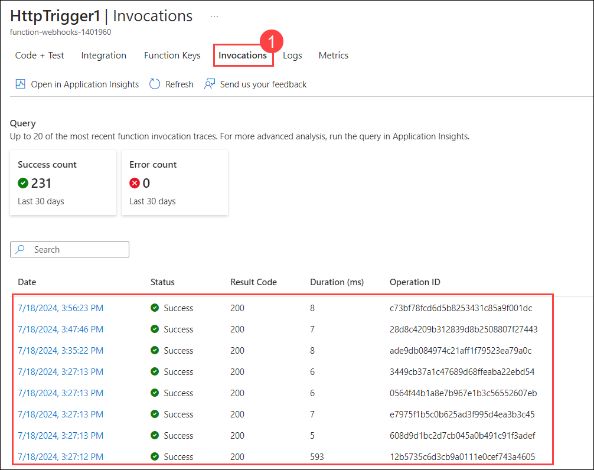
   
    >**Note:** It will take 5-7 minutes to show.

    > **Congratulations** on completing the task! Now, it's time to validate it. Here are the steps:
	
    - Hit the Validate button for the corresponding task. If you receive a success message, you can proceed to the next task. 
    - If not, carefully read the error message and retry the step, following the instructions in the lab guide.
    - If you need any assistance, please contact us at labs-support@spektrasystems.com. We are available 24/7 to help you out.

<validation step="c812660e-bf0e-4f9b-8621-fc3bf5af35a8" />

## Task 4: Talk about repository rulesets and how they can be used at scale [Read Only]

1. A ruleset is a named list of rules that applies to a repository. You can create rulesets to control how people interact with selected branches and tags in a repository. You can also control things like who can push commits to a certain branch or who can delete or rename a tag. For example, you could set up a ruleset for your repository's feature branch that requires signed commits and blocks force pushes for all users except repository administrators.

1. For each ruleset you create, you specify which branches or tags in your repository the ruleset applies to. You can use the **fnmatch syntax** to define a pattern and target specific branches and tags. For example, you could use the pattern releases/**/* to target all branches in your repository whose name starts with the string releases/.

1. When you create a ruleset, you can allow certain users to bypass the rules. This can be users with a certain role, such as repository administrator, or it can be specific teams or GitHub apps.

1. There is a limit of 75 rulesets per repository.

### Creating rulesets for a repository

You can create rulesets to control how users interact with selected branches and tags in a repository. When you create a ruleset, you can allow certain users to bypass the rules. This can be users with certain permissions, specific teams, or GitHub apps.

1. Create a **branch** or tag **ruleset**.

1. On GitHub, navigate to the **main page** of the repository.

1. Under any of	 your repository name, click on **Settings**. If you cannot see the "Settings" tab, select the **...**  dropdown menu, then click on **Settings**.

     

1. In the left sidebar, under **"Code and automation,"** click **Repository**, then click on **Rulesets**.

       

1. You can create a ruleset targeting branches, or a ruleset targeting tags.

   - To create a ruleset targeting branches, click on **New branch ruleset**.
   - To create a ruleset targeting tags, select **New tag ruleset**.

     
  
1. In the **"General"** section, type a name for the ruleset, then select **Disabled**  and click one of the following enforcement statuses:

   - **Active**: Your ruleset will be enforced upon creation.
   - **Disabled**: Your ruleset will not be enforced.

In summary, repository rulesets enhance security, compliance, and consistency across repositories, especially when managing large-scale projects. 

For more details, refer to the [GitHub documentation on rulesets](https://docs.github.com/en/repositories/configuring-branches-and-merges-in-your-repository/managing-rulesets/about-rulesets)

## Review

In this lab, you have completed the following:

+ How to grow adoption? How to communicate about GHAS internally?  
+ Viewed the security overview dashboard and reports 
+ Reviewed Webhooks and how they can be used to push events to an outside reporting tool, like a SIEM 
+ Talked about repository rulesets and how they can be used at scale 
