# Module 06: Microsoft Defender for Cloud Integration

## Lab Scenario

In this lab, you connected your GitHub account to Microsoft Defender for Cloud (formerly Azure Defender), enhancing security monitoring and threat detection capabilities. 

## Lab Objectives
In this lab, you will perform:

- Task 1: Connect your GitHub account to Microsoft Defender for Cloud

## Estimated Timing: 20 minutes

## Architecture Diagram

   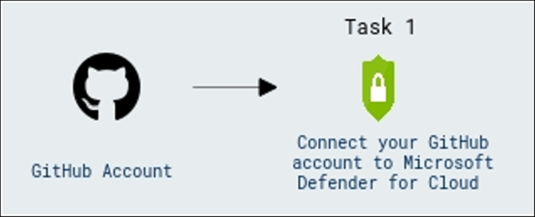

## Task 1: Connect your GitHub account to Microsoft Defender for Cloud

1. In the search bar of the Azure portal, type *Defender*, then select **Microsoft Defender for Cloud**.

   

1. The **Getting Started** page will open; select **skip**.

   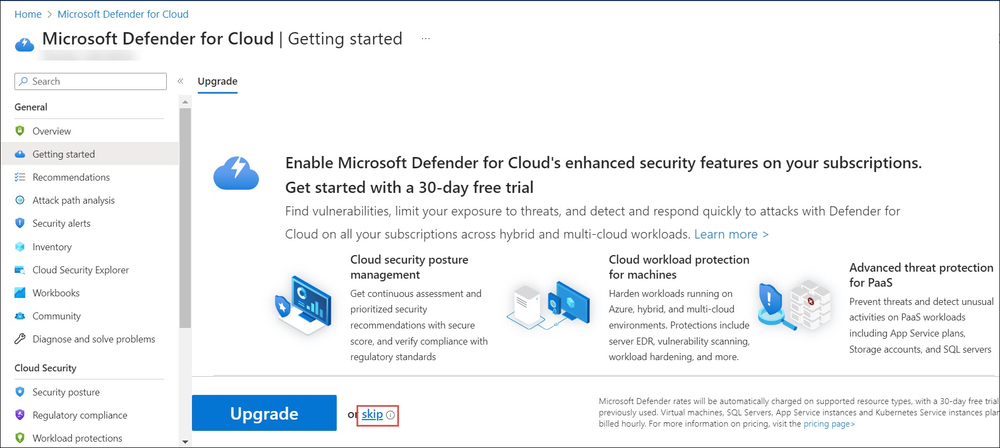

1. In the left menu for Microsoft Defender for Cloud, under **Management**, select **Environment settings (1)**, select **Add environment (2)** from the top and then select **GitHub (3)** from the dropdown.

   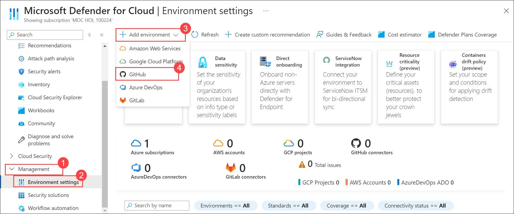

1. On the **GitHub Connection** page, under Account details, provide the below settings.

   | Setting  | Value |
   -----------|---------
   | Connector name | ghaz-github |
   | Resource group | Lab-VM |
   | Location | East US |
   
   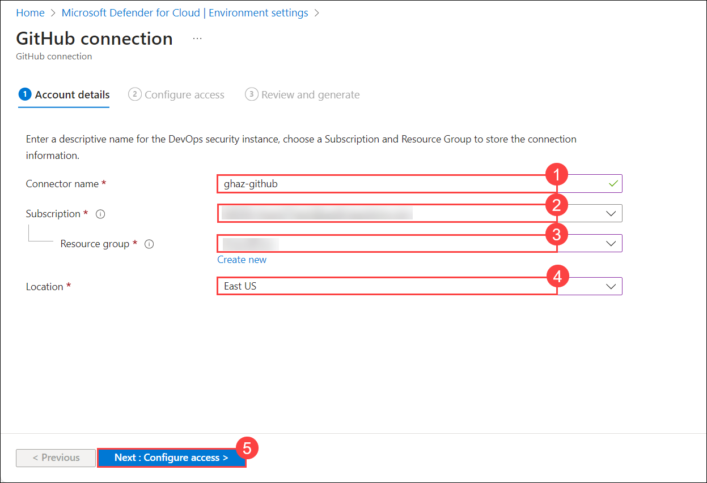

1. Select **Next: Configure access**.

1. Click the **Authorize** button.
       
   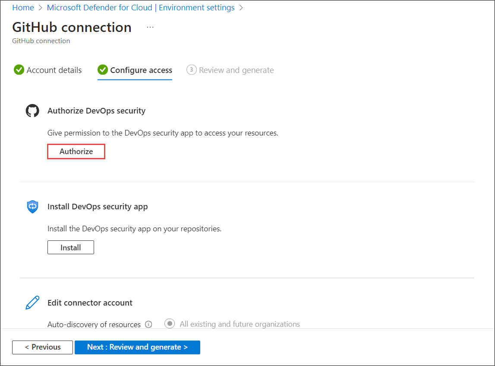

1. Click on **Authorize Microsoft Security Devops** to **Authorize**.
   
   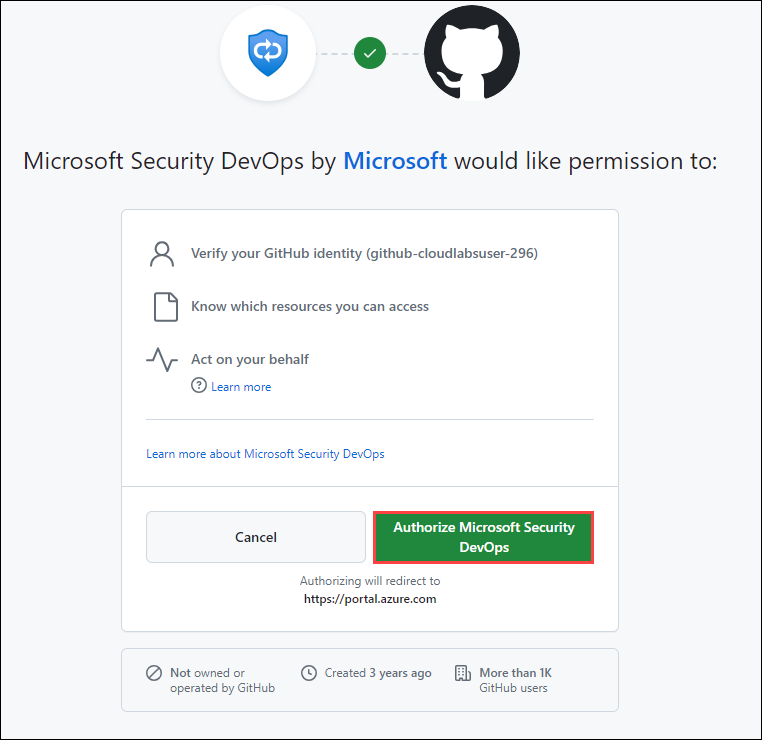

1. After the authorization is complete, click on **Install** under the **Install DevOps security app** option.
   
   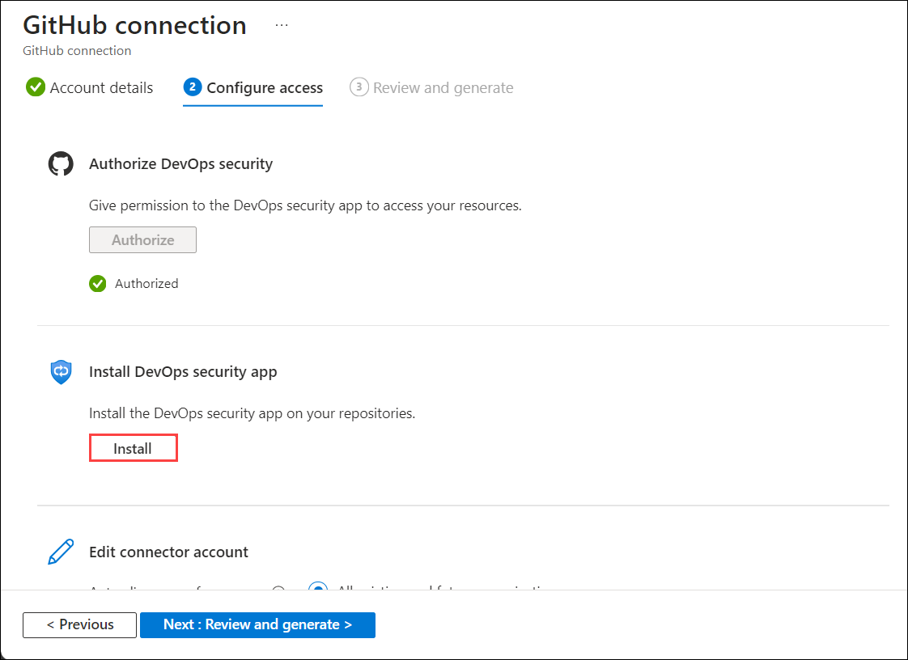

1. Select your GitHub organization for **All repositories** and click on **Install**.
   
   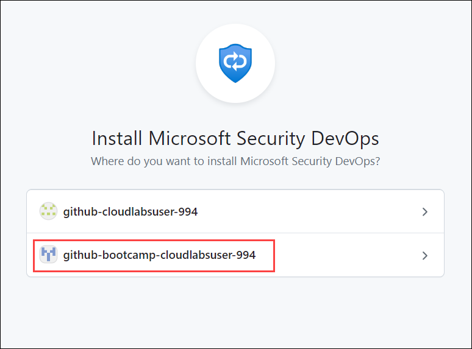
   
   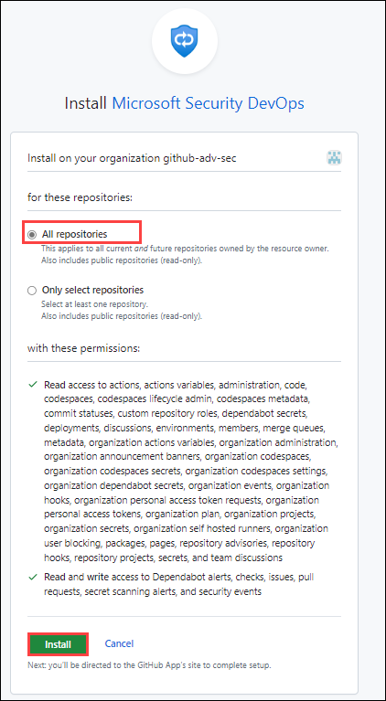

1. Click on **Next: Review and generate**.
   
   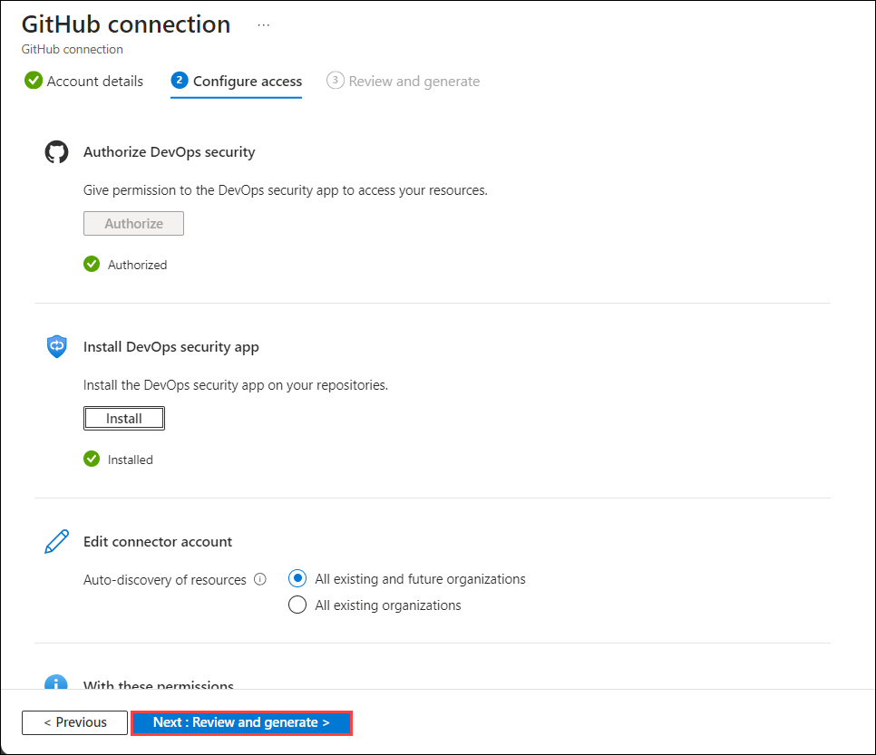

1. Review your details and click on **Create**.

   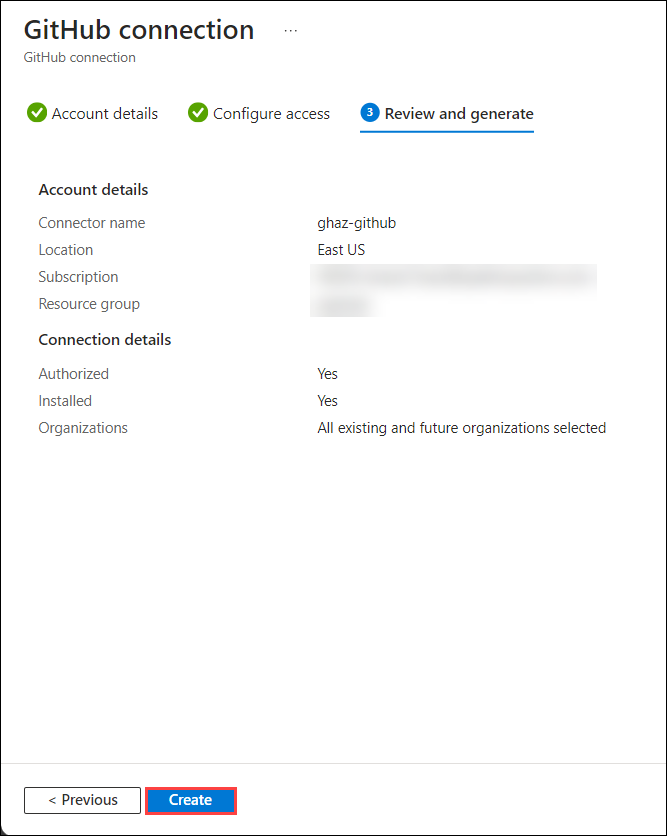
   
1. You will get GitHub connector in the **Environment settings** page.
   
   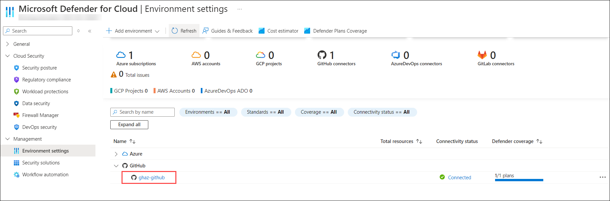                  
   
   >**Note:** It takes around 15 minutes to arrive.

1. In Microsoft Defender for Cloud, navigate to the **Recommendations** section. Here, you will find the recommendations related to GitHub. These recommendations will provide insights and best practices to enhance the security and compliance of your GitHub repositories integrated with Azure services.

   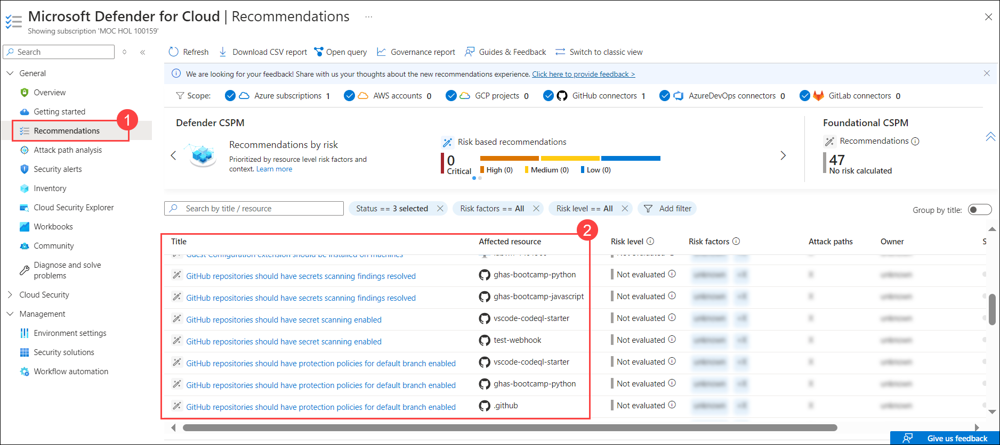

    >**Note**: It may take up to 24 hours for the changes to be reflected, and there is a possibility that you may receive different recommendations.

1. Navigate to each recommendation for further information to explore detailed insights and actionable steps provided by Microsoft Defender for Cloud.

   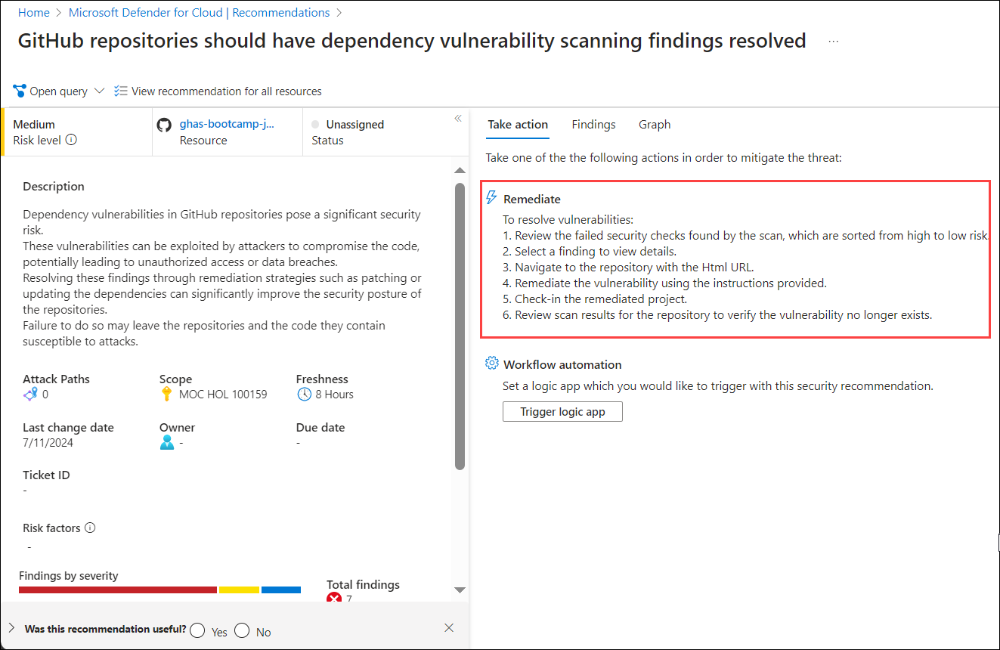

  > **Congratulations** on completing the task! Now, it's time to validate it. Here are the steps:
	
  - Hit the Validate button for the corresponding task. If you receive a success message, you can proceed to the next task. 
  - If not, carefully read the error message and retry the step, following the instructions in the lab guide.
  - If you need any assistance, please contact us at labs-support@spektrasystems.com. We are available 24/7 to help you out.

   <validation step="18b96a1a-7f72-4440-8d0b-ce63614a0abb" />

Please feel free to go through the below links for further understanding:
1. [Public Roadmap](https://github.com/orgs/github/projects/4247/views/6)
2. [Application Security](https://info.microsoft.com/US-DevOps-VDEO-FY24-02Feb-12-GitHub-and-AI-A-Powerful-Duo-for-Application-Security-Testing-SRGCM11732_LP01-Registration---Form-in-Body.html)
3. [Application Security Testing](https://www.microsoft.com/en-us/industry?rtc=1)
4. [Introducing AI-powered application security testing with GitHub Advanced Security](https://github.blog/2023-11-08-ai-powered-appsec/)

## Review

In this lab, you have completed the following:
+ Connected your GitHub account to Microsoft Defender for Cloud
