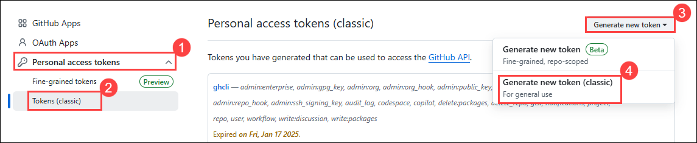
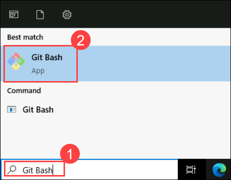
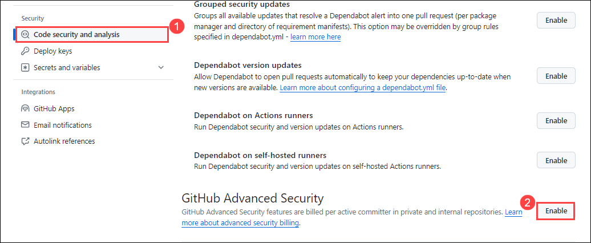
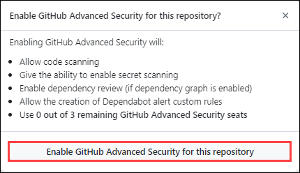
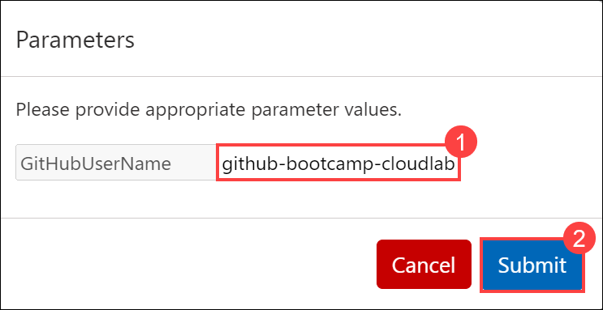
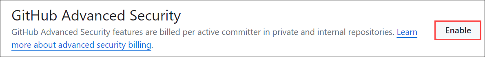
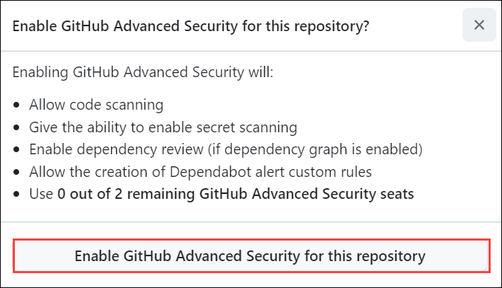

## Task 1: Create a registration token for a repository

### What is Personal Access Tokens?

Personal access tokens or (PAT) are an alternative to using passwords for authentication to GitHub when using the GitHub API or the command line.

Personal access tokens are intended to access GitHub resources on behalf of yourself. Users can generate PATs in their GitHub account settings and configure the specific permissions and scopes for the token, limiting what actions it can perform.
 
Refer to the link for more information. [Personal Access Tokens](https://docs.github.com/en/authentication/keeping-your-account-and-data-secure/managing-your-personal-access-tokens)

### Why are we using PAT Tokens?

In this lab, Personal Access Tokens (PATs) are used as example secrets to demonstrate how GitHub’s secret scanning and push protection features work. Here’s why PATs are chosen for this exercise:

- **Common Sensitive Data**: PATs are a common type of sensitive data that developers often accidentally commit to repositories. They provide a clear example of the kind of secrets that secret scanning is designed to detect and protect against.

- **Realistic Scenario**: Using PATs creates a realistic scenario. PATs are real credentials that can be used to access GitHub’s API and perform actions on behalf of the user. This makes them a tangible example of how secret scanning prevents unauthorized access.

- **Demonstration of Detection**: By using PATs, you can easily show how secret scanning identifies sensitive information in the codebase. This demonstrates the effectiveness of GitHub's security features in detecting and alerting on potential security risks.

- **Educational Purpose**: PATs are widely understood by developers, making it easier for them to grasp the concept and importance of secret scanning. The exercise involves generating PATs, which helps users learn how to manage and secure their own tokens and other secrets.

  >**Note:** If you haven't already **signed in** to GitHub, proceed to the Getting Started page and complete steps **1** through **4** of the **Login to Github** form.

1. To create a GitHub PAT token, go to your profile on top of the right hand, and then select **Settings**.

   

1. Go to **Developer settings** from the left Navigation pane -> **Personal access tokens (1)** -> **Tokens (classic) (2)**, and then click on **Generate new token (3)** and select **Generate new token (classic) (4)**.

   

1. Give your secret a name **Registration (1)** under *Note* field and set the **Expiration** to **Custom (2)** and select the next calendar day **(3)**. Select the checkboxes for **repo (4)** and **workflow (5)** to grant the necessary permissions, scroll to the bottom and click on **Generate token**. 

   

1. Once you've generated the token, click the **Copy** icon to the right of the secret value.

   

1. In the code below, replace **<Token>** with your generated Personal Access Token (PAT). Additionally, update the organization name to match the required format, which should be similar to `ghas-bootcamp-xxxx-xx-xx-cloudlabsxxx`.

    ```
    curl -L \
    -X POST \
    -H "Accept: application/vnd.github+json" \
    -H "Authorization: Bearer <TOKEN>" \
    -H "X-GitHub-Api-Version: 2022-11-28" \
    https://api.github.com/repos/ghas-bootcamp-xxxx-xx-xx-cloudlabsxxx/ghas-bootcamp-WebGoat/actions/runners/registration-token
    ```

1. In the virtual machine, click on the search bar and type **Git Bash (1)**. From the search results, select and open **Git Bash (2)** to launch the terminal environment.

   

1. Now, paste your code into the terminal and press **Enter**. This will execute the command and send a request to the designated endpoint.

   

---
### Task4 page 5 code scanning step 6 to last 

1. Go to the **Explorer (1)** in the upper left corner, select **Open Folder (2)**, select the folder you cloned from the **Desktop** **(3)**, and then click **Select Folder (4)**.

    

1. Select **Yes, I trust the authors**.

    

1. If you receive a pop-up requesting permission to collect usage data, simply click **Yes** to proceed.

    

1. Go to **Account** icon from bottom and click on **Sign in with GitHub to use CodeQL**. Please note it might take some time to get the extension updated with code, If you get any pop-up select yes. 

    

    >**Note:** If you encounter a page requesting you to sign in with GitHub credentials or authorize GitHub for VS Code, click on **Authorize Visual Studio Code** to proceed.

    

1. The site is trying to open the Visual Studio Code then click on **Open**. It will navigate back to the Visual Studio.

    

1. Go to the **CodeQL** extension and move the cursor over the **Database**, click on the **GitHub** icon.

      

1. Add the Database by the following command and press enter.

    >**Note**: Make sure to update the name of your organization, **ghas-bootcamp-xxxx-xx-xx-cloudlabsxxxx**.

    ```
    https://github.com/ghas-bootcamp-xxxx-xx-xx-cloudlabsxxxx/ghas-bootcamp-python
    ```

    

1. Go to the **Queries** section, click on **Create query** option and select **Python** as your target query language.

    

1. It will show up the location for query, press **enter**.

    

1. It will generate the simple query, click on the **Run**  from right corner (1) and analyze the result.

    

    >**Note**: If you receive a pop-up asking to run queries: example.ql , simply click **Yes** to proceed.

1. Now, replace the existing code with the provided code snippet. Then, click on the **Run** button to execute it.

   - This CodeQL query identifies named entities (special functions, built-in functions, modules, and files) in a Python codebase from a specified list of names ("foo", "baz", "main", "os", "sys", "re"). It checks if each name matches a specific type ("special", "builtin", "module", "file") and selects them, ordering the results by name and kind. 

	  ```
      # Import modules
	  import python
	  import semmle.python.types.Builtins
	
	  predicate named_entity(string name, string kind) {
	   exists(Builtin::special(name)) and kind = "special"
	    or
	    exists(Builtin::builtin(name)) and kind = "builtin"
	    or
	    exists(Module m | m.getName() = name) and kind = "module"
	    or
	    exists(File f | f.getShortName() = name + ".py") and kind = "file"
	  }
	
	  from string name, string kind
	  where
	    name in ["foo", "baz", "main", "os", "sys", "re"] and
	    named_entity(name, kind)
	  select name, kind order by name, kind
	  ```

        

    	>**Note**: If you receive any errors please remove **# Import modules** from the first line.      

17. This results helps to understand the classification and usage of these entities in the code.

    

Please feel free to go through the document for further understanding:[Code Security](https://docs.github.com/en/code-security) and [CodeQL Documentation](https://codeql.github.com/docs/)


### Code
1. Sign in with GitHub Credentials and on the **Authorize GitHub for VS Code** page click on the **Authorize Visual-Studio-Code.**

    

1. In the **`ghas-bootcamp-webgoat`** repository, go to the **`.github/workflows/dependency-review.yml`** file. Click on the **...** (ellipsis) icon and select **Delete File**.

   

   > **Note:** We are deleting the existing file to avoid conflicts when creating a new file with the same name. Deleting the existing file first ensures a smooth process.

1. Click on **Commit Changes (1)**, and then click **Commit Changes (2)** once again in the pop-up that appears.

    


1. In the **`ghas-bootcamp-webgoat`** repository, go to the **`.github/workflows/DepGraph.yml`** file.

   

1. Click the pencil icon at the top-right of the code block to edit it **Add a space to the end of the file**. click on **Commit changes**.

   

   

 	 > **Note:** This will trigger the DepGraph.yml file to run a new worflow named **Dependency Graph Upload**, this happened because we edited the file which got triggered automatically.


1.  Click on the **Run workflow** -> **Run workflow**  button located in the middle of the screen.

    


**Note:** By performing this task, you will have already enabled the security configurations for your upcoming module in this lab. This allows you to skip the security settings enablement steps in upcomming module.

 	 > **Note:** If you don't find the **Dependency Graph Upload** action under workflows, then rename the **`.github/workflows/DepGraph.yml`** file to **DepGraph.txt** (edit the file extension to **txt**) and then revert it back to save as **DepGraph.yml** file or just add an empty space anywhere in the yaml file and commit the changes, if you haven't add an space.


    >**Note:** To update the dependency-review.yml file, use a two-tab approach. In your first tab, navigate to the dependency-review.yml file. Then, in your second tab, find the updated code for this file. Copy the entire updated code from the second tab, return to the first tab, and paste it to replace all existing content in the dependency-review.yml file. Finally, click on "Commit changes" to save your updates. We're using this method because direct file updates are sometimes not allowed and may result in an error message stating that the file already exists. This approach helps bypass that issue and ensures your changes are successfully applied.


    >**Note:** If you get an error while commiting changes as file could not be edited. to fix that, rename the file **dependency-review.yml** to **dependency-review1.yml** and then try again to commit the changes in new action file.

    >**Note:** If the error persists, indicating that a file with the name already exists, delete the conflicting file and create file named **dependency-review.yml** before attempting the commit once more.

1. In the left sidebar, click on **Code security and analysis**.

1. Now on the **GitHub Advanced Security** **(1)**, click on **Enable** **(2)**.

   

1. Click the **Enable GitHub Advanced Security for this repository** button when the prompt appears.

   


## Why are we using PAT Tokens

In this lab, Personal Access Tokens (PATs) are used as example secrets to demonstrate how GitHub’s secret scanning and push protection features work. Here’s why PATs are chosen for this exercise:

1. **Common Sensitive Data**: PATs are a common type of sensitive data that developers often accidentally commit to repositories. They provide a clear example of the kind of secrets that secret scanning is designed to detect and protect against.

2. **Realistic Scenario**: Using PATs creates a realistic scenario. PATs are real credentials that can be used to access GitHub’s API and perform actions on behalf of the user. This makes them a tangible example of how secret scanning prevents unauthorized access.

3. **Demonstration of Detection**: By using PATs, you can easily show how secret scanning identifies sensitive information in the codebase. This demonstrates the effectiveness of GitHub's security features in detecting and alerting on potential security risks.

4. **Educational Purpose**: PATs are widely understood by developers, making it easier for them to grasp the concept and importance of secret scanning. The exercise involves generating PATs, which helps users learn how to manage and secure their own tokens and other secrets.

Overall, PATs serve as an illustrative example of secrets that GitHub’s security features aim to protect, enhancing the educational value of the lab.


11. Finally, to show off how much importance we place on catching real secrets over modified / false positive secrets, we will go back through the process of creating a new personal access token. Once again, go to your profile, and then **Settings** -> **Developer settings** -> **Personal access tokens** -> **Tokens (classic)**, and then click on **Generate new token** at the top and select **Generate new token (classic)**.

12. Once again, give your secret a name, **secret3**, set the **Expiration** to **_"Custom..."_** and select the next calendar day. By default, no permissions are granted, so it is safe to scroll to the bottom and click **Generate token**.

13. Once you've generated the token, click the **Copy** icon to the right of the secret value, and return to the **`ghas-bootcamp-javascript`** repository. Open up **_index.js_**, click the pencil icon on the top-right of the code block, and add **`var secret3 = "Your-Secret-Value"`** to the code. **BEFORE YOU COMMIT YOUR CODE**, go ahead and add some random letters and numbers to the end of the GitHub Personal Access Token you've added.

    

14. In the end, this will _NOT_ cause a **Secret scanning** pop-up to appear. It's important to once again reiterate that we focus on push protecting against secrets that we are highly confident about and that are real. They should also match the patterns expected from the algorithms partners use to generate their credential material.


1. In the Action workflow configuration there is a [link to the Action's repository](https://github.com/actions/dependency-review-action) as shown in the below screenshot. Copy this link and open it in a new tab.

   

1. Now, in this repository, scroll down to the **Configuration options**. We can copy the example that includes the **`fail-on-severity`** possible values.

   

1. Go to the **Files changed** tab and review the code we added.
  - What we find on **Line 54** is a **`val`** assignment calling **`login.objects.raw`**, which does not exist as a function in this project.
  - While other static analysis tools would likely have marked **Line 50** as a SQL injection, the CodeQL analysis performed as part of code scanning correctly marks this as a **`Clear-text logging of sensitive information`**. This is the power of CodeQL in action - accurately tracing dataflows and identifying security vulnerabilities in your code without all of the noise.


   >**Note:** Upon clicking the **validate** button for this exercise, you'll receive a prompt to input your GitHub username.Provide your **Orgnization name** as Username to validate, **github-bootcamp-cloudlabsuser-xxx**.

   
   
   >**Note:** Make sure to update the name of your organization, **github-bootcamp-cloudlabsuser-xxx**.

To find your GitHub username, simply click on your profile image within your GitHub account. After entering your username, proceed by selecting Submit.

Provide your Orgnization name as Username to validate, **github-bootcamp-cloudlabsuser-xxx**.

Note: Make sure to update the name of your organization, github-bootcamp-cloudlabsuser-xxx.


1. Enable **GitHub Advanced Security** option.

   

1. Click on **Enable GitHub Advanced Security for this repository**.
        
   
   
1. Select **enable** to activate Push Protection.

   

#### Task 3.1: Installing necessary tools.

1. Search for **powershell** in windows search, select **Powershell ISE** and **Run as administrator**.

    
   
1. Paste the following commands to install ***nodejs (1)*** and click on **Run (2)** button.

     ```
    #Install nodejs v16.8.0
    $WebClient = New-Object System.Net.WebClient
    $WebClient.DownloadFile("https://nodejs.org/download/release/v16.8.0/node-v16.8.0-x64.msi","C:\node-v16.8.0-x64.msi")
    $arguments = "/i `"C:\node-v16.8.0-x64.msi`" /quiet"
    Start-Process msiexec.exe -ArgumentList $arguments -Wait
    sleep 5
      ```

    

1. To install **Scoop** copy the following command and paste it in the powershell editor, highlight the code and click **Run**.

      ```
      iex "& {$(irm get.scoop.sh)} -RunAsAdmin"
      ```

     

1. To install **git** copy the following command and paste it in the powershell editor, highlight the code and click **Run**

      ```
      $WebClient = New-Object System.Net.WebClient
      $WebClient.DownloadFile("https://github.com/git-for-windows/git/releases/download/v2.44.0.windows.1/Git-2.44.0-64-bit.exe","C:\Git-2.44.0-64-bit.exe")
      $arguments = "/VERYSILENT /NORESTART /NOCANCEL /SP-"
      Start-Process "C:\Git-2.44.0-64-bit.exe" -ArgumentList $arguments -Wait
      sleep 5
      ```

      

#### Task 3.2: Clone a demo API server for receiving GitHub webhooks

1. Start **Visual Studio Code** from the desktop.

    

1. In the Visual Studio Code terminal, click on **(...)** (1) and select the **Terminal** (2) menu, select **New Terminal** (3). The terminal window usually opens in the lower half of your screen.

    
    
1. Clone the repository by running the following command:

      ```
      git clone --single-branch --branch github-webhooks https://github.com/hookdeck/nodejs-webhook-server-example.git
      ```

1. Navigate to the root of the project and install the required dependencies by running the following commands:

      ```
      cd nodejs-webhook-server-example
      ```

      ```
      npm install
      ```
      ```
      npm start
      ```
      
    
   
   >**Note:** This will boot up the API application and print a message to the screen indicating that the API is now running and listening for connections on port 1337.
   
#### Task 3.3: Get the webhook URL

1. Install the hookdeck by running the following commands.

      ```
      scoop bucket add hookdeck https://github.com/hookdeck/scoop-hookdeck-cli.git
      ```
      ```
      scoop install hookdeck
      ```

1. To allow traffic on port 1337

      ```
      netsh interface portproxy add v4tov4 listenport=1337 listenaddress=0.0.0.0 connectport=1337 connectaddress=127.0.0.1
      ```

1. To verify that the port is listening, you can use the following command:

      ```
      netstat -an | findstr "1337"
      ```
      
1. Once the setup process is complete, the next step is to use the CLI to generate a webhook URL that points to the running API application.

      ```
      hookdeck listen 1337
      ```

1. This command starts an interactive session where the CLI collects information about the endpoint you're about to create. Below are the questions and the answers you should supply to each question.

    | Question | Answer |
    | -- | -- |
    | **What source should you select?** | select **Create new source** |
    | **What should your new source label be?** | type the text **Github** |
    | **What path should the webhooks be forwarded to (i.e.: /webhooks)?** | type **/log-github-webhook** |
    | **What's the connection label (i.e.: My API)?** | type **My Github Response Server** |

1. With this information, the CLI will begin the process of generating the URL and once it's done, you will see the URL printed to the screen and the CLI indicating that it is ready to receive requests.

    

1. Now copy and paste **Inspect and replay webhooks** URL into your browser.

    

1. Copy the URL

    
   
1. Navigate to your repository's, click  Settings.

   

1. Click on **webhook**.

   

1. Click on **Add Webhooks**. and give your github password.

1. On the webhook form displayed, paste the webhook URL generated by the Hookdeck CLI into the **Payload URL (1)** field.

- **Content type**: Select **application/json (2)** so that you can receive the payload as a JSON object.
- **Secret**: You can leave this blank.
- **SSL verification**: Leave this as the default option of **Enable SSL verification (3)**.
- **Which events would you like to trigger this webhook?**: select the **Just the push event option (4)**.
- **Active (5)**: Leave this checked to receive event details when the GitHub webhook is triggered.
- Click on **Add Webhooks (6)**.

     
    

13. On the console page in web it will give the **Accepted** Status of your webhooks.

    

    >**Note**: It will take 3-5 minutes to show the status.

#### Task 6: Security Operations for CodeQL.

1. Start **Visual Studio Code** from the desktop.

    

1. In the Visual Studio Code, Click on **Extensions**, search and select the **CodeQL**, click on **install**.

    

1. In the Visual Studio Code terminal, click on **(...)** (1) and select the **Terminal** (2) menu, select **New Terminal** (3). The terminal window usually opens in the lower half of your screen.

    

1. Change the location to **Desktop** for easy navigation.

    ```
    cd Desktop
    ```
    
1. Clone the repository by running the following command:

      ```
      git clone --recursive https://github.com/github-bootcamp-cloudlabsuser-xxx/ghas-bootcamp-python.git
      ```
      >**Note**: Make sure to update the name of your organization, **github-bootcamp-cloudlabsuser-xxx**.

    

1. Go to the **Explorer** in the upper left corner, select **Open Folder**, select the folder you cloned from the **Desktop**, and then click **Select Folder**.

    

1. Select **Yes, I trust the authors**.

    

1. Go to **Account** icon from bottom and click on **Sign in with GitHub to use CodeQL**.

    

1. Sign in with GitHub Credentials and on the **Authorize GitHub for VS Code** page click on the **Authorize Visual-Studio-Code.**

    

1. If you get the pop-up, The site is trying to open the Visual Studio Code then click on **Open**. It will navigate back to the Visual Studio.

    

1. Go to the **CodeQL** extension and move the cursor over the **Database**, click on the **GitHub** icon.

      

1. Add the Database by the following command and press enter.

    ```
    https://github.com/github-bootcamp-cloudlabsuser-xxx/ghas-bootcamp-python
    ```
    >**Note**: Make sure to update the name of your organization, **github-bootcamp-cloudlabsuser-xxx**.

    

1. Go to the **Queries** section, click on **Create query** option and select **Python** as your target query language.

    

1. It will show up the location for query, press **enter**.

    

1. It will generate the simple query, click on the **Run** (1) and analyze the result.

    
